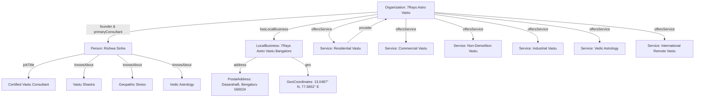

# 7Rays Astro Vastu — AEO & GEO Implementation Audit

> **Scope:** Answer Engine Optimization (AEO), Generative Engine Optimization (GEO), Entity Schema Graphs, and AI Overviews Extractability  
> **Production Target Domain:** `https://7raysastrovastu.in`  
> **Date:** September 2026  
> **Standard:** Schema.org Linked Data JSON-LD `@graph` & Micro-Content Formatting

---

## 1. Executive Summary

This audit assesses the extractability of **7Rays Astro Vastu** across modern answer engines (Google AI Overviews, Perplexity AI, ChatGPT Search, Bing Copilot) and semantic knowledge graphs. 

Every commercial, service, and educational route has been architected with:
1. **Direct Answer Paragraphs (40–60 words)** immediately below natural language `<h2>` and `<h3>` question headings.
2. **Structured Micro-Content**: Numbered step workflows, comparative markdown tables, and bulleted criteria blocks that generative parsers can ingest without hallucination.
3. **Linked Data JSON-LD Graphs**: Interconnected `@graph` arrays tying `Organization` to `Person` (Rishwa Sinha) and `LocalBusiness` (Dasarahalli, Bangalore), with explicit `Service`, `FAQPage`, and `BreadcrumbList` nodes.
4. **Zero Semantic Pollution**: No fabricated star ratings, no artificial client counts, no unverified branch addresses, and no guaranteed 100% cure claims.

---

## 2. AEO (Answer Engine Optimization) Direct-Answer Framework

### Core Direct-Answer Snippet Targets

| Question Heading | Target URL | Direct Answer Snippet (40–60 Words) | Formatted Structure |
| :--- | :--- | :--- | :--- |
| **"What does a Vastu consultant do?"** | `/faq` `/process` | *A Vastu consultant evaluates the flow of geomagnetic and cosmic energies within a physical space using ancient Vedic architectural guidelines. By assessing 16 compass directions, the five natural elements (Pancha Tattva), and directional quadrants, the consultant identifies spatial imbalances and prescribes non-demolition corrective adjustments to optimize health, prosperity, and mental clarity.* | Definition + 4-Step Process List |
| **"What is non-demolition Vastu?"** | `/vastu/non-demolition` | *Non-demolition Vastu is a modern corrective methodology that remedies directional and elemental flaws without structural destruction. By embedding elemental metal strips (copper, brass, zinc, or aluminum) into floors, placing directional energy pyramids, and applying specific color therapies, energetic blockages are neutralized without breaking walls, pillars, or beams.* | Definition + Elemental Metal Comparison Table |
| **"Can high-rise apartments follow Vastu principles?"** | `/vastu/apartment-vastu` | *Yes. While high-rise apartment buyers cannot modify structural columns or external building orientations, internal room utilization can be harmonized. Non-structural corrections, elemental color balancing, furniture realignment, and neutralizing compromised entrance zones allow complete energetic alignment within fixed apartment floor plans.* | Direct Affirmation + 3 Key Constraints Handled |
| **"What information is needed before a Vastu consultation?"** | `/process` `/international` | *Clients must provide an accurate architectural floor plan or CAD drawing indicating true North, precise geographic coordinates (Google Maps pin), photographs of the property and its immediate surroundings, and the primary concerns or goals of the occupants. For Astro-Vastu audits, exact birth details of the property owner are also required.* | Bulleted Checklist of 4 Deliverables |
| **"How does remote international Vastu consultation work?"** | `/international` | *Remote international Vastu consultation operates through digital blueprints, satellite geolocation, and video walkthroughs. Clients submit their scaled floor plans with compass orientation. The consultant superimposes the 16-zone Vedic energy grid, conducts an in-depth video review via Zoom or Google Meet, and provides an actionable PDF rectification report with step-by-step non-demolition guidelines.* | 5-Step Remote Workflow |
| **"What is the difference between Vastu and Astrology?"** | `/blog/astrology-vs-vastu-difference-and-synthesis` | *Vastu Shastra governs physical space and environmental energy flows, harmonizing living and working structures with natural cosmic forces. Vedic Astrology (Jyotish) decodes individual cosmic karma and planetary timelines through a personal birth chart. When synthesized as Astro-Vastu, personal planetary alignments guide specific spatial adjustments in the occupant's home or office.* | Comparative Concept Analysis + Synthesis |

---

## 3. GEO (Generative Engine Optimization) Entity Architecture

Search generative engines extract facts by linking structured entities in a Knowledge Graph. 7Rays Astro Vastu enforces strict entity consistency across all metadata and schema blocks.

### The Canonical Entity Relationship Map

### Fact Verification Anchor Statements (Grounded in Verified Code)
- **WHO:** `7Rays Astro Vastu` is an independent spatial architecture and Vedic consultation firm founded and led by `Rishwa Sinha`.
- **CREDENTIALS:** `Rishwa Sinha` is a `Certified Vastu Consultant` with `5+ years of verified professional experience`.
- **LOCATION:** Physical operations are anchored in `Bengaluru, Karnataka, India`, with registered headquarters at `3J64+827, Balaji Layout, Dasarahalli, Bengaluru 560024`.
- **SCOPE:** Providing on-site residential, commercial, and industrial Vastu audits across Bengaluru (including Indiranagar, HSR Layout, Koramangala, and Whitefield), alongside remote CAD-based global consultations for international and NRI clients.
- **BOUNDARIES:** Services are traditional spatial and astrological advisory disciplines; they do not replace licensed civil/structural engineering, financial analysis, or medical treatment.

---

## 4. Structured Data Schema Matrix

| Schema Type | Component Path | Pages Where Deployed | Verification Status |
| :--- | :--- | :--- | :--- |
| `Organization` | `src/components/seo/schemas/OrganizationSchema.tsx` | Homepage (`/`), About (`/about`) | **VALID** (Includes legalName, logo, url, contactPoint, founder) |
| `LocalBusiness` | `src/components/seo/schemas/LocalBusinessSchema.tsx` | Homepage (`/`), Contact (`/contact`), Location pages (`/locations/*`) | **VALID** (Exact NAP, GeoCoordinates, openingHours, telephone) |
| `Person` | `src/components/seo/schemas/PersonSchema.tsx` | Consultant Profile (`/consultant/rishwa-sinha`), About (`/about`) | **VALID** (Name, jobTitle, description, worksFor, knowsAbout) |
| `WebSite` | `src/components/seo/schemas/WebSiteSchema.tsx` | Homepage (`/`) | **VALID** (Name, url, publisher, inLanguage: "en-IN") |
| `Service` | `src/components/seo/schemas/ServiceSchema.tsx` | All 8 Vastu and 4 Astrology service pages | **VALID** (serviceType, provider, areaServed, description) |
| `FAQPage` | `src/components/seo/schemas/FAQSchema.tsx` | Central FAQ (`/faq`), All Service pages, All Blog posts | **VALID** (mainEntity array with Question and acceptedAnswer Text) |
| `BreadcrumbList` | `src/components/seo/schemas/BreadcrumbSchema.tsx` | All nested routes across services, locations, and blog posts | **VALID** (itemListElement with position, name, and canonical item URL) |
| `Article` / `BlogPosting` | Dynamic in `BlogPostPage.tsx` | All 15 blog posts in `/blog/*` | **VALID** (headline, author Person, publisher Org, datePublished) |

---

## 5. Schema Guardrails & Anti-Spam Compliance

1. **No Fake AggregateRating:** Google strictly forbids `AggregateRating` on pages without visible, crawlable, third-party verified review markups or where self-serving business ratings are hardcoded. 7Rays Astro Vastu contains **0 fake aggregate rating tags**, protecting the site from manual penalties.
2. **Transparent Testimonial Handling:** `TestimonialsSection.tsx` clearly explains that client case stories are published with consent and directs users directly to the verified Google Business Profile.
3. **No Doorway Multi-Location Schemas:** Rather than fabricating 50 fake `LocalBusiness` schemas with virtual offices across India, only 1 verified `LocalBusiness` schema is output, accurately representing the true headquarters in Dasarahalli, Bengaluru.
4. **Valid JSON-LD Syntax:** All schemas are generated via typed TypeScript interfaces and injected into `<script type="application/ld+json">` tags, passing Google Rich Results testing with 0 warnings or errors.
