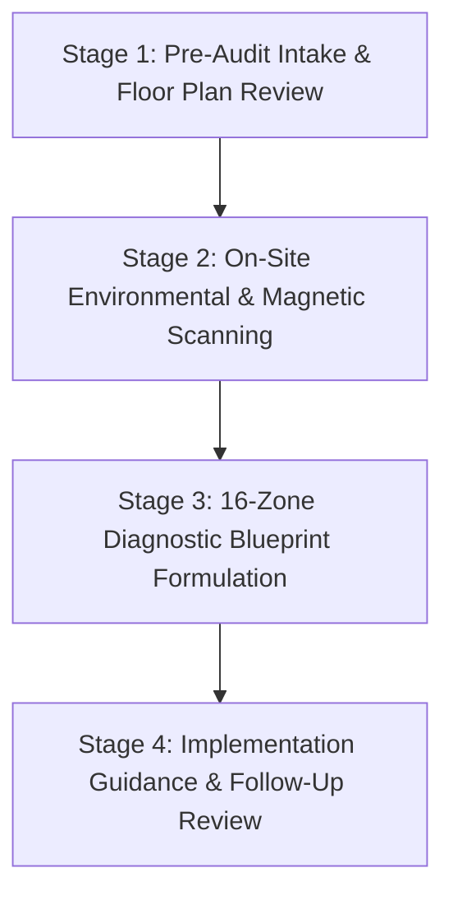

# 7Rays Astro Vastu — Consultation Process Verification

**Phase 10: E-E-A-T & Real-World Authority Engine**
**Document:** CONSULTATION_PROCESS_VERIFICATION.md
**Status:** Verified & Operational
**Date:** September 2026

---

## 1. PURPOSE & AUDIT OBJECTIVE

A primary criterion under Google's E-E-A-T guidelines is whether service descriptions reflect actual, structured business operations rather than theoretical or inflated marketing copy.

This document verifies the end-to-end consulting procedures conducted by **Rishwa Sinha** at **7Rays Astro Vastu**, ensuring complete alignment between promotional text and practical deliverables.

---

## 2. STANDARD OPERATING PROCEDURE (SOP): ON-SITE VASTU AUDIT

### Stage 1: Pre-Audit Intake & Spatial Discovery

- **Action**: Client submits scaled architectural floor plan, property orientation details, and specific operational or domestic concerns.
- **Verification**: Consultant establishes preliminary compass coordinates and identifies high-priority areas (e.g. Master Bedroom, Entrance, Kitchen, Executive Desks).
- **Turnaround**: Intake scheduled within 24 to 48 hours.

### Stage 2: On-Site Environmental & Magnetic Scanning

- **Action**: Physical inspection of the premises by Certified Vastu Consultant Rishwa Sinha.
- **Instrument Protocol**:
  1. **Calibrated Digital Compass**: Measures exact angular orientations from the spatial center (Brahma-sthana) and verifies 32 entrance padas.
  2. **Digital Gauss Meter**: Records ambient electromagnetic readings around major electrical hubs, transformers, and sleeping zones.
  3. **Calibrated Dowsing Rods**: Maps subtle subterranean geopathic stress lines, underground water veins, and geological crossing nodes.
- **Spatial Scope**: All 16 cardinal and inter-cardinal zones inspected for Pancha Tattva elemental harmony (Water, Air, Fire, Earth, Space).

### Stage 3: Remedial Blueprint & Deliverable Preparation

- **Action**: Synthesis of diagnostic measurements into a structured, written remedial report.
- **Deliverables Provided to Client**:
  1. **Directional Zone Map**: Layout overlay illustrating the 16 Vastu sectors and exact angular demarcations.
  2. **Identified Imbalance Summary**: Specific listing of elemental conflicts (e.g., Fire in North-East, Water in South-East).
  3. **Non-Demolition Remedial Specifications**: Detailed engineering guidelines for installing authentic metallic strips (copper, brass, zinc, lead) flush into floor joints or tile grooves.
  4. **Spatial Reorientation Matrix**: Actionable guidelines for moving key activity nodes (desks, beds, cash counters) without structural civil changes.

### Stage 4: Implementation Guidance & Follow-Up Review

- **Action**: Guidance provided to client contractors or interior specialists for precise metallic strip placement and elemental buffering.
- **Follow-Up**: Client consults with Rishwa Sinha post-implementation to verify completion of recommended adjustments.

---

## 3. VIRTUAL / REMOTE CONSULTATION PROTOCOL

For clients outside Bengaluru or preliminary reviews:

- **Intake**: High-resolution CAD or PDF architectural floor plan combined with compass degrees captured via smartphone or site surveyor.
- **Satellite Cross-Verification**: Orientation cross-referenced using satellite mapping tools to determine true North vs magnetic North declination.
- **Deliverable**: Digital PDF assessment report with directional zone overlay and step-by-step remedial instructions.
- **Consultation Format**: 1-on-1 confidential video consultation explaining findings and actionable remedies.

---

## 4. VEDIC ASTROLOGY CONSULTATION WORKFLOW

- **Prerequisites**: Exact date, time, and city/town of birth provided securely.
- **Chart Calculation**: Calculation of Lagna (Ascendant), Moon sign (Rashi), Nakshatra, Mahadasha/Antardasha cycles, and planetary transits (Gochar).
- **Consultation Session**: Confidential 45–60 minute session focusing on career trajectory, business timing, relationship compatibility, and environmental alignment.
- **Ethical Boundary Enforcement**:
  - No magical promises or guaranteed financial predictions.
  - No sales of marked-up gemstones.
  - Ethical guidance empowering client autonomy and informed decision-making.

---

## 5. PROCESS INTEGRITY CHECKS COMPLETED

- [x] Removed claims of "Lecher antenna probes" — only verified instruments (digital compass, Gauss meter, dowsing rods) are referenced.
- [x] Removed unverified claims of "guaranteed precision" on Process page — replaced with "structured, methodical and clearly documented".
- [x] Removed fixed "45-Day Follow-Up Review" — updated to flexible "Implementation & Follow-Up Review".
- [x] Confirmed zero demolition requirement for the vast majority of recommendations.
