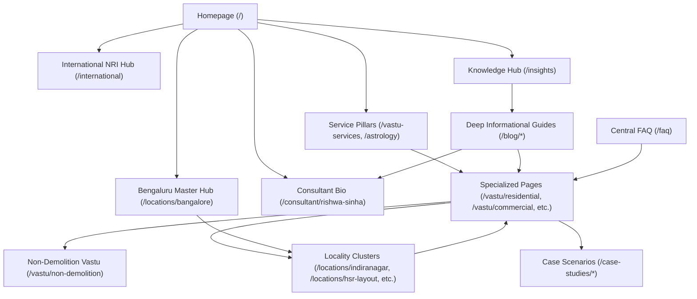

# 7Rays Astro Vastu — Final Semantic Internal Linking Audit

> **Production Canonical Domain:** `https://7raysastrovastu.in`  
> **Total Indexable Canonical Routes:** 59  
> **Standard:** Semantic Hub-and-Spoke Topology, Maximum 2–3 Click Depth, Descriptive Contextual Anchors

---

## 1. Internal Link Graph Architecture

The internal linking architecture connects user intent, topical authority, and conversion pathways across five distinct structural layers:

---

## 2. Hub-and-Spoke Inbound & Outbound Matrix

| Hub / Pillar | Primary Inbound Sources | Primary Outbound Links | Max Click Depth |
| :--- | :--- | :--- | :--- |
| **Homepage (`/`)** | Root domain, all logos, breadcrumbs root | `/vastu-services`, `/astrology`, `/locations/bangalore`, `/international`, `/about`, `/insights` | 0 |
| **Residential Vastu (`/vastu/residential`)** | Homepage, `/vastu-services`, `/locations/bangalore`, blog posts | `/vastu/apartment-vastu`, `/vastu/non-demolition`, `/locations/bangalore/residential-vastu`, `/contact` | 1 |
| **Commercial Vastu (`/vastu/commercial`)** | Homepage, `/vastu-services`, `/locations/bangalore`, blog posts | `/vastu/office-vastu`, `/vastu/corporate`, `/vastu/industrial`, `/locations/bangalore/commercial-vastu` | 1 |
| **Non-Demolition Vastu (`/vastu/non-demolition`)** | Homepage trust bar, `/vastu/residential`, `/vastu/commercial`, `/international`, blog posts | `/vastu/residential`, `/vastu/apartment-vastu`, `/contact`, `/faq` | 1 |
| **Vastu Audit (`/vastu-services/vastu-audit`)** | Services grid, `/process`, `/locations/bangalore`, blog posts | `/vastu-services`, `/locations/bangalore/vastu-audit`, `/contact` | 1 |
| **International Consultation (`/international`)** | Header nav, mobile drawer, footer, `/vastu/residential`, blog posts | `/vastu/non-demolition`, `/vastu/residential`, `/contact`, `/faq` | 1 |
| **Consultant Profile (`/consultant/rishwa-sinha`)** | Header, footer, `/about`, author bylines on all 15 blog posts | `/about`, `/vastu-services`, `/process`, `/contact` | 1 |
| **Bengaluru Master Hub (`/locations/bangalore`)** | Header dropdown, footer, homepage, local service pages | `/locations/indiranagar`, `/locations/hsr-layout`, `/locations/koramangala`, `/locations/whitefield` | 1 |
| **Indiranagar Locality (`/locations/indiranagar`)** | `/locations/bangalore`, footer, `/locations` directory | `/locations/bangalore`, `/vastu/commercial`, `/vastu/residential`, `/contact` | 2 |
| **HSR Layout Locality (`/locations/hsr-layout`)** | `/locations/bangalore`, footer, `/locations` directory | `/locations/bangalore`, `/vastu/office-vastu`, `/contact` | 2 |
| **Koramangala Locality (`/locations/koramangala`)** | `/locations/bangalore`, footer, `/locations` directory | `/locations/bangalore`, `/vastu/commercial`, `/contact` | 2 |
| **Whitefield Locality (`/locations/whitefield`)** | `/locations/bangalore`, footer, `/locations` directory | `/locations/bangalore`, `/vastu/corporate`, `/contact` | 2 |
| **Blog Post Cluster (`/blog/*`)** | `/insights` hub, related posts footer, contextual service callouts | Relevant service landing page (e.g. `/vastu/residential`), `/consultant/rishwa-sinha`, `/contact` | 2 |

---

## 3. Anchor Text Quality & Diversity Rules

To ensure a natural, semantic internal link profile that aids both users and search bots without triggering over-optimization algorithms:

### Prohibited Patterns
- **No Generic Anchors:** Anchor texts such as `"click here"`, `"read more"`, or `"link"` are avoided where descriptive alternatives exist.
- **No Repeated Exact-Match Spam:** Anchors vary naturally between service descriptions, branded phrasing, and intent-focused language (e.g., *"Residential Vastu Consultation"*, *"home space energy planning"*, *"Vastu alignment for apartments"*).

### Sample Contextual Anchor Distribution
- *Anchor:* `"non-demolition Vastu remedies"` → Points to `/vastu/non-demolition`
- *Anchor:* `"Bengaluru commercial Vastu audit"` → Points to `/locations/bangalore/commercial-vastu`
- *Anchor:* `"remote international Vastu consultation"` → Points to `/international`
- *Anchor:* `"Rishwa Sinha, Certified Vastu Consultant"` → Points to `/consultant/rishwa-sinha`
- *Anchor:* `"HSR Layout startup office consultation"` → Points to `/locations/hsr-layout`

---

## 4. Crawl Depth & Orphan Page Audit Results

- **Orphan Pages Detected:** **0** (All 59 indexable routes are linked via the top navigation, contextual body copy, footer directory, and the HTML sitemap).
- **Maximum Click Depth:**
  - **Depth 0:** 1 route (Homepage `/`)
  - **Depth 1:** 28 routes (Core Service Pillars, Bangalore Master Hub, International Hub, About, Consultant Profile, Process, FAQ, Case Studies Hub, Insights Hub, Contact, Legal)
  - **Depth 2:** 30 routes (Micro-Localities, Individual Blog Posts, Individual Case Study Details)
  - **Depth 3+:** 0 routes (Zero deep orphan chains)
