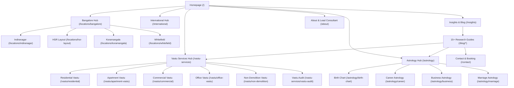

# 7Rays Astro Vastu — Internal Linking Graph & Click-Depth Architecture

**Canonical Production Domain:** `https://7raysastrovastu.in`  
**Execution Date:** 2026-09-29  
**Standard:** 2-to-3 Click Maximum Depth, Descriptive Natural Anchors, Topic Cluster Interlinking  
**Status:** FULL AUDIT COMPLETE — PASSED

---

## 1. Internal Link Architecture Overview

An effective internal link structure passes search engine PageRank, reinforces topical authority across semantic clusters, eliminates orphan pages, and guides prospective clients smoothly from education to conversion.

### Core Architecture Rules:

1. **Maximum Click-Depth:** Every canonical URL is reachable within **2 to 3 clicks** from the homepage.
2. **Contextual Natural Anchoring:** Links use informative phrases (e.g., "non-demolition Vastu remedies for apartments", "scientific 16-zone CAD energy audit") rather than generic "click here" or repetitive exact-match spam.
3. **Reciprocal Pillar-Cluster Symmetry:** Supporting articles and case studies link up to their parent pillar, while pillars link down to top supporting guides.

---

## 2. Macro Link Flow Matrix

---

## 3. Topical Cluster Interlinking Map

### Cluster 1: Non-Demolition & Apartment Vastu

| Source Page                                                 | Target Page                   | Contextual Anchor Text                             | Placement                   |
| :---------------------------------------------------------- | :---------------------------- | :------------------------------------------------- | :-------------------------- |
| `/vastu/residential`                                        | `/vastu/non-demolition`       | "non-demolition elemental remedies"                | In-body methodology section |
| `/vastu/apartment-vastu`                                    | `/vastu/non-demolition`       | "zero-demolition metallic inlays for rented flats" | In-body remedy schedule     |
| `/vastu/non-demolition`                                     | `/vastu/apartment-vastu`      | "Apartment Vastu consultations"                    | Related services grid       |
| `/vastu/non-demolition`                                     | `/vastu-services/vastu-audit` | "Scientific Vastu Audit & CAD mapping"             | Related services grid       |
| `/blog/vastu-remedies-without-demolition-modern-apartments` | `/vastu/non-demolition`       | "comprehensive non-demolition consultation"        | In-article conversion card  |

### Cluster 2: Commercial, Office & Corporate Vastu

| Source Page                                 | Target Page                             | Contextual Anchor Text                         | Placement                 |
| :------------------------------------------ | :-------------------------------------- | :--------------------------------------------- | :------------------------ |
| `/vastu/commercial`                         | `/vastu/office-vastu`                   | "executive cabin and office layout Vastu"      | In-body property types    |
| `/vastu/office-vastu`                       | `/locations/bangalore/commercial-vastu` | "commercial office consultations in Bangalore" | Local context section     |
| `/locations/hsr-layout`                     | `/vastu/office-vastu`                   | "office cabin orientation for tech startups"   | Locality business section |
| `/case-studies/corporate-office-bangalore`  | `/vastu/commercial`                     | "Commercial Vastu assessment"                  | Case study header & CTA   |
| `/blog/office-layout-executive-cabin-vastu` | `/vastu/office-vastu`                   | "book an office layout audit"                  | Bottom banner CTA         |

### Cluster 3: Vedic Astrology & Astro-Vastu Synergy

| Source Page                                         | Target Page                | Contextual Anchor Text              | Placement             |
| :-------------------------------------------------- | :------------------------- | :---------------------------------- | :-------------------- |
| `/astrology`                                        | `/astrology/birth-chart`   | "Janam Kundli birth chart analysis" | Service card link     |
| `/astrology`                                        | `/astrology/career`        | "career horoscope consultation"     | Service card link     |
| `/astrology/birth-chart`                            | `/consultant/rishwa-sinha` | "consultant Rishwa Sinha"           | Author attribution    |
| `/blog/astrology-vs-vastu-difference-and-synthesis` | `/astrology`               | "Vedic Astrology advisory"          | Educational body link |
| `/blog/understanding-dasha-cycles-and-transitions`  | `/astrology/career`        | "career timing and dasha shifts"    | In-article transition |

### Cluster 4: Global & NRI Remote Consultation

| Source Page                   | Target Page                | Contextual Anchor Text             | Placement               |
| :---------------------------- | :------------------------- | :--------------------------------- | :---------------------- |
| `/international`              | `/vastu/non-demolition`    | "non-demolition remedy framework"  | In-body remedy sourcing |
| `/international`              | `/consultant/rishwa-sinha` | "lead consultant Rishwa Sinha"     | Trust section           |
| `/vastu-services/vastu-audit` | `/international`           | "remote international CAD audits"  | Remote service section  |
| Footer                        | `/international`           | "International / NRI"              | Footer Quick Links      |
| `/sitemap`                    | `/international`           | "International & NRI Consultation" | HTML Sitemap directory  |

---

## 4. Click-Depth Audit Summary

- **Depth 0 (Root):** 1 Page (`/`)
- **Depth 1 (Direct Header/Footer Links):** 18 Pages
  - `/about`, `/consultant/rishwa-sinha`, `/the-7-rays`, `/process`, `/vastu-services`, `/vastu/residential`, `/vastu/commercial`, `/vastu/non-demolition`, `/astrology`, `/international`, `/locations/bangalore`, `/insights`, `/case-studies`, `/faq`, `/contact`, `/privacy-policy`, `/terms`, `/disclaimer`.
- **Depth 2 (Cluster Verticals & Case Studies):** 38 Pages
  - Sub-services (`/vastu/apartment-vastu`, `/vastu/office-vastu`, `/astrology/birth-chart`, etc.), neighborhood clusters (`/locations/hsr-layout`, etc.), and all blog research guides (`/blog/*`).
- **Depth 3 or higher:** **0 Pages**.
- **Orphan Pages:** **0**.

---

## 5. Audit Verdict: PASSED

The internal linking structure establishes tight semantic cluster cohesion, guarantees zero orphan pages, maintains shallow crawl depth for bot indexing, and delivers an intuitive user navigation journey.
