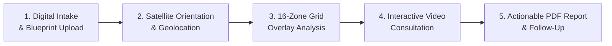

# 7Rays Astro Vastu — International & NRI SEO Architecture

> **Canonical Hub URL:** `https://7raysastrovastu.in/international`  
> **Target Audience:** Non-Resident Indians (NRIs), Overseas Property Owners, Global Expatriates, and International Clients (USA, UK, UAE, Singapore, Australia, Canada, Europe)  
> **Core Strategy:** Authority-driven Centralized Global Remote Consultation Hub without Doorway Page Spam

---

## 1. Architectural Strategy & Anti-Spam Position

Traditional international SEO often relies on mass-generating thin, programmatic city pages such as `/vastu-consultant-new-york`, `/vastu-consultant-london`, or `/vastu-consultant-dubai`. In 2026, search algorithms (Google SpamBrain, Helpful Content System) aggressively penalize sites utilizing such doorway strategies.

### The 7Rays Astro Vastu Approach:

Instead of creating dozens of low-value, duplicate landing pages with only the city name swapped:

1. **Single Centralized High-Authority Hub (`/international`):** A comprehensive, feature-rich landing page addressing the genuine technical, logistical, and architectural concerns of international clients.
2. **True Value Proposition:** Focuses on the real-world mechanics of remote spatial analysis: CAD blueprint evaluation, geographic orientation via satellite imagery, time-zone synchronized video calls, and comprehensive digital PDF reports.
3. **`.in` Domain Global Authority:** Leveraging the natural Indian ccTLD authority (`7raysastrovastu.in`) to signal authentic Vedic practitioner origin, which international diaspora audiences actively seek and trust.

---

## 2. Remote Consultation Workflow Architecture

The international consultation offering is structured into five distinct, transparent phases:

### Phase Details

#### Step 1: Digital Intake & Floor Plan Submission

- **Client Deliverables:** Architectural CAD drawings or scaled floor plans in PDF/image format.
- **Orientation Confirmation:** Client provides compass reading or magnetic declination if known.
- **Visual Context:** Video walkthrough or high-resolution photos of key zones (Entrance, Kitchen, Master Bedroom, Balconies).

#### Step 2: Satellite Geolocation & True North Verification

- **Satellite Cross-Referencing:** Verification of property orientation using Google Earth satellite mapping to calculate true geographic North versus magnetic North.
- **Environmental Scanning:** Identification of external environmental factors (high-tension power lines, water bodies, road junctions/Vithi Shoolas, surrounding high-rises).

#### Step 3: Vedic 16-Zone Energy Matrix Overlay

- **Pancha Tattva Zoning:** Superimposition of the 16 Vastu padas over the client's architectural layout.
- **Zone Energy Audit:** Systematic evaluation of elemental balance across North-East (Water/Clarity), South-East (Fire/Vitality), South-West (Earth/Stability), and North-West (Air/Movement).

#### Step 4: Time-Zone Synchronized Consultation

- **Scheduling Coordination:** Dedicated scheduling buffers accommodated across standard global time zones:
  - **North America (EST/CST/PST):** Evening IST slots aligned with US/Canada morning hours.
  - **Europe & UK (GMT/BST):** Mid-day IST slots matching European morning hours.
  - **Middle East (GST - UAE/Qatar/Oman):** Afternoon IST slots seamlessly bridging Gulf working hours.
  - **Southeast Asia & Australia (SGT/AEST):** Morning IST slots aligning with Singapore and Australian afternoons.
- **Interactive Review:** Live screen-sharing session (Zoom / Google Meet) walking the client through every zone of their property.

#### Step 5: Comprehensive Digital Remediation Report

- **Written Deliverable:** Detailed, illustrated PDF report documenting all observed spatial imbalances.
- **Non-Demolition Remedies:** Prescriptions utilizing elemental metal rods/strips (copper, brass, aluminum), semi-precious crystals, lighting adjustments, and color therapy easily obtainable in overseas retail markets.
- **Complimentary Verification:** One round of follow-up blueprint review after remedies are installed.

---

## 3. Global NRI Search Intent Matrix

| Target Market            | Diaspora Hubs                                        | Primary Property Typology                               | Unique Client Concern                                                                  | Strategic Content Response                                                                                                            |
| :----------------------- | :--------------------------------------------------- | :------------------------------------------------------ | :------------------------------------------------------------------------------------- | :------------------------------------------------------------------------------------------------------------------------------------ |
| **United States**        | Bay Area (CA), Dallas (TX), New Jersey, Seattle (WA) | Single-family detached homes, townhouses                | Wooden frame construction, basements, HVAC placement, septic tank locations            | Specialized guidance on timber construction Vastu, North-East basement energy balancing, and furnace placement in Agni corner.        |
| **United Arab Emirates** | Dubai, Abu Dhabi, Sharjah                            | Luxury high-rise apartments, off-plan villa communities | Fixed developer layouts, no structural modification allowed, glass facade orientations | Non-demolition remedies using brass floor dividers, threshold energizers, and balancing high solar heat gain in South/West quadrants. |
| **United Kingdom**       | Greater London, Birmingham, Manchester               | Victorian/Edwardian terraced houses, modern urban flats | Party walls, dampness/basements, irregular room shapes, combined bathroom-toilets      | Correcting irregular room geometries with metallic boundary strips and neutralizing center-of-home (Brahma Sthan) staircases.         |
| **Singapore**            | Tampines, Jurong, Bukit Timah                        | HDB flats, private condominiums, cluster housing        | High-density living, common corridor entrance doors, strict building management rules  | Subtle internal threshold corrections, balcony energy channels, and non-invasive elemental color zoning.                              |
| **Australia**            | Sydney, Melbourne, Brisbane                          | Single-storey suburban houses, modern townhomes         | Southern Hemisphere directional dynamics, reverse solar trajectories                   | Clarification on geomagnetic vs. solar Vastu principles, ensuring correct orientation standards applied globally.                     |

---

## 4. International Technical SEO & Meta Specifications

### Canonical URL

`https://7raysastrovastu.in/international`

### SEO Metadata

- **Meta Title:** International & NRI Vastu Consultation Online | 7Rays Astro Vastu
- **Meta Description:** Professional online Vastu consultation for NRIs and global property owners in USA, UK, UAE, Singapore & Australia. CAD blueprint analysis, video sessions & non-demolition remedies.
- **H1 Heading:** International & NRI Remote Vastu Consultation
- **Language / Hreflang Policy:** Standard English (`en-IN` as default with global accessibility). No unnecessary multi-lingual doorway subdomains (`en-us`, `en-gb`) until regional physical representation or localized currency checkout is established.

### Structured Data (JSON-LD)

- Enforces `@type: Service` with `serviceType: "Remote Vastu Consultation"`
- Explicit `areaServed`: `[{"@type": "Country", "name": "United States"}, {"@type": "Country", "name": "United Kingdom"}, {"@type": "Country", "name": "United Arab Emirates"}, {"@type": "Country", "name": "Singapore"}, {"@type": "Country", "name": "Australia"}, {"@type": "Country", "name": "Canada"}]`
- `availableChannel`: Online video conferencing (`Zoom`, `Google Meet`)
- Provider linked to authoritative `Organization` and `Person` (Rishwa Sinha).

---

## 5. Prevention of Thin International Doorway Pages

The project adheres to the following strict governance rules:

1. **No URL Generation by Country Name:** URLs like `/vastu-usa/` or `/vastu-dubai/` are strictly disallowed unless distinct physical offices, local phone numbers, or localized commercial entities are registered.
2. **Centralized Query Capture:** All international search queries resolve to `/international`, concentrating page rank and building authentic topical depth.
3. **Transparent Advisory Scope:** Clearly states consultation pricing is customized based on square footage and property scope, with straightforward international wire / UPI / digital payment options communicated upon inquiry.
