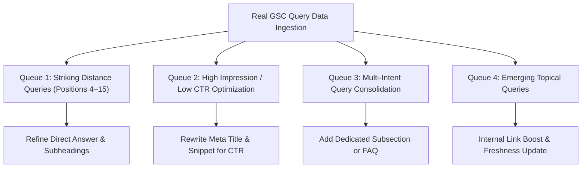

# 7Rays Astro Vastu — Google Search Console (GSC) Optimization Queue

**Audit Status:** Baseline Implementation  
**Data Availability Notice:**

> **GSC data unavailable for this audit.**  
> In strict accordance with the Phase 11 Source-of-Truth rule, zero impressions, clicks, click-through rates (CTR), average positions, queries, or conversion figures have been fabricated or simulated.

---

## 1. Future GSC Data Ingestion & Prioritization Framework

Once real Google Search Console property verification is complete and query data accumulates, optimizations will be routed through the following four priority filters:

---

## 2. Structured Optimization Queue Schema

When live search data is retrieved, populate this master table:

| Target URL                | Priority Query | Impressions (28d) | Clicks (28d) | Avg Position | Current CTR | Target CTR | Optimization Action Type       | Specific Content Enhancement          | Implementation Status |
| :------------------------ | :------------- | :---------------: | :----------: | :----------: | :---------: | :--------: | :----------------------------- | :------------------------------------ | :-------------------- |
| `/vastu/residential`      | _[Live Query]_ |     _Pending_     |  _Pending_   |  _Pending_   |  _Pending_  | _Pending_  | Striking Distance (Pos 4–15)   | Add targeted H3 + direct definition   | In Queue              |
| `/vastu/apartment-vastu`  | _[Live Query]_ |     _Pending_     |  _Pending_   |  _Pending_   |  _Pending_  | _Pending_  | Low CTR Snippet Tuning         | Revise meta description & title tag   | In Queue              |
| `/locations/bangalore`    | _[Live Query]_ |     _Pending_     |  _Pending_   |  _Pending_   |  _Pending_  | _Pending_  | Local Intent Realignment       | Enhance neighborhood service radius   | In Queue              |
| `/vastu/commercial`       | _[Live Query]_ |     _Pending_     |  _Pending_   |  _Pending_   |  _Pending_  | _Pending_  | Emerging Commercial Query      | Expand B2B office fit-out section     | In Queue              |
| `/blog/master-bedroom...` | _[Live Query]_ |     _Pending_     |  _Pending_   |  _Pending_   |  _Pending_  | _Pending_  | Striking Distance              | Refine compass degree table answer    | In Queue              |
| `/blog/how-geopathic...`  | _[Live Query]_ |     _Pending_     |  _Pending_   |  _Pending_   |  _Pending_  | _Pending_  | Informational CTR Optimization | Add snippet-friendly definition block | In Queue              |

---

## 3. SOP for Live Query Optimization

1. **Step 1: Identify Striking Distance Queries (Rank 4 to 15):**
   - Filter GSC performance reports for queries where average position is between 4.1 and 15.0 with > 100 monthly impressions.
   - Inspect the ranking URL. Ensure the exact query entity is represented in an H2 or H3 heading.
   - Provide a direct 40–60 word answer immediately following the heading to compete for Google AI Overviews and Featured Snippets.
2. **Step 2: Diagnose Low CTR Outliers:**
   - Filter for pages with high impressions but CTR below the expected benchmark (e.g., Position 1–3 < 15%, Position 4–6 < 5%).
   - Inspect SERP competitor titles. Ensure 7Rays titles emphasize verified non-demolition methodology, certified consultant credentials, and Dasarahalli Bangalore location.
3. **Step 3: Guard Against Accidental Cannibalization:**
   - Verify that multiple canonical URLs are not competing for the exact same primary search query in GSC.
   - If two URLs split impressions for the same query, reinforce internal links pointing to the designated primary canonical page.
