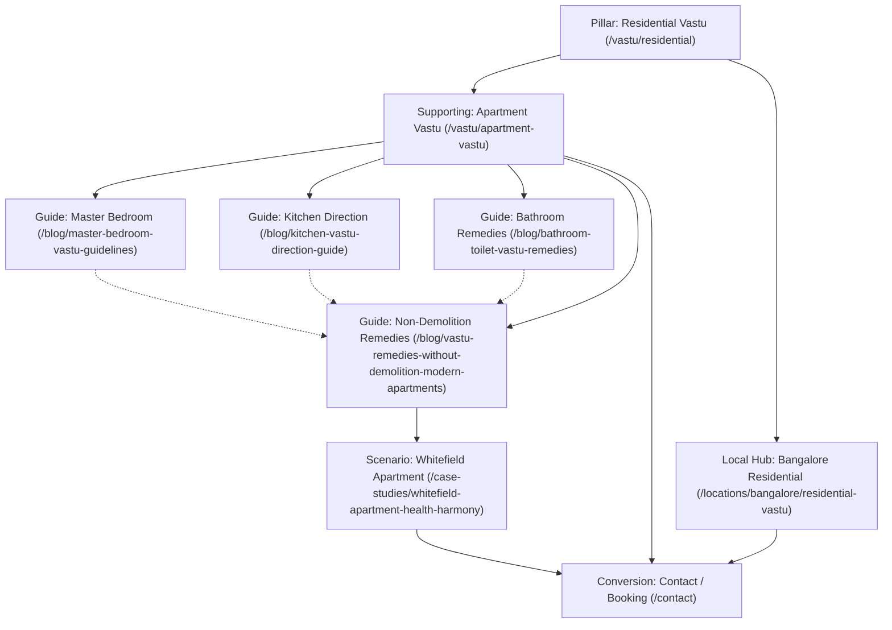
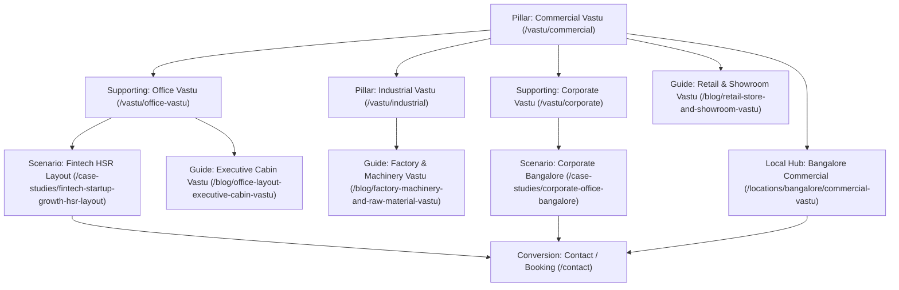
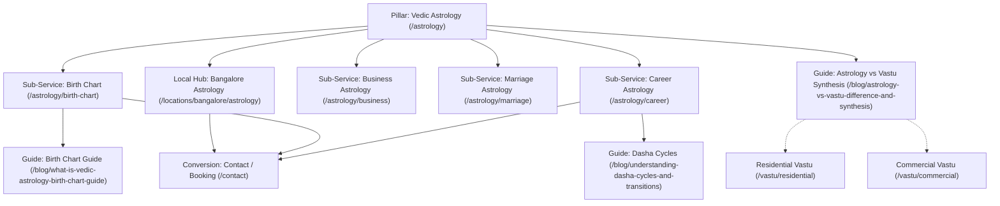
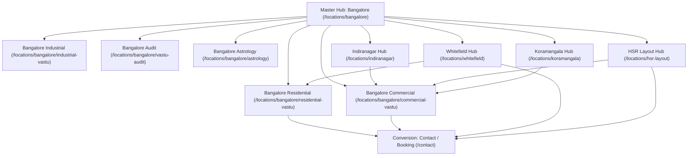

# 7Rays Astro Vastu — Internal Topic Graph & Semantic Linking Architecture

**Document Purpose:** Defines the multi-directional semantic internal linking graph across all 58 canonical URLs. Establishes explicit hierarchical (upward), contextual (sideways), localized (geographic), and commercial (conversion) pathways without repetitive exact-match link stuffing.

---

## 1. Linking Philosophy & Standards

To build topical authority that search engines and AI answer engines can crawl seamlessly, each tier of content enforces four connection vectors:

1. **Upward Link (Pillar Anchor):** Directs link equity back to the topical pillar or hub.
2. **Sideways Link (Cluster Relevance):** Connects closely related topics within the same domain (e.g., Master Bedroom to Kitchen Vastu).
3. **Local Link (Geographic Entity):** Bridges general concepts to Bangalore-specific architectural applications where relevant.
4. **Conversion Link (Transaction Path):** Natural, non-aggressive CTA directing interested users to relevant service booking or contact inquiry.

---

## 2. Topic Cluster Graphs

### Cluster A: Residential Vastu Architecture

#### Detailed Link Routing Table — Residential Cluster:

| Source Page                                                 | Upward Pillar Link   | Sideways / Cluster Links                                                                            | Bangalore / Local Link                   | Conversion / Service Link                                |
| :---------------------------------------------------------- | :------------------- | :-------------------------------------------------------------------------------------------------- | :--------------------------------------- | :------------------------------------------------------- |
| `/vastu/residential`                                        | `/vastu-services`    | `/vastu/apartment-vastu`, `/vastu-services/vastu-audit`                                             | `/locations/bangalore/residential-vastu` | `/contact` ("Book a Residential Vastu Audit")            |
| `/vastu/apartment-vastu`                                    | `/vastu/residential` | `/blog/vastu-remedies-without-demolition-modern-apartments`, `/blog/bathroom-toilet-vastu-remedies` | `/locations/whitefield`                  | `/contact` ("Request Apartment Assessment")              |
| `/blog/master-bedroom-vastu-guidelines`                     | `/vastu/residential` | `/blog/how-geopathic-stress-causes-insomnia-and-fatigue`, `/blog/kitchen-vastu-direction-guide`     | `/locations/bangalore/residential-vastu` | `/vastu/residential` ("Explore Full Residential Vastu")  |
| `/blog/kitchen-vastu-direction-guide`                       | `/vastu/residential` | `/blog/bathroom-toilet-vastu-remedies`, `/blog/north-facing-house-vastu-plan`                       | `/locations/bangalore`                   | `/vastu/residential` ("Schedule a Kitchen Consultation") |
| `/blog/bathroom-toilet-vastu-remedies`                      | `/vastu/residential` | `/blog/vastu-remedies-without-demolition-modern-apartments`                                         | `/locations/bangalore/vastu-audit`       | `/vastu/apartment-vastu` ("View Apartment Remedies")     |
| `/blog/vastu-remedies-without-demolition-modern-apartments` | `/vastu/residential` | `/case-studies/whitefield-apartment-health-harmony`, `/vastu/apartment-vastu`                       | `/locations/bangalore/residential-vastu` | `/process` ("Review Our Non-Demolition Process")         |

---

### Cluster B: Commercial & Workplace Vastu Architecture

#### Detailed Link Routing Table — Commercial Cluster:

| Source Page                                 | Upward Pillar Link  | Sideways / Cluster Links                                                                       | Bangalore / Local Link                  | Conversion / Service Link                            |
| :------------------------------------------ | :------------------ | :--------------------------------------------------------------------------------------------- | :-------------------------------------- | :--------------------------------------------------- |
| `/vastu/commercial`                         | `/vastu-services`   | `/vastu/office-vastu`, `/vastu/corporate`, `/vastu/industrial`                                 | `/locations/bangalore/commercial-vastu` | `/contact` ("Consult for Commercial Premises")       |
| `/vastu/office-vastu`                       | `/vastu/commercial` | `/blog/office-layout-executive-cabin-vastu`, `/case-studies/fintech-startup-growth-hsr-layout` | `/locations/hsr-layout`                 | `/contact` ("Book Workplace Assessment")             |
| `/vastu/corporate`                          | `/vastu/commercial` | `/case-studies/corporate-office-bangalore`, `/vastu/office-vastu`                              | `/locations/koramangala`                | `/process` ("Explore Corporate Audit Methodology")   |
| `/vastu/industrial`                         | `/vastu-services`   | `/blog/factory-machinery-and-raw-material-vastu`, `/vastu-services/vastu-audit`                | `/locations/bangalore/industrial-vastu` | `/contact` ("Schedule Industrial Site Audit")        |
| `/blog/office-layout-executive-cabin-vastu` | `/vastu/commercial` | `/vastu/office-vastu`, `/case-studies/corporate-office-bangalore`                              | `/locations/bangalore/commercial-vastu` | `/vastu/office-vastu` ("View Office Vastu Services") |
| `/blog/retail-store-and-showroom-vastu`     | `/vastu/commercial` | `/case-studies/commercial-space-hyderabad`                                                     | `/locations/indiranagar`                | `/vastu/commercial` ("Commercial Retail Guidance")   |

---

### Cluster C: Vedic Astrology & Astro-Vastu Synthesis

#### Detailed Link Routing Table — Astrology Cluster:

| Source Page                                         | Upward Pillar Link | Sideways / Cluster Links                                                                                  | Bangalore / Local Link                  | Conversion / Service Link                              |
| :-------------------------------------------------- | :----------------- | :-------------------------------------------------------------------------------------------------------- | :-------------------------------------- | :----------------------------------------------------- |
| `/astrology`                                        | `/` (Home)         | `/astrology/birth-chart`, `/astrology/career`, `/astrology/business`                                      | `/locations/bangalore/astrology`        | `/contact` ("Schedule Astrology Reading")              |
| `/astrology/birth-chart`                            | `/astrology`       | `/blog/what-is-vedic-astrology-birth-chart-guide`, `/astrology/career`                                    | `/locations/bangalore/astrology`        | `/contact` ("Book Birth Chart Consultation")           |
| `/astrology/career`                                 | `/astrology`       | `/blog/career-astrology-professional-path-guidelines`, `/blog/understanding-dasha-cycles-and-transitions` | `/locations/bangalore/astrology`        | `/contact` ("Consult on Career Timing")                |
| `/astrology/business`                               | `/astrology`       | `/vastu/commercial`, `/astrology/career`                                                                  | `/locations/bangalore/commercial-vastu` | `/contact` ("Book Business Astrology Session")         |
| `/astrology/marriage`                               | `/astrology`       | `/astrology/birth-chart`, `/vastu/residential`                                                            | `/locations/bangalore/astrology`        | `/contact` ("Relationship Compatibility Consultation") |
| `/blog/astrology-vs-vastu-difference-and-synthesis` | `/astrology`       | `/vastu/residential`, `/vastu/commercial`                                                                 | `/locations/bangalore`                  | `/about` ("Learn About Rishwa's Dual Approach")        |

---

### Cluster D: Bangalore Local Authority & Neighborhood Mesh

---

## 3. Natural Anchor Text Rules

To avoid mechanical SEO over-optimization and unnatural repetition, anchor text MUST follow descriptive natural variation:

| Target Page                             | Prohibited Anchors (Repetitive Spam)                               | Permitted Natural Semantic Anchors                                                                                                                      |
| :-------------------------------------- | :----------------------------------------------------------------- | :------------------------------------------------------------------------------------------------------------------------------------------------------ |
| `/vastu/residential`                    | "residential vastu", "vastu residential"                           | "our comprehensive residential Vastu consultation", "Vastu guidelines for homes and villas", "evaluating residential spatial alignment"                 |
| `/vastu/apartment-vastu`                | "apartment vastu", "vastu for apartments"                          | "practical Vastu solutions for high-rise apartments", "navigating shared wall and apartment constraints", "our non-demolition flat assessment protocol" |
| `/locations/bangalore`                  | "best vastu consultant in bangalore", "vastu consultant bangalore" | "our Bangalore consultation headquarters in Dasarahalli", "on-site Vastu assessments across Bengaluru", "consulting with our Bangalore-based team"      |
| `/blog/master-bedroom-vastu-guidelines` | "master bedroom vastu", "bedroom vastu tips"                       | "in-depth master bedroom directional guidelines", "Southwest bedroom orientation rules", "our guide to restful bedroom spatial alignment"               |
| `/contact`                              | "click here", "contact us now"                                     | "book a professional Vastu audit", "schedule an on-site spatial assessment", "connect with certified consultant Rishwa Sinha"                           |
