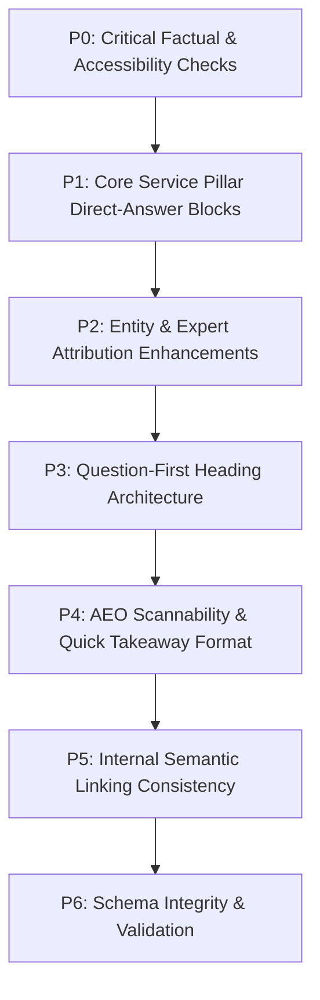

# 7Rays Astro Vastu — Phase 12 Content & AEO Implementation Plan

**Document Date:** September 2026  
**Auditor:** Antigravity AI Engine  
**Objective:** Prioritized execution roadmap for implementing Answer Engine Optimization (AEO), direct-answer blocks, entity clarity enhancements, and question-first headings across key pages on `7raysastrovastu.com`.

---

## 1. Priority Implementation Hierarchy

---

## 2. Detailed Task Breakdown by Priority Tier

### Priority P0: Critical Factual, Claim & Accessibility Safeguards

- **Scope:** Verify that all textual answers distinguish traditional Vastu/astrology concepts from empirical facts.
- **Tasks:**
  - Verify zero causal/medical claims across all modified files.
  - Confirm crawlability: ensure all critical direct answers are present directly in indexable HTML (not trapped behind closed tabs or modals).
  - Verify that `dist/robots.txt` and `dist/sitemap.xml` are intact and unblocked for search engine crawlers.

### Priority P1: Important Pages Lacking High-Visibility Direct Answers

- **Scope:** Add concise, self-contained direct answer blocks (`"At a Glance / Direct Answer"`) within the opening sections of key service pillars.
- **Target Pages:**
  1. `/vastu/office-vastu` (`OfficeVastuPage.tsx`): Direct answer on workplace seating, team pod orientation, and founder cabins.
  2. `/vastu/apartment-vastu` (`ApartmentVastuPage.tsx`): Direct answer on non-demolition remedies, shared shear walls, and common plumbing shafts.
  3. `/vastu/industrial` (`IndustrialVastuPage.tsx`): Direct answer on factory machinery weighting (Southwest) and logistics dispatch (Northwest).
  4. `/vastu-services/vastu-audit` (`VastuAuditPage.tsx`): Direct answer on what an electronic on-site audit involves (digital compass, Gauss meter).
  5. `/astrology` (`AstrologyPage.tsx`): Direct answer on Vedic astrology as an ethical timing and self-awareness counseling framework.

### Priority P2: Entity & Expert Attribution Improvements

- **Scope:** Ensure consistent brand and person naming across all surfaces.
- **Tasks:**
  - Brand identity strictly maintained as `7Rays Astro Vastu`.
  - Expert attribution consistently formatted as `Rishwa Sinha, Certified Vastu Consultant (5+ years experience)`.
  - Organization headquarters anchored consistently at `Dasarahalli, Bengaluru, Karnataka 560024`.

### Priority P3: Question Architecture & Natural Query Headings

- **Scope:** Ensure major headings are framed as natural user questions rather than dry keyword labels.
- **Examples:**
  - _"How does an on-site Vastu energy audit work?"_ (instead of _"Audit Process"_)
  - _"Can an existing apartment be remediated without demolition?"_ (instead of _"Remedies Overview"_)
  - _"Where should the founder and finance teams sit in an office?"_ (instead of _"Office Zones"_)

### Priority P4: AEO Formatting & Quick Scannability

- **Scope:** Provide bulleted takeaways, checklists, and concise procedural steps following every direct answer.
- **Tasks:**
  - Ensure answers are 40–60 words long, self-contained, and easily extractable by AI Overviews and featured snippets.
  - Avoid excessive fragmentation or unnatural robotic phrasing.

### Priority P5: Internal Semantic Linking

- **Scope:** Reinforce the topic graph from `PHASE_11_INTERNAL_TOPIC_GRAPH.md` without link stuffing.
- **Tasks:**
  - Verify that newly added direct answers link contextually to deep-dive guides and local hubs.
  - Maintain natural anchor text variations.

### Priority P6: Schema Consistency

- **Scope:** Audit JSON-LD across all pages.
- **Tasks:**
  - Confirm stable `@id` entity URIs (`#organization`, `#rishwa-sinha`, `#localbusiness`, `#website`).
  - Confirm zero `Review`, `AggregateRating`, or fabricated `CaseStudy` schema.
  - Verify `ServiceSchema`, `LocalBusinessSchema`, `PersonSchema`, and `BreadcrumbSchema` validity.
