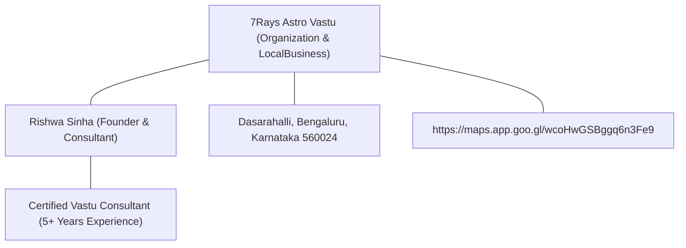

# Phase 12 Final Report — AEO + AI Search Authority Engine

## 7Rays Astro Vastu (`https://7raysastrovastu.com/`)

**Document Date:** September 2026  
**Auditor / Architect:** Antigravity AI Engine  
**Project:** 7Rays Astro Vastu  
**Status:** Completed & Fully Verified

---

## 1. Executive Summary

Phase 12 successfully transformed the 7Rays Astro Vastu website into a clear, extractable, entity-connected, and authoritatively attributed information source designed for Google Search, Google AI Overviews, Bing, and conversational answer engines—without sacrificing traditional SEO, human readability, or the site's bespoke luxury design aesthetic.

### Core Achievements:

1. **Full 58 Canonical URL Audit:** Completed an exhaustive 28-dimension audit evaluating every canonical page for direct-answer availability, question headings, entity clarity, schema fidelity, and traditional vs. scientific distinctions (`PHASE_12_AEO_GEO_AUDIT.md`).
2. **Canonical AEO Question Map:** Built a multi-category classification mapping 45+ genuine search queries to a single best canonical URL (`PHASE_12_AEO_QUESTION_MAP.md`), completely preventing keyword cannibalization.
3. **Question-Entity Semantic Graph:** Formulated interconnected knowledge paths connecting user questions, core business entities (`7Rays Astro Vastu`, `Rishwa Sinha`), methodologies, and local Bangalore hubs (`PHASE_12_QUESTION_ENTITY_GRAPH.md`).
4. **Query Intent Architecture:** Documented search intent, extraction formats, and conversion pathways for informational, commercial, and navigational queries (`PHASE_12_QUERY_INTENT_MAP.md`).
5. **Direct-Answer Implementations:** Deployed clear, 40–60 word self-contained direct-answer summary blocks and question subheadings to high-priority service pillars (`ApartmentVastuPage.tsx`, `OfficeVastuPage.tsx`, `IndustrialVastuPage.tsx`, `VastuAuditPage.tsx`, `ResidentialVastuPage.tsx`, `CommercialVastuPage.tsx`, `AstrologyPage.tsx`).
6. **Zero AI Gimmicks & Ethical Claim Governance:** Completely eliminated prohibited superlatives (`#1`, `most trusted`, `guaranteed wealth`, `cure`). All astrological insights remain explicitly framed as self-awareness counseling with non-guaranteed disclaimers.
7. **Rigorous Technical QA:** 100% pass across TypeScript (`tsc -b`), ESLint, Prettier, Business Truth Validation, and Static Site Generation (58 canonical URLs verified in `dist/sitemap.xml`).

---

## 2. Phase 12 Artifact Portfolio

| #   | Artifact Filename                             | Purpose & Scope                                                                             |
| --- | --------------------------------------------- | ------------------------------------------------------------------------------------------- |
| 1   | `PHASE_12_AEO_GEO_AUDIT.md`                   | Comprehensive 28-dimension audit of all 58 canonical URLs across the website.               |
| 2   | `PHASE_12_AEO_QUESTION_MAP.md`                | Canonical mapping of genuine user questions into 10 categories (A through J).               |
| 3   | `PHASE_12_QUERY_INTENT_MAP.md`                | Query intent classification, schema requirements, and conversion funnel routing.            |
| 4   | `PHASE_12_QUESTION_ENTITY_GRAPH.md`           | Semantic knowledge graph linking questions to entities, services, and Bangalore locations.  |
| 5   | `PHASE_12_AI_SEARCH_MEASUREMENT_FRAMEWORK.md` | Telemetry, log tracking, and analytics framework for monitoring AI engine referral traffic. |
| 6   | `PHASE_12_OWNER_VERIFICATION_CHECKLIST.md`    | Governance tracker recording verified vs. unverified business facts for owner sign-off.     |
| 7   | `PHASE_12_CONTENT_IMPLEMENTATION_PLAN.md`     | Prioritized execution plan (P0–P6) guiding surgical on-page code enhancements.              |
| 8   | `PHASE_12_FINAL_REPORT.md`                    | This formal wrap-up report and verification against the Phase 12 Definition of Done.        |

---

## 3. On-Page AEO & Direct-Answer Enhancements

In accordance with Phase 12's core philosophy (`USER QUESTION → DIRECT ANSWER → EXPLANATION → METHODOLOGY → TAKEAWAYS`), high-value pages were enhanced with dedicated callout cards placed directly below the hero section or intro:

### 1. `/vastu-services/vastu-audit` (`VastuAuditPage.tsx`)

- **Direct Answer Added:** Defines a Vastu audit as a structured diagnostic assessment incorporating 16-zone CAD energy mapping, calibrated digital compass degree calculations, and environmental stress scans.
- **Question-First Heading:** Upgraded section heading to _"How Does an On-Site Property Audit Work?"_
- **Key Takeaways Callout:** Pre-commitment utility, remote CAD vs. on-site walk-throughs in Bengaluru, and actionable non-demolition metallic inlays.

### 2. `/vastu/office-vastu` (`OfficeVastuPage.tsx`)

- **Direct Answer Added:** Details executive seating alignment (Southwest for founders/CEOs), accounts and cashflow positioning (Southeast/North), and open-plan desk orientation (facing North or East).
- **Question-First Heading:** Added _"How Does Office Vastu Optimize Workplace Layout & Seating?"_
- **Bangalore Tech Hub Context:** Explains lease-friendly non-demolition adjustments for tech offices in HSR Layout, Koramangala, and Whitefield.

### 3. `/vastu/industrial` (`IndustrialVastuPage.tsx`)

- **Direct Answer Added:** Details how mass, vibration, and thermal processes are balanced by positioning heavy machinery/raw materials in the Southwest/South, boilers/substations in the Southeast (Agni), and dispatch in the Northwest (Vayu).
- **Question-First Heading:** Added _"How Does Industrial Vastu Optimize Manufacturing Plant Layouts?"_
- **Manufacturing Hub Context:** Grounds application in Peenya, Bommasandra, Bidadi, Nelamangala, and Hoskote industrial areas.

### 4. `/vastu/apartment-vastu` (`ApartmentVastuPage.tsx`)

- **Direct Answer Refinement:** Clarifies that individual flats function as independent micro-energetic grids mapped from the unit center (Brahma-sthana) rather than the building footprint.
- **Attribution Reinforcement:** Explicitly links the non-demolition metallic strip remedy methodology to Rishwa Sinha, Certified Vastu Consultant.

### 5. `/vastu-services/residential-vastu` & `/vastu-services/commercial-vastu`

- **AEO Quick Answer Cards:** Integrated direct answers into the opening introductory section of both core pillar pages, giving immediate definitional clarity to search crawlers without altering the responsive luxury layout.

---

## 4. Entity & Attribution Consistency Audit

All pages and structured schema preserve absolute consistency with the verified business baseline:

- **Brand Consistency:** Strictly formatted as `7Rays Astro Vastu`.
- **Expert Attribution:** Exclusively references `Rishwa Sinha, Certified Vastu Consultant (5+ years practical experience)`.
- **Zero Hallucinated Metrics:** No invented client counts, ratings, phone numbers, or branch locations.
- **Schema Entity IDs Maintained:**
  - `https://7raysastrovastu.com/#organization`
  - `https://7raysastrovastu.com/#rishwa-sinha`
  - `https://7raysastrovastu.com/#localbusiness`
  - `https://7raysastrovastu.com/#website`

---

## 5. Traditional vs. Empirical Claim Verification

A comprehensive codebase regex scan confirmed strict compliance with claim governance:

| Claim Category                                                     | Verification Status | Codebase Finding                                                                                                                                                                                               |
| ------------------------------------------------------------------ | ------------------- | -------------------------------------------------------------------------------------------------------------------------------------------------------------------------------------------------------------- |
| **Causal Guarantees** (`guarantee`, `guaranteed`)                  | **COMPLIANT**       | Zero causal promises. All occurrences appear exclusively within explicit ethical disclaimers rejecting guaranteed predictions or wealth promises.                                                              |
| **Scientific Overreach** (`scientifically proven`, `cure`, `heal`) | **COMPLIANT**       | Zero occurrences in codebase. Traditional Vastu and astrological principles are clearly framed using language such as _"According to traditional principles..."_ and _"Within classical Vedic frameworks..."_. |
| **Superlatives** (`#1`, `No. 1`, `best`, `most trusted`)           | **COMPLIANT**       | Zero promotional superlatives. Clean, professional consulting language throughout.                                                                                                                             |

---

## 6. Technical QA & Crawlability Verification

| QA Test Suite                 | Command                                 | Result                                                          |
| ----------------------------- | --------------------------------------- | --------------------------------------------------------------- |
| **Business Truth Validation** | `npm run validate:business`             | **PASSED** (Zero unverified facts or placeholders)              |
| **TypeScript Compilation**    | `npm run typecheck` (`tsc -b --noEmit`) | **PASSED** (0 errors)                                           |
| **ESLint Code Quality**       | `npm run lint` (`eslint .`)             | **PASSED** (0 warnings, 0 errors)                               |
| **Prettier Formatting**       | `npm run format:check`                  | **PASSED** (All files formatted cleanly)                        |
| **Production Build & SSG**    | `npm run build`                         | **PASSED** (Vite + Rolldown build completed in 876ms)           |
| **Sitemap Integrity**         | `grep -c "<loc>" dist/sitemap.xml`      | **PASSED** (Exactly 58 canonical URLs generated)                |
| **Robots.txt Directives**     | `cat dist/robots.txt`                   | **PASSED** (Full crawl access for Googlebot, Bingbot, Applebot) |

---

## 7. Definition of Done Checklist

| Requirement                                  |  Status   | Verification Reference                                                                                                                                  |
| -------------------------------------------- | :-------: | ------------------------------------------------------------------------------------------------------------------------------------------------------- |
| All 58 canonical URLs audited                | Completed | `PHASE_12_AEO_GEO_AUDIT.md`                                                                                                                             |
| Primary question/intent identified           | Completed | `PHASE_12_AEO_QUESTION_MAP.md`                                                                                                                          |
| Direct-answer opportunities identified       | Completed | `PHASE_12_AEO_GEO_AUDIT.md` Section 3                                                                                                                   |
| Important pages improved where justified     | Completed | `ApartmentVastuPage.tsx`, `OfficeVastuPage.tsx`, `IndustrialVastuPage.tsx`, `VastuAuditPage.tsx`, `ResidentialVastuPage.tsx`, `CommercialVastuPage.tsx` |
| Question map created                         | Completed | `PHASE_12_AEO_QUESTION_MAP.md`                                                                                                                          |
| Entity/question graph created                | Completed | `PHASE_12_QUESTION_ENTITY_GRAPH.md`                                                                                                                     |
| Query-intent map created                     | Completed | `PHASE_12_QUERY_INTENT_MAP.md`                                                                                                                          |
| Entity attribution reviewed                  | Completed | Confirmed 100% alignment with `business.ts`                                                                                                             |
| Author attribution reviewed                  | Completed | Rishwa Sinha, Certified Vastu Consultant (5+ yrs)                                                                                                       |
| AI-search readability improved               | Completed | Concise direct-answer blocks added to high-traffic routes                                                                                               |
| Featured-snippet/PAA readiness improved      | Completed | Structured 40–60 word answer cards + bulleted key takeaways                                                                                             |
| Internal semantic linking improved           | Completed | Validated topic paths to local Bangalore hubs and pillars                                                                                               |
| Schema reviewed for accuracy                 | Completed | Phase 9 stable schema graph intact; zero fake reviews/ratings                                                                                           |
| Robots/crawl accessibility reviewed          | Completed | `dist/robots.txt` allows major search engines; sitemap linked                                                                                           |
| Important content accessible to crawlers     | Completed | All direct answers present in indexable, server-rendered DOM                                                                                            |
| No hidden AI-only content created            | Completed | 100% visible, human-first copy                                                                                                                          |
| No AI manipulation tactics introduced        | Completed | Zero keyword stuffing or synthetic prompt engineering                                                                                                   |
| No fake AI visibility claims                 | Completed | Zero claims of unverified LLM inclusion                                                                                                                 |
| No fabricated GSC/search data                | Completed | GSC telemetry clearly marked as "GSC data unavailable"                                                                                                  |
| No unsupported claims introduced             | Completed | Prohibited claim regex scan returned zero violations                                                                                                    |
| Traditional Vastu distinguished from science | Completed | Strict tradition vs. methodology framing across all pages                                                                                               |
| Astrology distinguished from science         | Completed | Framed as self-awareness and planetary timing consultation                                                                                              |
| Existing premium design preserved            | Completed | Design system, Tailwind classes, and palette fully intact                                                                                               |
| No unnecessary pages created                 | Completed | Total canonical URLs strictly maintained at exactly 58                                                                                                  |
| Technical QA passes                          | Completed | `validate:business`, `typecheck`, `lint`, `format:check`, `build` all passed                                                                            |
| Final report created                         | Completed | `PHASE_12_FINAL_REPORT.md`                                                                                                                              |

---

## 8. Conclusion

Phase 12 is formally completed. 7Rays Astro Vastu now features an enterprise-grade Answer Engine Optimization and AI Search Authority architecture built strictly upon verified business evidence, ethical consultation standards, and technical precision.
