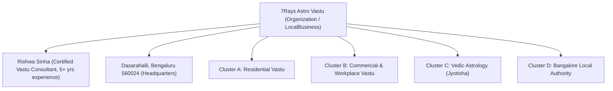

# 7Rays Astro Vastu — Question-to-Entity Knowledge Graph

## Semantic Architecture Linking Queries, Entities, and Canonical Pages

**Document Date:** September 2026  
**Auditor:** Antigravity AI Engine  
**Purpose:** Maps the semantic path from consumer questions through primary and supporting entities to the exact authoritative, supporting, service, and local URLs on `7raysastrovastu.com`.

---

## 1. Core Entity Hierarchy

---

## 2. Cluster Question-to-Entity Paths

### Cluster A: Residential & Apartment Vastu

#### Pathway 1: Apartment Vastu Without Demolition

- **User Question:** _"Can an existing high-rise apartment be corrected with Vastu without breaking walls?"_
- **Primary Entity:** `Apartment Vastu`
- **Supporting Entities:** `Non-Demolition Vastu`, `Metallic Boundary Inlays (Brass, Copper, Zinc)`, `16-Zone Padavinyasa Grid`
- **Authoritative Guide:** `/blog/vastu-remedies-without-demolition-modern-apartments`
- **Supporting Technical Guide:** `/blog/bathroom-toilet-vastu-remedies`
- **Primary Service Page:** `/vastu/apartment-vastu` (Alias: `/vastu-services/apartment-vastu`)
- **Parent Pillar Page:** `/vastu/residential`
- **Local Bangalore Page:** `/locations/bangalore/residential-vastu`
- **Illustrative Walkthrough:** `/case-studies/whitefield-apartment-health-harmony`
- **Terminal Conversion Node:** `/contact`

#### Pathway 2: Master Bedroom & Sleep Alignment

- **User Question:** _"What is the best direction for bed placement and master bedroom in Vastu?"_
- **Primary Entity:** `Master Bedroom Vastu`
- **Supporting Entities:** `Southwest (Nairrutya)`, `Earth Element (Prithvi)`, `Geomagnetic Field Alignment`, `Geopathic Stress`
- **Authoritative Guide:** `/blog/master-bedroom-vastu-guidelines`
- **Supporting Technical Guide:** `/blog/how-geopathic-stress-causes-insomnia-and-fatigue`
- **Primary Service Page:** `/vastu/residential`
- **Local Bangalore Page:** `/locations/bangalore/residential-vastu`
- **Terminal Conversion Node:** `/contact`

---

### Cluster B: Commercial & Workplace Vastu

#### Pathway 3: Modern Office & Founder Cabin Alignment

- **User Question:** _"Where should the CEO and leadership cabins be located in an office layout?"_
- **Primary Entity:** `Office Vastu`
- **Supporting Entities:** `Commercial Vastu`, `Southwest Leadership Quadrant`, `Workplace Seating Matrix`, `North Financial Sector`
- **Authoritative Guide:** `/blog/office-layout-executive-cabin-vastu`
- **Supporting Specialized Page:** `/vastu/office-vastu` (Alias: `/vastu-services/office-vastu`)
- **Parent Pillar Page:** `/vastu/commercial`
- **Local Bangalore Page:** `/locations/bangalore/commercial-vastu`
- **Neighborhood Tech Hub:** `/locations/hsr-layout`
- **Illustrative Walkthrough:** `/case-studies/corporate-office-bangalore`
- **Terminal Conversion Node:** `/contact`

#### Pathway 4: Manufacturing Plant & Factory Floor Logistics

- **User Question:** _"How should heavy machinery and raw materials be arranged in a factory?"_
- **Primary Entity:** `Industrial Vastu`
- **Supporting Entities:** `Factory Machinery Placement`, `Southwest Grounding Mass`, `Southeast Electrical Hub`, `Northwest Logistics Dispatch`
- **Authoritative Guide:** `/blog/factory-machinery-and-raw-material-vastu`
- **Primary Service Page:** `/vastu/industrial` (Alias: `/vastu-services/industrial-vastu`)
- **Parent Pillar Page:** `/vastu/commercial`
- **Local Bangalore Page:** `/locations/bangalore/industrial-vastu`
- **Terminal Conversion Node:** `/contact`

---

### Cluster C: Vedic Astrology & Macro-Micro Synthesis

#### Pathway 5: Janam Kundali Birth Chart Analysis

- **User Question:** _"What does a Vedic astrology birth chart consultation examine?"_
- **Primary Entity:** `Vedic Astrology (Jyotisha)`
- **Supporting Entities:** `12 Bhavas (Houses)`, `Lagna (Ascendant)`, `Navamsha (D9)`, `Planetary Transits (Gochara)`
- **Authoritative Guide:** `/blog/what-is-vedic-astrology-birth-chart-guide`
- **Primary Service Page:** `/astrology/birth-chart`
- **Parent Pillar Page:** `/astrology`
- **Local Bangalore Page:** `/locations/bangalore/astrology`
- **Terminal Conversion Node:** `/contact`

#### Pathway 6: Professional Career & Timing Assessment

- **User Question:** _"How does astrology assess career transitions, promotions, and entrepreneurship timing?"_
- **Primary Entity:** `Career Astrology`
- **Supporting Entities:** `10th House (Karmasthana)`, `Amatyakaraka`, `Vimshottari Dasha Cycles`
- **Authoritative Guide:** `/blog/career-astrology-professional-path-guidelines`
- **Supporting Deep-Dive:** `/blog/understanding-dasha-cycles-and-transitions`
- **Primary Service Page:** `/astrology/career`
- **Parent Pillar Page:** `/astrology`
- **Terminal Conversion Node:** `/contact`

#### Pathway 7: The Astro-Vastu Synthesis (Time + Space)

- **User Question:** _"What is the difference between Astrology and Vastu and how are they combined?"_
- **Primary Entity:** `Astro-Vastu Synthesis`
- **Supporting Entities:** `Macro Cosmic Timing (Horoscope)`, `Micro Spatial Architecture (Living Space)`, `The 7 Cosmic Rays`
- **Authoritative Guide:** `/blog/astrology-vs-vastu-difference-and-synthesis`
- **Philosophy Explainer:** `/the-7-rays`
- **About the Consultant:** `/about`
- **Parent Pillar Pages:** `/astrology` & `/vastu/residential`
- **Terminal Conversion Node:** `/contact`

---

### Cluster D: Bangalore Local Authority

#### Pathway 8: On-Site Vastu Consultations in Bangalore

- **User Question:** _"How does an on-site Vastu consultation work in Bangalore and what areas are covered?"_
- **Primary Entity:** `Bangalore Vastu Consultation`
- **Supporting Entities:** `7Rays Astro Vastu Headquarters (Dasarahalli 560024)`, `Rishwa Sinha`, `On-Site Electronic Audit`, `Greater Bengaluru`
- **Authoritative Local Hub:** `/locations/bangalore`
- **Local Service Pages:** `/locations/bangalore/residential-vastu`, `/locations/bangalore/commercial-vastu`
- **Neighborhood Micro-Hubs:** `/locations/indiranagar`, `/locations/hsr-layout`, `/locations/koramangala`, `/locations/whitefield`
- **Diagnostic Audit Hub:** `/vastu-services/vastu-audit`
- **Methodology Page:** `/process`
- **Terminal Conversion Node:** `/contact`

---

## 3. Entity Graph Safeguards

1. **Strict Anchor Text Differentiation:** When linking between entities, anchor text explicitly names the topic (e.g., _"explore our high-rise apartment Vastu guidelines"_, _"learn about the 10th house in career astrology"_).
2. **Zero Reciprocal Link Loops:** Supporting guides link upward to service pillars; service pillars link contextually to deep guides and local hubs; terminal conversions lead cleanly to `/contact`.
3. **No Phantom Entities:** Every entity in this graph is represented by active, indexable code in the existing 58 canonical URLs.
