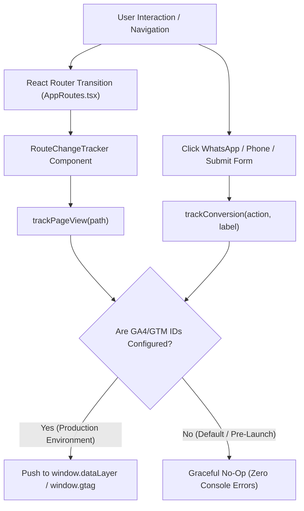

# 7Rays Astro Vastu — Phase 13A: Web Analytics & Conversion Tracking Status

**Document Purpose:** Complete technical audit of the website's analytics infrastructure, tracking scripts, conversion event handlers, and environment variables.  
**Audited Codebase Files:** `src/config/env.ts`, `src/utils/analytics.ts`, `src/utils/vitals.ts`, `src/main.tsx`, `src/routes/AppRoutes.tsx`  
**Date:** September 2026  
**Status:** Pre-GSC Deployment Architecture

---

## 1. Analytics Architecture Summary

The 7Rays Astro Vastu application features a lightweight, privacy-focused, zero-leak analytics architecture ready to interface with Google Analytics 4 (GA4) and Google Tag Manager (GTM).



---

## 2. Technical Infrastructure Status

| Component                         | Code Location                                | Implementation Status | Technical Details & Behavior                                                                                                                        |
| --------------------------------- | -------------------------------------------- | :-------------------: | --------------------------------------------------------------------------------------------------------------------------------------------------- |
| **GA4 Standalone Integration**    | `src/utils/analytics.ts` (`initAnalytics`)   |       **READY**       | Dynamically appends `gtag/js?id=${env.ga4MeasurementId}`. Only executes if `VITE_GA4_MEASUREMENT_ID` is set.                                        |
| **Google Tag Manager**            | `src/utils/analytics.ts` (`initAnalytics`)   |       **READY**       | Dynamically injects `gtm.js?id=${env.gtmContainerId}`. Takes priority if GTM container ID is populated.                                             |
| **Virtual Pageview Tracking**     | `src/utils/analytics.ts` (`trackPageView`)   |      **ACTIVE**       | Hooked into `RouteChangeTracker` in `AppRoutes.tsx`. Automatically fires `page_view` and `virtual_page_view` on every client-side route navigation. |
| **Conversion Event Handlers**     | `src/utils/analytics.ts` (`trackConversion`) |      **ACTIVE**       | Pre-configured tracking helper for high-intent user conversion actions.                                                                             |
| **Core Web Vitals Telemetry**     | `src/utils/vitals.ts` (`initWebVitals`)      |      **ACTIVE**       | Measures LCP, INP, CLS, FCP, TTFB. Initialized on application bootstrap in `main.tsx`.                                                              |
| **Private Credential Protection** | `src/config/env.ts`                          |     **COMPLIANT**     | Zero hard-coded measurement IDs. Relies strictly on `import.meta.env` environment variables.                                                        |

---

## 3. Pre-Configured Conversion Events

The codebase defines four specific conversion actions ready for Google Analytics 4 and Google Search Console conversion mapping:

```typescript
export function trackConversion(
  action: 'whatsapp_click' | 'phone_call' | 'form_submission' | 'consultation_booking',
  label?: string
): void
```

1. **`whatsapp_click`:**
   - **Trigger:** When a user clicks on the floating WhatsApp consultation button or service-specific WhatsApp link.
   - **GA4 Category:** `Consultation Intent`.
   - **Label:** Specific service context (e.g., `"Residential Vastu Inquiry"`).
2. **`phone_call`:**
   - **Trigger:** When a user initiates a click-to-call action on verified business telephone links.
   - **GA4 Category:** `Consultation Intent`.
3. **`form_submission`:**
   - **Trigger:** Successful submission of the general contact inquiry form on `/contact`.
   - **GA4 Category:** `Lead Generation`.
4. **`consultation_booking`:**
   - **Trigger:** Successful submission of the comprehensive `ConsultationModal` across service pillar pages.
   - **GA4 Category:** `Lead Generation`.

---

## 4. Current Environment & Measurement ID Status

| Environment Variable          | Description                                                | Current Value in Codebase | Action Required by Owner                                                      |
| ----------------------------- | ---------------------------------------------------------- | :-----------------------: | ----------------------------------------------------------------------------- |
| `VITE_GA4_MEASUREMENT_ID`     | Google Analytics 4 Measurement ID (Format: `G-XXXXXXXXXX`) |   `""` (Empty default)    | When GA4 property is created, inject measurement ID into hosting environment. |
| `VITE_GTM_CONTAINER_ID`       | Google Tag Manager Container ID (Format: `GTM-XXXXXXX`)    |   `""` (Empty default)    | Optional: inject container ID if managing tags via GTM.                       |
| `VITE_GSC_VERIFICATION_TOKEN` | Google Search Console HTML Meta Tag Token                  |   `""` (Empty default)    | Optional fallback if Domain Property DNS verification is unavailable.         |

---

## 5. Security & Privacy Compliance

- **No Third-Party Cookies Prior to Consent:** Standalone scripts are not loaded until environment variables are explicitly provided.
- **Zero PII Leakage:** Pageview tracking records only URL paths and page titles. No personal data, email addresses, or phone inputs are sent to the analytics payload.
