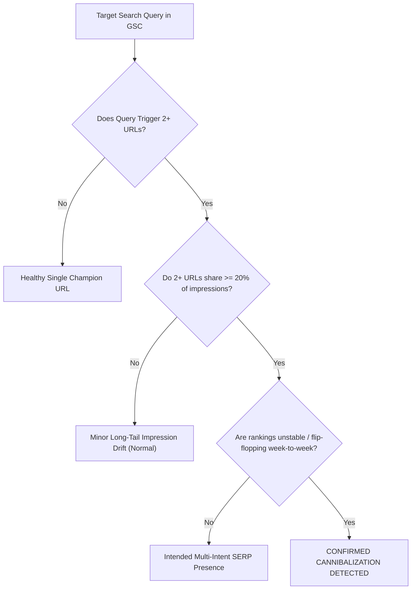

# 7Rays Astro Vastu — Phase 13A: Search Console Keyword Cannibalization Framework

**Document Purpose:** Establishes the empirical evidence standards and remediation protocols for diagnosing and resolving search cannibalization once Google Search Console is connected.  
**Lead Consultant:** Rishwa Sinha (Certified Vastu Consultant, 5+ years experience)  
**Date:** September 2026  
**Status:** Pre-GSC Operational Protocol (Zero Pages Merged or Deleted During Pre-GSC Phase)

---

## 1. What Is and Is Not Keyword Cannibalization

> [!IMPORTANT]
> **Strict Semantic Distinction:** Two pages merely mentioning the same topic (e.g., both a service page and a blog post referencing _"apartment Vastu"_) does **not** constitute keyword cannibalization. A healthy website features deep topical clusters where informational articles naturally support transactional pillar pages.

### True Keyword Cannibalization Requires Empirical Evidence:

Cannibalization exists **only** when multiple URLs from the same website compete against each other for the exact same search query in a way that depresses organic performance:



---

## 2. The 4 Empirical Cannibalization Criteria

Before initiating any content modification or canonical consolidation, all four of the following conditions must be documented using real GSC data:

1. **Query Intent Overlap:**
   - Both pages attempt to satisfy the exact same search intent (e.g., two pages attempting to be the primary transactional consultation page for _"office Vastu Bangalore"_).
2. **Impression Split:**
   - At least two URLs each capture `>= 20%` of the total impressions for the target query over a 28-day window.
3. **URL Instability (SERP Flip-Flopping):**
   - Google switches the ranking URL between Page A and Page B across consecutive weeks, preventing either page from accumulating stable authority signals.
4. **Sub-Optimal Ranking:**
   - The split results in both URLs ranking outside the top 3 (e.g., oscillating between Position 7 and Position 14), whereas a consolidated champion would command a top-3 position.

---

## 3. Systematic Remediation Workflow

When empirical cannibalization is verified in Phase 13, execute the following 5-stage protocol:

```mermaid
sequenceDiagram
    participant Audit as 1. Audit Query & Intent
    participant Select as 2. Designate Single Champion URL
    participant DeTune as 3. De-tune Competing Supporting Page
    participant Link as 4. Add Contextual Link to Champion
    participant Canonical as 5. Evaluate Canonical / 301 Redirect

    Audit->>Select: Map query to canonical question in Phase 12 Question Map
    Select->>DeTune: Keep highest authority URL as Champion
    DeTune->>Link: Rephrase secondary headings on supporting page to focus on subtopic
    Link->>Canonical: Anchor text: "For full consultation, see [Champion Page]"
    Note over Canonical: Only 301 redirect if supporting page is thin and duplicative
```

### Stage 1: Designate the Authoritative Champion URL

- Cross-reference the query with [PHASE_12_AEO_QUESTION_MAP.md](file:///Users/shekharyadav/Desktop/Projects%20/7rays%20Astro%20Vastu/PHASE_12_AEO_QUESTION_MAP.md).
- Select the single URL designed as the canonical champion for that query intent.
- _Example:_ For _"office seating direction"_, the designated champion is `/vastu/office-vastu` (not a generalized blog post).

### Stage 2: De-tune the Supporting URL

- Adjust the secondary page’s `<title>`, `<meta name="description">`, and H1/H2 tags so they do not target the champion query verbatim.
- Narrow the supporting page's focus to its specific niche (e.g., refocusing a blog post on _"Common Ergonomic Mistakes in Office Workstations"_ rather than generic _"Office Vastu"_).

### Stage 3: Direct Contextual Internal Linking

- Insert a prominent editorial callout on the supporting page pointing directly to the champion URL.
- Use explicit, descriptive anchor text:
  - _Bad:_ "Click here"
  - _Good:_ "For complete executive cabin and department layout blueprints, explore our [Office Vastu Consultation](/vastu/office-vastu)."

### Stage 4: Self-Canonical Verification

- Verify that both pages have valid self-referential canonical tags to avoid accidental search crawler confusion.

### Stage 5: 301 Redirection (Last Resort Only)

- A 301 redirect consolidation is permitted **only** if the competing page has no unique informational value, receives zero independent traffic, and is essentially a duplicate duplicate route.
- _Strict Rule:_ No pages will be deleted or 301 redirected during Phase 13A.

---

## 4. Current Pre-GSC Route Observations to Monitor

The following route pairs have been pre-cataloged for observation once GSC performance data becomes active:

| URL Pair                                                                                | Component Shared       | Canonical Tag Target        | Expected GSC Behavior                                                           | Planned Phase 13 Action                                                          |
| --------------------------------------------------------------------------------------- | ---------------------- | --------------------------- | ------------------------------------------------------------------------------- | -------------------------------------------------------------------------------- |
| `/vastu/residential` vs `/vastu-services/residential-vastu`                             | `ResidentialVastuPage` | `/vastu/residential`        | `/vastu-services/...` will be marked as "Alternate with proper canonical".      | Monitor if impressions split; maintain `/vastu/residential` as primary champion. |
| `/vastu/commercial` vs `/vastu-services/commercial-vastu`                               | `CommercialVastuPage`  | `/vastu/commercial`         | `/vastu-services/...` will be marked as "Alternate with proper canonical".      | Maintain `/vastu/commercial` as primary champion.                                |
| `/vastu/office-vastu` vs `/blog/office-layout-executive-cabin-vastu`                    | Different components   | Independent self-canonicals | Service page targets commercial intent; blog targets informational intent.      | Ensure blog links to service page for commercial intent queries.                 |
| `/vastu/apartment-vastu` vs `/blog/vastu-remedies-without-demolition-modern-apartments` | Different components   | Independent self-canonicals | Service page targets apartment consultation; blog targets DIY remedy questions. | Ensure blog reinforces service page authority without competing.                 |
