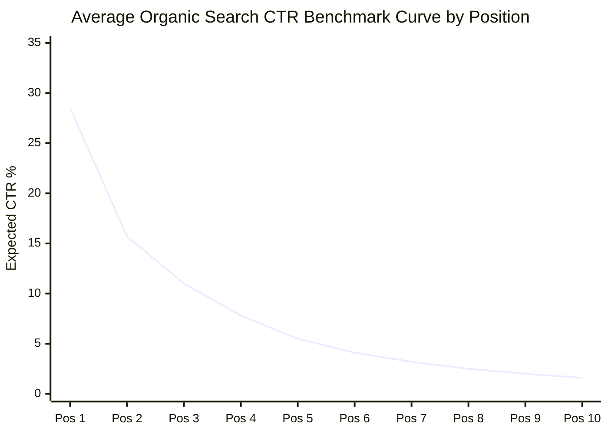
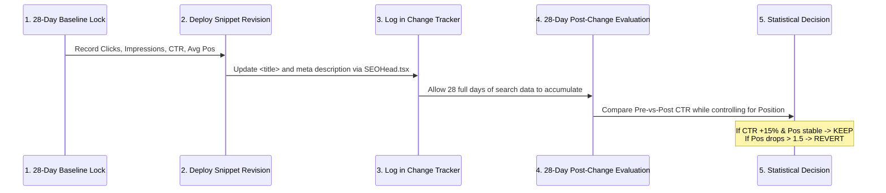

# 7Rays Astro Vastu — Phase 13A: Search Result CTR Optimization Framework

**Document Purpose:** Defines the mathematical models, qualification thresholds, and testing methodologies for optimizing Click-Through Rates (CTR) in Google Search based strictly on verified GSC telemetry.  
**Lead Consultant:** Rishwa Sinha (Certified Vastu Consultant, 5+ years experience)  
**Date:** September 2026  
**Status:** Pre-GSC Deployment Methodology (Zero Speculative Rewrites)

---

## 1. Principles of Evidence-Based CTR Optimization

> [!IMPORTANT]
> **Strict Policy:** Titles and meta descriptions must **never** be rewritten based on subjective preference, aesthetic whim, or imagined performance. Every snippet adjustment must be justified by at least 28 days of verified GSC impression volume, a statistically significant CTR deficit, and strict adherence to verified business truth.

---

## 2. SERP Position vs. Expected CTR Benchmark Curve

To identify true underperformance, actual GSC CTR will be benchmarked against standard organic search distribution curves for local and specialized professional services:

### Table: Qualification Thresholds for Snippet Optimization

| Average Position Range  | Expected Organic CTR Range | Underperformance Trigger (Requires Optimization) | Minimum Impression Threshold (28-Day Window) |
| :---------------------: | :------------------------: | :----------------------------------------------: | :------------------------------------------: |
| **Position 1.0 – 1.9**  |       25.0% – 32.0%        |              **Actual CTR < 18.0%**              |              >= 500 impressions              |
| **Position 2.0 – 2.9**  |       13.0% – 18.0%        |              **Actual CTR < 9.0%**               |              >= 500 impressions              |
| **Position 3.0 – 3.9**  |        9.0% – 13.0%        |              **Actual CTR < 6.0%**               |              >= 500 impressions              |
| **Position 4.0 – 5.9**  |        5.0% – 8.0%         |              **Actual CTR < 3.5%**               |             >= 1,000 impressions             |
| **Position 6.0 – 10.0** |        2.0% – 4.5%         |              **Actual CTR < 1.5%**               |             >= 1,500 impressions             |

_Note:_ Positions > 10.0 (Page 2+) are **not** candidates for CTR snippet testing. Low CTR on Page 2 is a natural consequence of ranking below the fold. Positions > 10 must first be elevated via content authority and depth (Category C Opportunity).

---

## 3. High-Integrity Optimization Levers (No Clickbait)

When a page qualifies for CTR optimization, revisions must use verified value propositions rather than sensationalist clickbait:

### Approved High-Intent Modifiers:

- **Non-Demolition Solutions:** _"Without Demolition"_, _"No Civil Breakdown"_ (appeals directly to flat and office leaseholders).
- **Technical & Diagnostic Precision:** _"16-Zone CAD Mapping"_, _"Calibrated Compass Assessment"_, _"Digital Gauss Meter"_.
- **Bangalore Local Grounding:** _"Bengaluru Tech Hubs"_, _"Dasarahalli HQ"_, _"HSR Layout & Whitefield Inspections"_.
- **Verified Credentials:** _"Certified Vastu Consultant"_, _"5+ Years Experience"_.
- **Ethical Clarity:** _"Non-Fatalistic Vedic Astrology"_, _"Clear Consultation Process"_.

### Strictly Prohibited Clickbait Patterns:

- **No False Guarantees:** Never use _"100% Guaranteed Success"_, _"Guaranteed Wealth"_, _"Instant Promotion"_.
- **No Fabricated Superlatives:** Never use _"#1 Consultant in India"_, _"Best Astrologer in the World"_, _"Most Trusted by 10,000 Clients"_.
- **No Unsubstantiated Scientific Claims:** Never use _"Scientifically Proven to Cure Anxiety"_ or _"Guaranteed Miracle Energy"_.

---

## 4. Controlled A/B Snippet Testing Protocol

To ensure that changes produce measurable improvements without harming rankings, follow this controlled sequential protocol:

### Statistical Decision Rules:

1. **Successful Win (Keep):** CTR improves by `>= 15%` relative to baseline, and Average Position remains stable (`+/- 0.5`).
2. **Neutral (Monitor / Iterate):** CTR changes by `< 5%`. Leave active for another 14 days or test alternative value-proposition copy.
3. **Negative Signal (Immediate Revert):** Average Position drops by `> 1.5` positions or total clicks decrease. Immediately revert `<title>` to original baseline.
