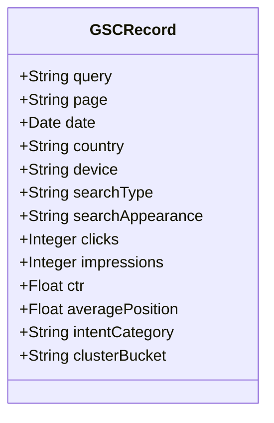

# 7Rays Astro Vastu — Phase 13A: Google Search Console Data Schema & Ingestion Framework

**Document Purpose:** Defines the structured data model, metric definitions, and classification taxonomies for storing and analyzing Search Console performance data in Phase 13.  
**Lead Consultant:** Rishwa Sinha (Certified Vastu Consultant, 5+ years experience)  
**Date:** September 2026  
**Status:** Pre-GSC Deployment Architecture

---

## 1. Core GSC Performance Data Dimensions & Metrics

When Google Search Console is connected and accumulating data, performance exports (via GSC UI, BigQuery export, or Search Console API) will be normalized using the following standardized schema:

### Table: Field Definitions & Constraints

| Field Name          | Type                | Allowed Values / Format                                                                            | Description & Analytical Purpose                                   |
| ------------------- | ------------------- | -------------------------------------------------------------------------------------------------- | ------------------------------------------------------------------ |
| `QUERY`             | String              | Raw query string or `(not set)`                                                                    | The exact search phrase entered by the user in Google Search.      |
| `PAGE`              | String (URI)        | Fully qualified canonical URL                                                                      | The landing page URL displayed to the user in search results.      |
| `DATE`              | Date (ISO)          | `YYYY-MM-DD`                                                                                       | Date of search impression/click event.                             |
| `CLICKS`            | Integer             | `>= 0`                                                                                             | Count of clicks resulting in navigation to 7Rays Astro Vastu.      |
| `IMPRESSIONS`       | Integer             | `>= 1`                                                                                             | Count of times any page URL was shown in search results to a user. |
| `CTR`               | Float (Percentage)  | `0.00%` to `100.00%`                                                                               | Click-Through Rate calculated as `(CLICKS / IMPRESSIONS) * 100`.   |
| `AVERAGE_POSITION`  | Float               | `1.0` to `100.0+`                                                                                  | Average rank of the highest ranking page for the query.            |
| `SEARCH_APPEARANCE` | String              | `standard`, `good_page_experience`, `rich_results`, `review_snippet`, `video`, `translated_result` | Filter for special SERP features or rich snippets.                 |
| `COUNTRY`           | String (ISO 3166-1) | `IND`, `USA`, `ARE`, `GBR`, `SGP`, `CAN`, `AUS`, `OTH`                                             | Geographic origin of searcher (India is primary focus).            |
| `DEVICE`            | String              | `DESKTOP`, `MOBILE`, `TABLET`                                                                      | Device form factor (evaluates mobile usability correlation).       |
| `SEARCH_TYPE`       | String              | `WEB`, `IMAGE`, `VIDEO`, `NEWS`                                                                    | Search surface filter (default: `WEB`).                            |
| `INTENT_CATEGORY`   | String              | `Navigational`, `Informational`, `Commercial`, `Transactional`, `Local`                            | Standardized search intent bucket.                                 |
| `CLUSTER_BUCKET`    | String              | One of 15 defined cluster taxonomies (see Section 2).                                              | Categorical mapping to content pillar.                             |

---

## 2. Query Categorization & Taxonomy Framework

Every verified query extracted from Google Search Console will be systematically routed into one of the following 15 analysis categories:

### 1. Brand Queries

- **Definition:** Searches specifically referencing the company or founder name.
- **Example Match Patterns:** `7rays`, `7rays astro vastu`, `rishwa sinha`, `rishwa sinha vastu`, `7 rays vastu consultant`.
- **Target Champion URL:** `https://7raysastrovastu.com/` or `https://7raysastrovastu.com/about`.
- **Expected CTR Benchmark:** `> 35.0%`. Average Position: `< 1.5`.

### 2. Vastu Informational Queries

- **Definition:** High-level educational queries about Vastu Shastra principles and traditions.
- **Example Match Patterns:** `what is vastu shastra`, `pancha tattva five elements`, `brahma sthana meaning`, `directions in vastu`.
- **Target Champion URLs:** `/the-7-rays`, `/blog/understanding-the-five-elements-pancha-tattva`.

### 3. Vastu Service Queries

- **Definition:** High-intent commercial queries seeking professional consulting assistance.
- **Example Match Patterns:** `vastu consultation`, `vastu consultant near me`, `hire vastu expert`, `vastu consultation charges`.
- **Target Champion URLs:** `/vastu-services`, `/contact`.

### 4. Residential Vastu Queries

- **Definition:** Queries concerning home, villa, or independent house layouts.
- **Example Match Patterns:** `house vastu remedies`, `master bedroom vastu direction`, `kitchen vastu guidelines`, `north facing house vastu`.
- **Target Champion URLs:** `/vastu/residential`, `/blog/master-bedroom-vastu-guidelines`, `/blog/kitchen-vastu-direction-guide`.

### 5. Apartment Vastu Queries

- **Definition:** Specialized queries for multi-storey apartments and high-rise flats.
- **Example Match Patterns:** `apartment vastu without demolition`, `flat vastu entrance pada`, `remedies for rented flat vastu`.
- **Target Champion URLs:** `/vastu/apartment-vastu`, `/blog/vastu-remedies-without-demolition-modern-apartments`.

### 6. Commercial Vastu Queries

- **Definition:** Queries focusing on commercial properties, retail stores, and hospitality spaces.
- **Example Match Patterns:** `commercial vastu consultant`, `retail shop vastu`, `showroom cash counter direction`, `restaurant vastu`.
- **Target Champion URLs:** `/vastu/commercial`, `/blog/retail-store-and-showroom-vastu`, `/blog/restaurant-and-hospitality-vastu`.

### 7. Office Vastu Queries

- **Definition:** Inquiries regarding corporate office spaces, startup tech parks, and executive seating.
- **Example Match Patterns:** `office vastu layout`, `ceo cabin direction vastu`, `conference room vastu`, `workplace seating direction`.
- **Target Champion URLs:** `/vastu/office-vastu`, `/blog/office-layout-executive-cabin-vastu`.

### 8. Industrial Vastu Queries

- **Definition:** Large-scale manufacturing, plant layout, and warehouse queries.
- **Example Match Patterns:** `factory vastu consultation`, `heavy machinery placement vastu`, `transformer electrical vastu`, `warehouse dispatch vastu`.
- **Target Champion URLs:** `/vastu/industrial`, `/blog/factory-machinery-and-raw-material-vastu`.

### 9. Vastu Audit Queries

- **Definition:** Diagnostic evaluations, CAD blueprints, and environmental energy scans.
- **Example Match Patterns:** `vastu energy audit`, `16 zone cad vastu analysis`, `geopathic stress scan`, `digital compass vastu test`.
- **Target Champion URLs:** `/vastu-services/vastu-audit`, `/blog/how-geopathic-stress-causes-insomnia-and-fatigue`.

### 10. Bangalore Local Queries

- **Definition:** Geo-modified searches explicitly targeting Bengaluru and key tech/residential localities.
- **Example Match Patterns:** `vastu consultant bangalore`, `vastu consultant hsr layout`, `whitefield flat vastu`, `indiranagar vastu expert`.
- **Target Champion URLs:** `/locations/bangalore`, `/locations/hsr-layout`, `/locations/whitefield`, `/locations/indiranagar`, `/locations/koramangala`.

### 11. Astrology Queries

- **Definition:** General Vedic horoscope, astrological timing, and life path inquiries.
- **Example Match Patterns:** `vedic astrology consultation bangalore`, `jyotish reading`, `dasha cycle analysis`, `astrology vs vastu`.
- **Target Champion URLs:** `/astrology`, `/blog/what-is-vedic-astrology-birth-chart-guide`, `/blog/understanding-dasha-cycles-and-transitions`.

### 12. Birth Chart Queries

- **Definition:** In-depth natal Kundli analysis and horoscope chart interpretation.
- **Example Match Patterns:** `birth chart reading`, `kundli consultation bangalore`, `lagna chart analysis`, `natal planetary positions`.
- **Target Champion URLs:** `/astrology/birth-chart`.

### 13. Long-Tail Queries

- **Definition:** Ultra-specific 5+ word problem-solving questions.
- **Example Match Patterns:** `how to fix southwest toilet in apartment without demolition`, `best direction for accounts team in bangalore office`.
- **Target Champion URLs:** Deep-dive guides matching specific symptom keywords.

### 14. Unexpected Relevant Queries

- **Definition:** Lucrative search queries where 7Rays receives impressions, but for which no dedicated landing page exists.
- **Action:** Flagged directly to the Phase 13 Content Intelligence Queue for information-gain analysis.

### 15. Irrelevant Queries

- **Definition:** Searches reflecting mismatched intent (e.g., free astrology apps, superstitious charms, black magic, unrelated city names).
- **Action:** Filtered out to avoid skewing CTR and ranking optimization baselines.

---

## 3. Data Ingestion & Storage Architecture

When GSC is connected, data will be collected according to the following cadence:

1. **Weekly Snapshot:** Aggregate 7-day rolling performance metrics (Clicks, Impressions, Average Position) stored in markdown audit logs (`PHASE_13_GSC_WEEKLY_SNAPSHOT.md`).
2. **Monthly Full Export:** 28-day historical CSV export stored in repository archives for trendline comparison.
3. **Data Freshness Lag:** Google Search Console data carries a standard 48-to-72-hour reporting lag. Analyses will always compare stabilized full weeks (Monday to Sunday) rather than intraday figures.
