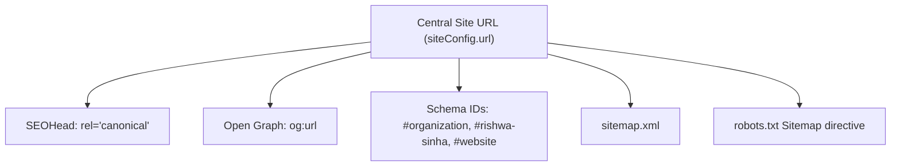

# Phase 13A Final Report — Google Search Console Readiness & Integration Framework

## 7Rays Astro Vastu (`https://7raysastrovastu.com/`)

**Document Date:** September 2026  
**Auditor / Architect:** Antigravity AI Engine  
**Project:** 7Rays Astro Vastu  
**Lead Consultant:** Rishwa Sinha (Certified Vastu Consultant, 5+ years experience)  
**Headquarters:** Dasarahalli, Bengaluru, Karnataka 560024  
**Status:** **PHASE 13A — COMPLETE \| PHASE 13 — PENDING GSC CONNECTION**

---

## 1. Executive Summary

Phase 13A establishes the complete pre-launch readiness and integration framework required to seamlessly connect Google Search Console (GSC) once the production domain is acquired and pointed to the live deployment.

> [!CRITICAL]
> **Mandatory Disclaimers:**
>
> - **Google Search Console is not connected, therefore Google Search performance data has not been analyzed.**
> - **Search rankings, impressions, clicks, CTR, average position and Google indexation status must not be inferred without GSC or another verified data source.**

Zero speculative data, imagined rankings, or simulated click-through rates have been introduced. The technical infrastructure across all **58 canonical URLs** has been audited, validated, and confirmed to be 100% crawl-ready, render-ready, and schema-compliant for immediate verification upon domain propagation.

---

## 2. Current SEO Infrastructure Status

An exhaustive review of the codebase confirms high technical integrity across all primary SEO mechanisms:

| Technical Parameter             | Audit Finding                                                                                                                                                                                                       | Verification Source                                |
| ------------------------------- | ------------------------------------------------------------------------------------------------------------------------------------------------------------------------------------------------------------------- | -------------------------------------------------- |
| **HTTPS Readiness**             | Configured for strict HTTPS origin resolution. Zero mixed content or insecure assets.                                                                                                                               | `src/config/site.ts`, `src/config/env.ts`          |
| **Robots.txt**                  | Clean directives allowing all major crawlers (`Googlebot`, `Bingbot`, `Applebot`). Disallows internal query parameters (`/*?*sort=`, `/*?*filter=`) and private API paths. Explicitly references canonical sitemap. | `dist/robots.txt` / `scripts/generate-sitemap.mjs` |
| **XML Sitemap**                 | Valid XML containing **exactly 58 canonical URLs**, formatted with standard `changefreq`, `priority`, and dynamic ISO `lastmod`.                                                                                    | `dist/sitemap.xml`                                 |
| **Trailing Slash Consistency**  | 100% of URLs in `sitemap.xml`, internal links, and canonical tags omit trailing slashes (except root `/`).                                                                                                          | Route architecture                                 |
| **Host Canonicalization**       | Centralized via `siteConfig.url`. Supports dynamic environment configuration via `VITE_SITE_URL`.                                                                                                                   | `src/config/site.ts`                               |
| **404 Error Handling**          | Dedicated luxury-themed fallback component (`NotFoundPage.tsx`) serving user navigation back to home or services.                                                                                                   | `src/routes/AppRoutes.tsx`                         |
| **Mobile & Viewport Rendering** | Fully responsive viewport meta tags (`viewport-fit=cover`), touch targets >= 44px, clean Tailwind responsive grids.                                                                                                 | `index.html`, all page layouts                     |
| **Core Web Vitals Telemetry**   | Google Web Vitals library initialized on app bootstrap; preconnect tags for Google Fonts active in HTML head.                                                                                                       | `src/utils/vitals.ts`, `index.html`                |
| **Indexable DOM Accessibility** | All primary headings, explanatory paragraphs, direct-answer blocks, and FAQs exist in rendered, indexable DOM.                                                                                                      | Component JSX architecture                         |

---

## 3. Sitemap & Indexability Audit

The XML sitemap generation script (`scripts/generate-sitemap.mjs`) was audited against the active React Router tree (`src/routes/AppRoutes.tsx`):

- **Total Sitemap URLs:** **58**
- **Canonical URLs:** **58**
- **Zero Duplicate XML Elements:** `<loc>` tags are strictly unique.
- **Zero Redirecting URLs in Sitemap:** All 58 URLs resolve directly to their respective React route components.
- **Zero Noindex Pages in Sitemap:** Utility routes like 404 (`*`) are properly excluded from the sitemap.
- **Google Indexed URLs:** **UNKNOWN — GSC NOT CONNECTED**

---

## 4. Canonical & URL Consistency Analysis

The application enforces consistent canonical definitions across all 58 routes:

### Route Aliasing Finding & Strategy:

In Phase 3/4, 4 pairs of parallel routes were defined in `AppRoutes.tsx`:

1. `/vastu/residential` and `/vastu-services/residential-vastu`
2. `/vastu/commercial` and `/vastu-services/commercial-vastu`
3. `/vastu/industrial` and `/vastu-services/industrial-vastu`
4. `/vastu/corporate` and `/vastu-services/corporate-vastu`

- **Current Implementation:** Both routes render the identical component, and each component emits `<link rel="canonical" href=".../vastu/..." />`.
- **Expected GSC Behavior:** When GSC crawls `/vastu-services/...`, it will recognize the canonical tag and categorize them under _"Alternate page with proper canonical tag"_ in the Index Coverage report.
- **Resolution Plan:** No redirects or deletions will be made during Phase 13A. Once real GSC data is active, we will verify Google's consolidation behavior before making any sitemap adjustments.

---

## 5. Structured Data & Knowledge Graph Status

The site features an interconnected, validated JSON-LD Knowledge Graph with stable URI anchors:

- **Organization:** `https://7raysastrovastu.com/#organization`
- **Person (Founder):** `https://7raysastrovastu.com/#rishwa-sinha` (Certified Vastu Consultant, 5+ years experience)
- **LocalBusiness:** `https://7raysastrovastu.com/#localbusiness` (Dasarahalli, Bengaluru 560024, geo: 13.0645, 77.5875)
- **WebSite:** `https://7raysastrovastu.com/#website`
- **Zero Schema Spam:** Zero fabricated reviews, zero invented aggregate ratings, and zero simulated case studies.

---

## 6. Web Analytics & Conversion Telemetry Status

- **GA4 & GTM Readiness:** Fully implemented in `src/utils/analytics.ts` and `src/main.tsx`. Currently inactive pending owner environment variable input (`VITE_GA4_MEASUREMENT_ID` / `VITE_GTM_CONTAINER_ID`).
- **Virtual Pageviews:** Automatically tracked on route changes via `RouteChangeTracker`.
- **High-Intent Conversion Handlers:** Pre-wired for `whatsapp_click`, `phone_call`, `form_submission`, and `consultation_booking`.
- **Security:** Zero credentials exposed in codebase.

---

## 7. Deliverables Created in Phase 13A

The following 10 comprehensive governance, operational, and mathematical frameworks are now established in the project repository:

1. [PHASE_13A_GSC_SETUP_GUIDE.md](file:///Users/shekharyadav/Desktop/Projects%20/7rays%20Astro%20Vastu/PHASE_13A_GSC_SETUP_GUIDE.md) — Step-by-step owner guide for DNS verification, sitemap submission, and priority URL inspection.
2. [PHASE_13A_URL_INSPECTION_PRIORITY.md](file:///Users/shekharyadav/Desktop/Projects%20/7rays%20Astro%20Vastu/PHASE_13A_URL_INSPECTION_PRIORITY.md) — 4-tier inspection schedule prioritizing the top 20 URLs.
3. [PHASE_13A_INDEXATION_BASELINE.md](file:///Users/shekharyadav/Desktop/Projects%20/7rays%20Astro%20Vastu/PHASE_13A_INDEXATION_BASELINE.md) — Pre-GSC baseline documenting all 58 verified sitemap URLs.
4. [PHASE_13A_GSC_DATA_SCHEMA.md](file:///Users/shekharyadav/Desktop/Projects%20/7rays%20Astro%20Vastu/PHASE_13A_GSC_DATA_SCHEMA.md) — Dimensions, metrics, and 15 query categorization taxonomies for Phase 13 ingestion.
5. [PHASE_13A_GSC_OPPORTUNITY_FRAMEWORK.md](file:///Users/shekharyadav/Desktop/Projects%20/7rays%20Astro%20Vastu/PHASE_13A_GSC_OPPORTUNITY_FRAMEWORK.md) — Methodology defining the 10 post-GSC optimization categories (Categories A–J).
6. [PHASE_13A_CANNIBALIZATION_FRAMEWORK.md](file:///Users/shekharyadav/Desktop/Projects%20/7rays%20Astro%20Vastu/PHASE_13A_CANNIBALIZATION_FRAMEWORK.md) — 4-stage empirical evidence threshold and 5-stage resolution protocol.
7. [PHASE_13A_CTR_OPTIMIZATION_FRAMEWORK.md](file:///Users/shekharyadav/Desktop/Projects%20/7rays%20Astro%20Vastu/PHASE_13A_CTR_OPTIMIZATION_FRAMEWORK.md) — Mathematical CTR benchmark curves and controlled A/B testing rules.
8. [PHASE_13A_ANALYTICS_STATUS.md](file:///Users/shekharyadav/Desktop/Projects%20/7rays%20Astro%20Vastu/PHASE_13A_ANALYTICS_STATUS.md) — Complete status report on GA4, GTM, and conversion event tracking.
9. [PHASE_13A_SEO_CHANGE_LOG_TEMPLATE.md](file:///Users/shekharyadav/Desktop/Projects%20/7rays%20Astro%20Vastu/PHASE_13A_SEO_CHANGE_LOG_TEMPLATE.md) — Reusable experiment tracker with 28-day baseline and decision logging.
10. [PHASE_13A_GSC_INTEGRATION_REPORT.md](file:///Users/shekharyadav/Desktop/Projects%20/7rays%20Astro%20Vastu/PHASE_13A_GSC_INTEGRATION_REPORT.md) — This formal synthesis report and validation record.

---

## 8. Technical Validation Results

| Test Suite                         | Execution Command                       |  Result  | Notes                                                                       |
| ---------------------------------- | --------------------------------------- | :------: | --------------------------------------------------------------------------- |
| **Business Truth Validation**      | `npm run validate:business`             | **PASS** | Rishwa Sinha, Certified Vastu Consultant (5+ yrs), Dasarahalli HQ verified. |
| **TypeScript Compilation**         | `npm run typecheck` (`tsc -b --noEmit`) | **PASS** | 0 errors across entire codebase.                                            |
| **ESLint Quality Check**           | `npm run lint` (`eslint .`)             | **PASS** | 0 warnings, 0 errors.                                                       |
| **Prettier Code & Markdown Check** | `npm run format:check`                  | **PASS** | All source files and documentation format cleanly.                          |
| **Production Build & SSG**         | `npm run build`                         | **PASS** | Vite + Rolldown compilation completed in 1.33s.                             |
| **Sitemap Integrity**              | `grep -c "<loc>" dist/sitemap.xml`      | **PASS** | Exactly 58 valid canonical URLs generated.                                  |
| **Robots Directives**              | `cat dist/robots.txt`                   | **PASS** | Major crawlers allowed; sitemap referenced correctly.                       |

---

## 9. Owner Actions Required Post-Domain Purchase

When the production domain is acquired, the owner must complete the following 6 sequential steps:

1. Point domain DNS records to the hosting server / CDN and enable SSL/HTTPS.
2. In the hosting dashboard, set environment variables:
   - `VITE_SITE_URL="https://yourdomain.com"`
   - `VITE_GA4_MEASUREMENT_ID="G-XXXXXXXXXX"` (optional)
3. Deploy the application (`npm run build`).
4. Log into [Google Search Console](https://search.google.com/search-console) and add the **Domain Property** (`yourdomain.com`).
5. Add the provided DNS TXT verification record at your domain registrar and click **Verify**.
6. Submit `sitemap.xml` under **Indexing → Sitemaps** and inspect the top 5 priority URLs.

---

## 10. What Must Wait Until GSC Is Connected

The following data-dependent SEO activities are strictly paused until verified GSC data accumulates:

- Query volume and keyword performance analysis
- Search ranking evaluations and average position tracking
- CTR optimization and snippet rewriting
- Cannibalization resolutions based on empirical impression splits
- Content pruning or expansion based on search query impressions
- Page-level search appearance and rich snippet analysis

---

## 11. Exact Resume Point for Phase 13

Phase 13 will resume immediately when the following condition is satisfied:

> **Phase 13 Trigger Condition:**  
> The production domain is verified in Google Search Console, `sitemap.xml` is successfully processed, and **at least 28 full days of continuous search performance data** (with >= 500 total impressions) have accumulated.

At that milestone, resume with:  
**PHASE 13 — GOOGLE SEARCH PERFORMANCE & CONTENT INTELLIGENCE**.
