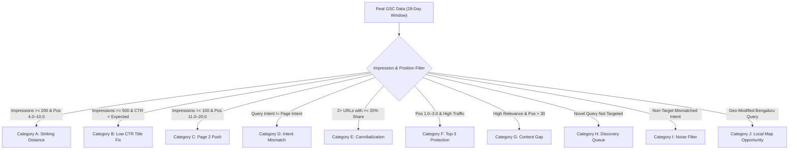

# 7Rays Astro Vastu — Phase 13A: Google Search Console Opportunity Analysis Framework

**Document Purpose:** Establishes the mathematical thresholds, diagnostic criteria, and action protocols for analyzing Google Search Console data once the production domain is live.  
**Lead Consultant:** Rishwa Sinha (Certified Vastu Consultant, 5+ years experience)  
**Date:** September 2026  
**Status:** Pre-GSC Analytical Methodology (Zero Simulated Data)

---

## 1. Governance Principles & Strict Evidence Thresholds

> [!IMPORTANT]
> **No Fabricated Data Rule:** In strict accordance with Phase 13A pre-GSC rules, this framework defines **only the analytical methodology and action formulas**. Zero rankings, clicks, or impressions are estimated or assumed. Actual analysis will be initiated only after 28 days of verified Google Search Console data have accumulated.

---

## 2. The 10 Strategic Opportunity Categories

---

### Category A: Striking-Distance Queries (Positions 4.0 – 10.0)

- **Diagnostic Criteria:**
  - `Impressions >= 200` over the last 28 days.
  - `Average Position between 4.0 and 10.0`.
  - The page already satisfies search intent but sits below the high-click top-3 fold.
- **Analytical Action Protocol:**
  1. Inspect the matching URL's content depth against Google top 3 competitors.
  2. Reinforce information gain: add concrete diagnostic steps, illustrative scenarios, or traditional Vastu references.
  3. Build 2–3 contextual internal links from high-authority pillar pages using descriptive natural anchor text.
  4. Avoid keyword stuffing or rewriting core headings that already earn impressions.

---

### Category B: High Impressions with Below-Benchmark CTR

- **Diagnostic Criteria:**
  - `Impressions >= 500` over 28 days.
  - `Actual CTR < 50% of Expected Position CTR` (e.g., Position 2 with < 7.0% CTR instead of ~15%).
- **Analytical Action Protocol:**
  1. Inspect the search snippet: does the current title get truncated or look generic?
  2. Optimize the `<title>` tag and `<meta name="description">` to explicitly address user intent.
  3. Highlight verified value propositions: _"Without Demolition"_, _"16-Zone CAD Analysis"_, _"Certified Vastu Consultant Bengaluru"_.
  4. Ensure schema markup (`FAQPage`, `ServiceSchema`) is rendering rich snippet features in search appearance.

---

### Category C: Page 2 Opportunity Push (Positions 11.0 – 20.0)

- **Diagnostic Criteria:**
  - `Impressions >= 100` over 28 days.
  - `Average Position between 11.0 and 20.0`.
- **Analytical Action Protocol:**
  1. Determine whether the ranking URL is the designated canonical champion or an accidental supporting page.
  2. If it is the canonical champion, expand topical breadth: add answering sub-headings (H2/H3) addressing related search questions identified in `PHASE_12_AEO_QUESTION_MAP.md`.
  3. Strengthen semantic co-occurrence: integrate related entity terms (e.g., _Pancha Tattva_, _Brahma-sthana_, _Padavinyasa_).

---

### Category D: Intent Mismatch (Wrong Page Ranking for Query)

- **Diagnostic Criteria:**
  - A query with specific transactional or localized intent triggers an informational blog post instead of the primary service or location landing page (e.g., _"office vastu consultant bangalore"_ ranking `/blog/office-layout-executive-cabin-vastu` instead of `/locations/bangalore/commercial-vastu`).
- **Analytical Action Protocol:**
  1. Check internal link anchor text pointing to both pages.
  2. Insert a prominent editorial callout on the ranking blog post: link directly to the service landing page with clear transactional anchor text (_"For corporate office audits in Bangalore, see our Bangalore Commercial Vastu Consultation"_).
  3. Review the service landing page to ensure it contains the specific query vocabulary that the blog post was outranking it for.

---

### Category E: Potential Keyword Cannibalization

- **Diagnostic Criteria:**
  - Multiple URLs from `7raysastrovastu.com` receive impressions for the exact same query, with neither URL achieving a stable top-5 position.
  - Google alternates which URL ranks from week to week.
- **Analytical Action Protocol:**
  - Execute the dedicated 5-step diagnostic workflow defined in `PHASE_13A_CANNIBALIZATION_FRAMEWORK.md`.

---

### Category F: High-Performance Protection (Positions 1.0 – 3.0)

- **Diagnostic Criteria:**
  - `Average Position between 1.0 and 3.0`.
  - `CTR meets or exceeds benchmark`.
- **Analytical Action Protocol:**
  1. **Strict Non-Disruption Policy:** Do not alter the H1, URL slug, or primary opening paragraphs.
  2. Monitor weekly crawl logs and Search Console Coverage reports to ensure no accidental canonical or schema degradation occurs.
  3. Preserve internal inbound link integrity.

---

### Category G: Content Depth Deficits (Relevant Queries with Low Visibility)

- **Diagnostic Criteria:**
  - Highly relevant industry queries where 7Rays receives impressions but ranks at `Position > 30.0`.
- **Analytical Action Protocol:**
  1. Evaluate if the topic is covered only superficially in an FAQ bullet.
  2. Expand existing supporting sections with structured tables, diagnostic workflows, or dedicated scenario examples.

---

### Category H: Emerging Search Discovery Queue (Unexpected Relevant Queries)

- **Diagnostic Criteria:**
  - Queries accumulating impressions that were not targeted during Phases 1–12 (e.g., _"vastu for EV charging station in apartment"_, _"soundproof pooja room vastu"_).
- **Analytical Action Protocol:**
  1. Review query against business boundaries: does 7Rays offer this?
  2. If legitimate, add the question and direct answer into the existing relevant service page's FAQ block or knowledge base section.
  3. Avoid creating new thin standalone URLs.

---

### Category I: Irrelevant Query Noise Filter

- **Diagnostic Criteria:**
  - Queries for free automated horoscope apps, occult charms, black magic, unrelated geographies (e.g., Delhi, Mumbai municipal rules), or unrelated services.
- **Analytical Action Protocol:**
  1. Confirm that 7Rays does not inadvertently rank or target these phrases.
  2. Ensure internal links and metadata do not use ambiguous phrasing that could trigger unintended queries.

---

### Category J: Bangalore Local Search Opportunities

- **Diagnostic Criteria:**
  - Searches with explicit Bangalore neighborhood modifiers (_HSR Layout_, _Whitefield_, _Indiranagar_, _Koramangala_, _Electronic City_, _Hebbal_, _Yelahanka_).
- **Analytical Action Protocol:**
  1. Align Google Business Profile (GBP) primary and secondary categories with top-performing local query variations.
  2. Strengthen on-page neighborhood geographic landmarks and local architectural context on `/locations/bangalore/...` sub-pages.
