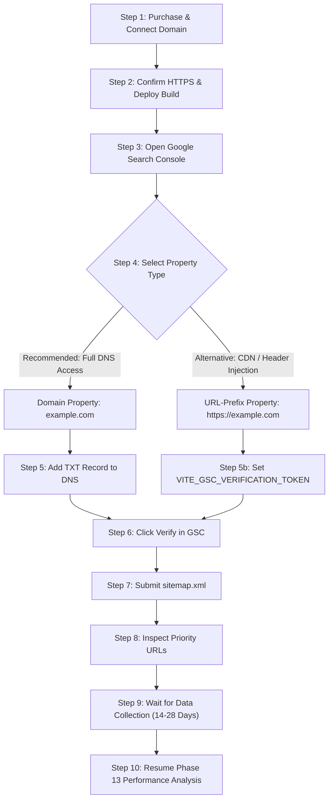

# 7Rays Astro Vastu — Phase 13A: Google Search Console Setup & Verification Guide

**Document Purpose:** Owner's operational manual for setting up, verifying, and configuring Google Search Console (GSC) immediately after purchasing and connecting the final production domain.  
**Target Entity:** 7Rays Astro Vastu (`https://7raysastrovastu.com/` or configured production domain)  
**Lead Consultant:** Rishwa Sinha (Certified Vastu Consultant, 5+ years experience)  
**Headquarters:** Dasarahalli, Bengaluru, Karnataka 560024  
**Date:** September 2026  
**Status:** Pre-GSC Deployment Blueprint (Do not execute until final domain is connected)

---

## 1. Security & Credentials Policy

> [!IMPORTANT]
> **Strict Security Rule:** Never share or store Google account passwords, Google Cloud credentials, DNS management credentials, API secrets, or backup recovery codes in this codebase, chat sessions, or version control. All verification steps described below must be executed directly by the business owner in their official Google account.

---

## 2. Pre-Verification Prerequisites (Domain & Hosting Setup)

Before attempting Google Search Console property registration, ensure the following technical gates are passed:

1. **Domain Purchase & DNS Propagation:**
   - The production domain (e.g., `7raysastrovastu.com`) is registered and DNS records point to the production web hosting server or CDN (Cloudflare, Vercel, Netlify, AWS CloudFront, or custom VPS).
2. **SSL / HTTPS Configuration:**
   - Active SSL/TLS certificate installed (Let's Encrypt, Cloudflare Edge Certificate, or custom CA).
   - Strict 301 redirection active: any request to `http://` must permanently redirect to `https://`.
   - Host canonicalization: ensure `www` automatically redirects to the apex domain (or vice versa, matching `siteConfig.url`).
3. **Environment Variable Configuration:**
   - Set the production environment variable `VITE_SITE_URL` to the exact HTTPS origin (e.g., `https://7raysastrovastu.com`).
   - Run production build (`npm run build`) so that `sitemap.xml` and `robots.txt` dynamically incorporate the correct domain origin.
4. **Live Accessibility Check:**
   - Visit `https://<your-domain>/sitemap.xml` in an incognito window and verify that the XML renders 58 URLs with 200 OK.
   - Visit `https://<your-domain>/robots.txt` and confirm that `Sitemap: https://<your-domain>/sitemap.xml` is present and Googlebot is allowed.

---

## 3. Step-by-Step Google Search Console Setup Workflow



### Step 1: Open Google Search Console

1. Navigate to: [https://search.google.com/search-console](https://search.google.com/search-console).
2. Sign in using the official business Google account designated for 7Rays Astro Vastu.

### Step 2: Choose Property Type (Domain Property Recommended)

Google offers two property options:

| Property Type           | Syntax                                         | Verification Method                      |      Recommendation      | Why?                                                                                                                       |
| ----------------------- | ---------------------------------------------- | ---------------------------------------- | :----------------------: | -------------------------------------------------------------------------------------------------------------------------- |
| **Domain Property**     | `7raysastrovastu.com` (no `https://` or `www`) | DNS TXT Record via Domain Registrar      | **STRONGLY RECOMMENDED** | Measures all protocol variants (`http`, `https`), subdomains (`www`, `m`), and port combinations in a single unified view. |
| **URL-Prefix Property** | `https://7raysastrovastu.com/`                 | HTML Tag, HTML File, or Google Analytics |     Fallback Option      | Only tracks the exact protocol and prefix. Misses traffic if non-https or www variants leak through.                       |

#### If Choosing Domain Property (Recommended):

1. In the **Domain** card (left side), enter your naked domain: `7raysastrovastu.com`.
2. Click **Continue**.
3. A modal will display a DNS TXT verification string (e.g., `google-site-verification=AbCdEfGhIjKlMnOpQrStUvWxYz...`).
4. Copy this TXT record string.

#### Adding the DNS Record at Your Domain Registrar:

1. Log into your domain registrar or DNS manager (GoDaddy, Namecheap, Cloudflare, Google Domains/Squarespace, Hostinger).
2. Go to the **DNS Management / Zone Editor** section.
3. Add a new record:
   - **Type:** `TXT`
   - **Name / Host:** `@` (or leave blank if registrar uses root)
   - **TTL:** `3600` (or `Auto` / `1 Hour`)
   - **Value / Content:** Paste the entire string copied from GSC (`google-site-verification=...`).
4. Save the record.
5. _Note:_ DNS propagation can take between 5 minutes and 24 hours. Wait 5–15 minutes before clicking **Verify** in GSC.

#### If Using URL-Prefix Property (Fallback / Alternative):

If you do not have direct DNS access or your registrar is locked:

1. Choose **URL-Prefix** and enter: `https://7raysastrovastu.com/`.
2. Select the **HTML Tag** method.
3. Copy the verification token value inside `content="..."`.
4. Add it to your hosting environment:
   ```bash
   VITE_GSC_VERIFICATION_TOKEN="AbCdEfGhIjKlMnOpQrStUvWxYz..."
   ```
5. Trigger a rebuild/deploy (`npm run build`).
6. The codebase will automatically inject `<meta name="google-site-verification" content="..." />` into the `<head>` of all pages via `SEOHead.tsx`.
7. Click **Verify** in GSC.

---

## 4. Submitting the XML Sitemap

Once verification succeeds:

1. In the left navigation menu of Google Search Console, click on **Indexing → Sitemaps**.
2. Under **Add a new sitemap**, enter:
   ```text
   sitemap.xml
   ```
   _(The full path submitted will be `https://7raysastrovastu.com/sitemap.xml`)_.
3. Click **Submit**.
4. Check the **Submitted sitemaps** table below:
   - **Status:** Should initially show `Processing` or `Success`.
   - **Discovered pages:** Should report **58** discovered URLs.
5. If the status reads `Couldn't fetch`, verify that the domain is live and accessible without basic authentication or firewall blocks, and click resubmit after 1 hour.

---

## 5. Priority URL Inspection Protocol

Do **not** request indexing for all 58 pages at once (Google enforces a daily quota on manual indexing requests, usually 10–20 per day).

Use the **URL Inspection Tool** (search bar at the top of GSC) for the following initial priority batch:

1. **Homepage:** `https://7raysastrovastu.com/`
2. **Main Vastu Pillar:** `https://7raysastrovastu.com/vastu-services`
3. **Vastu Audit Service:** `https://7raysastrovastu.com/vastu-services/vastu-audit`
4. **Bangalore Local Pillar:** `https://7raysastrovastu.com/locations/bangalore`
5. **Astrology Main Pillar:** `https://7raysastrovastu.com/astrology`

For each priority URL:

1. Paste the URL into the top inspection bar.
2. Click **Test Live URL** to confirm Googlebot smartphone can render the page without critical errors.
3. Verify that the **User-declared canonical** matches the **Google-selected canonical**.
4. Click **Request Indexing** once per priority URL.
5. Stop after 5–10 priority URLs. Allow Google's automated crawler to discover the remaining URLs via the sitemap and internal links.

---

## 6. What to Expect During the Initial Ingestion Phase (Days 1–28)

| Timeframe      | Google Search Console State                                                                                        | Expected System Status   | Action Required                                                                                    |
| -------------- | ------------------------------------------------------------------------------------------------------------------ | ------------------------ | -------------------------------------------------------------------------------------------------- |
| **Days 1–3**   | "Processing sitemap", URLs showing "Discovered – currently not indexed"                                            | Normal crawl discovery   | Do not panic. Do not change URLs or titles.                                                        |
| **Days 4–7**   | Priority URLs begin appearing as "Crawled – currently not indexed" or "Submitted and indexed"                      | Indexation initiation    | Check for crawl errors or Mobile Usability alerts in GSC.                                          |
| **Days 8–14**  | Initial impressions appear in the Performance report for exact brand queries (`7rays astro vastu`, `rishwa sinha`) | Baseline search presence | Confirm that brand searches resolve to the homepage.                                               |
| **Days 15–28** | Impressions begin populating for long-tail, service, and local queries                                             | Data accumulation        | Wait until at least 28 full days of continuous search data exist before running Phase 13 analysis. |

---

## 7. When to Resume Phase 13

Do **not** begin query optimization, CTR rewriting, or content pruning until:

1. Property is verified in GSC.
2. Sitemap reports `Success` with 58 discovered URLs.
3. At least **28 full days** of performance data have accumulated.
4. Total property impressions exceed **500+ impressions** across the site.

At that milestone, resume with:  
**PHASE 13 — GOOGLE SEARCH PERFORMANCE & CONTENT INTELLIGENCE**.
