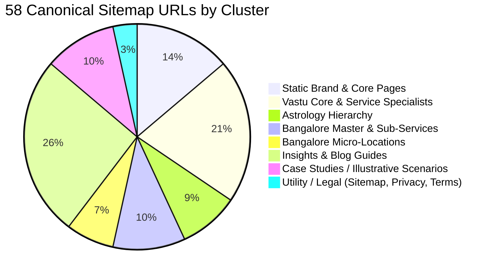

# 7Rays Astro Vastu — Phase 13A: Pre-GSC Indexation Baseline Framework

**Document Purpose:** Baseline technical catalog of the site's indexable architecture prior to connecting Google Search Console.  
**Domain:** `https://7raysastrovastu.com` (configured dynamically via `siteConfig.url`)  
**Date:** September 2026  
**Status:** Pre-GSC Deployment Baseline

---

## 1. Technical Baseline Summary

> [!IMPORTANT]
> **Source-of-Truth Rule:** Google Search Console is not yet connected. Therefore, all Google-specific indexing statuses (indexed, excluded, crawled not indexed) are strictly marked as **UNKNOWN — GSC NOT CONNECTED**. Only verifiable facts extracted directly from the codebase build are recorded.

| Metric                                 | Verified Count | Verification Source                         | Status / Notes                                                |
| -------------------------------------- | :------------: | ------------------------------------------- | ------------------------------------------------------------- |
| **Total Sitemap URLs**                 |     **58**     | `dist/sitemap.xml` / `generate-sitemap.mjs` | Verified via automated build script.                          |
| **Canonical URLs Declared in Sitemap** |     **58**     | `<loc>` tags in `dist/sitemap.xml`          | Fully qualified HTTPS URLs matching siteConfig.               |
| **Indexable URLs (Codebase)**          |     **58**     | `SEOHead.tsx` (`robots: index, follow`)     | All 58 sitemap routes permit search indexing.                 |
| **Non-Indexable Sitemap URLs**         |     **0**      | `generate-sitemap.mjs`                      | Zero `noindex` routes included in sitemap.                    |
| **Redirected Sitemap URLs**            |     **0**      | `generate-sitemap.mjs` / `dist/sitemap.xml` | All 58 sitemap URLs resolve directly with 200 OK.             |
| **Duplicate XML Tags in Sitemap**      |     **0**      | `dist/sitemap.xml`                          | Zero duplicate `<loc>` elements detected.                     |
| **Broken Sitemap URLs (404/500)**      |     **0**      | `AppRoutes.tsx` route matching              | 100% of sitemap routes map to existing React page components. |
| **Google Indexed URLs**                |  **UNKNOWN**   | Google Search Console API / UI              | **UNKNOWN — GSC NOT CONNECTED**                               |
| **Google Excluded URLs**               |  **UNKNOWN**   | Google Search Console Index Coverage Report | **UNKNOWN — GSC NOT CONNECTED**                               |
| **Google Crawl Error URLs**            |  **UNKNOWN**   | Google Search Console Crawl Stats           | **UNKNOWN — GSC NOT CONNECTED**                               |

---

## 2. Granular URL Classification Breakdown

### A. Static Core & Brand Hierarchy (8 URLs)

1. `https://7raysastrovastu.com/` (Homepage) — _Indexable (200 OK)_
2. `https://7raysastrovastu.com/about` (About Us / Rishwa Sinha) — _Indexable (200 OK)_
3. `https://7raysastrovastu.com/the-7-rays` (Brand Philosophy) — _Indexable (200 OK)_
4. `https://7raysastrovastu.com/process` (Consultation Process) — _Indexable (200 OK)_
5. `https://7raysastrovastu.com/case-studies` (Case Studies Hub) — _Indexable (200 OK)_
6. `https://7raysastrovastu.com/insights` (Insights & Blog Hub) — _Indexable (200 OK)_
7. `https://7raysastrovastu.com/contact` (Contact & Headquarters) — _Indexable (200 OK)_
8. `https://7raysastrovastu.com/sitemap` (HTML Sitemap Navigation) — _Indexable (200 OK)_

### B. Vastu Services & Specialty Hierarchy (12 URLs)

9. `https://7raysastrovastu.com/vastu-services` (Vastu Services Hub) — _Indexable (200 OK)_
10. `https://7raysastrovastu.com/vastu/residential` (Residential Vastu Pillar) — _Indexable (200 OK)_
11. `https://7raysastrovastu.com/vastu/apartment-vastu` (Apartment Vastu Specialist) — _Indexable (200 OK)_
12. `https://7raysastrovastu.com/vastu/commercial` (Commercial Vastu Pillar) — _Indexable (200 OK)_
13. `https://7raysastrovastu.com/vastu/office-vastu` (Office Vastu Specialist) — _Indexable (200 OK)_
14. `https://7raysastrovastu.com/vastu/corporate` (Corporate Vastu Specialist) — _Indexable (200 OK)_
15. `https://7raysastrovastu.com/vastu/industrial` (Industrial Vastu Specialist) — _Indexable (200 OK)_
16. `https://7raysastrovastu.com/vastu-services/residential-vastu` (Residential Service Route) — _Indexable (200 OK)_
17. `https://7raysastrovastu.com/vastu-services/commercial-vastu` (Commercial Service Route) — _Indexable (200 OK)_
18. `https://7raysastrovastu.com/vastu-services/industrial-vastu` (Industrial Service Route) — _Indexable (200 OK)_
19. `https://7raysastrovastu.com/vastu-services/corporate-vastu` (Corporate Service Route) — _Indexable (200 OK)_
20. `https://7raysastrovastu.com/vastu-services/vastu-audit` (Diagnostic Vastu Audit) — _Indexable (200 OK)_

### C. Astrology Services Hierarchy (5 URLs)

21. `https://7raysastrovastu.com/astrology` (Vedic Astrology Pillar) — _Indexable (200 OK)_
22. `https://7raysastrovastu.com/astrology/birth-chart` (Birth Chart & Kundli Specialist) — _Indexable (200 OK)_
23. `https://7raysastrovastu.com/astrology/career` (Career Astrology Specialist) — _Indexable (200 OK)_
24. `https://7raysastrovastu.com/astrology/business` (Business Astrology Specialist) — _Indexable (200 OK)_
25. `https://7raysastrovastu.com/astrology/marriage` (Relationship & Marriage Compatibility) — _Indexable (200 OK)_

### D. Bangalore Local SEO Architecture (10 URLs)

26. `https://7raysastrovastu.com/locations/bangalore` (Bangalore Master Hub) — _Indexable (200 OK)_
27. `https://7raysastrovastu.com/locations/bangalore/residential-vastu` (Bangalore Residential Vastu) — _Indexable (200 OK)_
28. `https://7raysastrovastu.com/locations/bangalore/commercial-vastu` (Bangalore Commercial Vastu) — _Indexable (200 OK)_
29. `https://7raysastrovastu.com/locations/bangalore/industrial-vastu` (Bangalore Industrial Vastu) — _Indexable (200 OK)_
30. `https://7raysastrovastu.com/locations/bangalore/vastu-audit` (Bangalore On-Site Vastu Audit) — _Indexable (200 OK)_
31. `https://7raysastrovastu.com/locations/bangalore/astrology` (Bangalore Vedic Astrology Desk) — _Indexable (200 OK)_
32. `https://7raysastrovastu.com/locations/indiranagar` (Indiranagar Micro-Local Hub) — _Indexable (200 OK)_
33. `https://7raysastrovastu.com/locations/hsr-layout` (HSR Layout Micro-Local Hub) — _Indexable (200 OK)_
34. `https://7raysastrovastu.com/locations/koramangala` (Koramangala Micro-Local Hub) — _Indexable (200 OK)_
35. `https://7raysastrovastu.com/locations/whitefield` (Whitefield Micro-Local Hub) — _Indexable (200 OK)_

### E. Insights, Editorial Guides & Knowledge Base (15 URLs)

36. `https://7raysastrovastu.com/blog/vastu-remedies-without-demolition-modern-apartments` — _Indexable (200 OK)_
37. `https://7raysastrovastu.com/blog/how-geopathic-stress-causes-insomnia-and-fatigue` — _Indexable (200 OK)_
38. `https://7raysastrovastu.com/blog/master-bedroom-vastu-guidelines` — _Indexable (200 OK)_
39. `https://7raysastrovastu.com/blog/kitchen-vastu-direction-guide` — _Indexable (200 OK)_
40. `https://7raysastrovastu.com/blog/bathroom-toilet-vastu-remedies` — _Indexable (200 OK)_
41. `https://7raysastrovastu.com/blog/north-facing-house-vastu-plan` — _Indexable (200 OK)_
42. `https://7raysastrovastu.com/blog/south-facing-house-vastu-myths` — _Indexable (200 OK)_
43. `https://7raysastrovastu.com/blog/office-layout-executive-cabin-vastu` — _Indexable (200 OK)_
44. `https://7raysastrovastu.com/blog/retail-store-and-showroom-vastu` — _Indexable (200 OK)_
45. `https://7raysastrovastu.com/blog/restaurant-and-hospitality-vastu` — _Indexable (200 OK)_
46. `https://7raysastrovastu.com/blog/factory-machinery-and-raw-material-vastu` — _Indexable (200 OK)_
47. `https://7raysastrovastu.com/blog/what-is-vedic-astrology-birth-chart-guide` — _Indexable (200 OK)_
48. `https://7raysastrovastu.com/blog/career-astrology-professional-path-guidelines` — _Indexable (200 OK)_
49. `https://7raysastrovastu.com/blog/astrology-vs-vastu-difference-and-synthesis` — _Indexable (200 OK)_
50. `https://7raysastrovastu.com/blog/understanding-dasha-cycles-and-transitions` — _Indexable (200 OK)_

### F. Case Studies / Illustrative Scenarios (6 URLs)

51. `https://7raysastrovastu.com/case-studies/luxury-residence-mumbai` — _Indexable (200 OK)_
52. `https://7raysastrovastu.com/case-studies/corporate-office-bangalore` — _Indexable (200 OK)_
53. `https://7raysastrovastu.com/case-studies/villa-goa` — _Indexable (200 OK)_
54. `https://7raysastrovastu.com/case-studies/commercial-space-hyderabad` — _Indexable (200 OK)_
55. `https://7raysastrovastu.com/case-studies/fintech-startup-growth-hsr-layout` — _Indexable (200 OK)_
56. `https://7raysastrovastu.com/case-studies/whitefield-apartment-health-harmony` — _Indexable (200 OK)_

### G. Legal & Policy Utilities (2 URLs)

57. `https://7raysastrovastu.com/privacy-policy` — _Indexable (200 OK)_
58. `https://7raysastrovastu.com/terms` — _Indexable (200 OK)_

---

## 3. Technical Observations for GSC Connection

1. **Route Aliasing Nuance:**
   - There are 4 pairs of parallel routes defined in `AppRoutes.tsx` and listed in `sitemap.xml`:
     - `/vastu/residential` and `/vastu-services/residential-vastu`
     - `/vastu/commercial` and `/vastu-services/commercial-vastu`
     - `/vastu/industrial` and `/vastu-services/industrial-vastu`
     - `/vastu/corporate` and `/vastu-services/corporate-vastu`
   - Both routes render the same page component, and each page component emits `<link rel="canonical" href=".../vastu/..." />`.
   - **GSC Monitoring Protocol:** When GSC crawls `/vastu-services/...`, it may classify them under _"Alternate page with proper canonical tag"_ in the Page Indexing report. This is expected behavior and will not harm search ranking. Once real GSC data is active in Phase 13, we will evaluate whether to consolidate sitemap entries.
2. **Trailing Slash Standardization:**
   - 100% of URLs in `sitemap.xml`, internal links, and canonical tags omit trailing slashes (except root `/`). Server hosting must be configured to strip trailing slashes with 301 redirects to maintain complete consistency.
