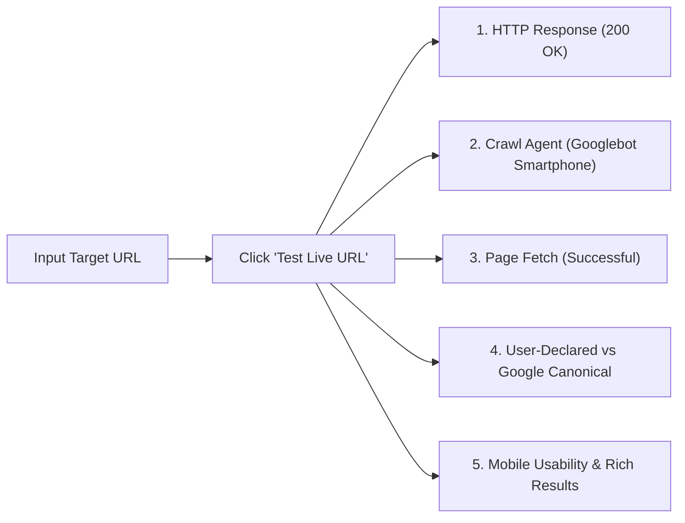

# 7Rays Astro Vastu — Phase 13A: Priority URL Inspection Framework

**Document Purpose:** Prioritized inventory and diagnostic inspection protocol for testing URLs in Google Search Console's URL Inspection Tool once the production domain is verified.  
**Domain Configuration:** Base site URL resolves dynamically via `siteConfig.url` (default: `https://7raysastrovastu.com`).  
**Lead Consultant:** Rishwa Sinha (Certified Vastu Consultant, 5+ years experience)  
**Date:** September 2026  
**Status:** Pre-GSC Deployment Blueprint

---

## 1. URL Inspection Protocol & Quota Management

Google Search Console enforces daily quotas on live URL inspections and manual indexation requests (typically 10–20 manual requests per 24 hours per property).

### Inspection Sequence Rules:

1. **Tier 1 (P0: Critical Foundation):** Inspect immediately on Day 1 following sitemap submission (1–5 URLs).
2. **Tier 2 (P1: Core Service Pillars):** Inspect on Day 2 (6–10 URLs).
3. **Tier 3 (P2: Bangalore Local Hubs):** Inspect on Day 3 (11–15 URLs).
4. **Tier 4 (P3: High-Intent Guides & Trust Pages):** Inspect on Day 4 (16–20 URLs).
5. **Remaining URLs:** Allow natural discovery via `sitemap.xml` and internal topic graph links.

> [!NOTE]
> In accordance with Phase 13A pre-GSC governance, **zero pages are currently claimed as indexed**. All pages carry the status: `Indexation status: Pending GSC verification`.

---

## 2. Priority URL Master Inspection Table

| #   | Target Canonical URL                                                                   | Primary Intent               | Primary Topic                                | Page Type          |     Priority Tier     | Canonical Expectation                                                                  | Inspection Reason & Validation Focus                                                                                  |               Current Status                |
| --- | -------------------------------------------------------------------------------------- | ---------------------------- | -------------------------------------------- | ------------------ | :-------------------: | -------------------------------------------------------------------------------------- | --------------------------------------------------------------------------------------------------------------------- | :-----------------------------------------: |
| 1   | `https://7raysastrovastu.com/`                                                         | Navigational / Brand         | Core Brand & Service Synthesis               | Homepage           |  **P0 (Immediate)**   | `https://7raysastrovastu.com/`                                                         | Core root entity anchor; validates `Organization`, `LocalBusiness`, and `WebSite` JSON-LD schema parsing.             | Indexation status: Pending GSC verification |
| 2   | `https://7raysastrovastu.com/vastu-services`                                           | Commercial Investigation     | Comprehensive Vastu Consultancy Hub          | Service Hub        |  **P0 (Immediate)**   | `https://7raysastrovastu.com/vastu-services`                                           | Primary topical parent for all architectural Vastu sub-branches; validates internal navigation hierarchy.             | Indexation status: Pending GSC verification |
| 3   | `https://7raysastrovastu.com/vastu-services/vastu-audit`                               | Commercial / Transactional   | 16-Zone CAD Property Audit & Energy Scan     | Diagnostic Service |  **P0 (Immediate)**   | `https://7raysastrovastu.com/vastu-services/vastu-audit`                               | High-value diagnostic entry point; checks AEO direct-answer block rendering and `ServiceSchema`.                      | Indexation status: Pending GSC verification |
| 4   | `https://7raysastrovastu.com/locations/bangalore`                                      | Local Commercial             | Bangalore Premier Vastu Consultation         | Local Hub          |  **P0 (Immediate)**   | `https://7raysastrovastu.com/locations/bangalore`                                      | Master local landing page; validates geographic coordinates (`13.0645, 77.5875`) and Dasarahalli HQ address.          | Indexation status: Pending GSC verification |
| 5   | `https://7raysastrovastu.com/astrology`                                                | Commercial / Informational   | Vedic Astrology & Parashari Jyotish          | Core Pillar        |  **P0 (Immediate)**   | `https://7raysastrovastu.com/astrology`                                                | Primary astrology pillar; validates ethical non-fatalistic framing and AEO Jyotish definition cards.                  | Indexation status: Pending GSC verification |
| 6   | `https://7raysastrovastu.com/vastu/residential`                                        | Commercial / Transactional   | Residential Vastu (Homes, Flats, Villas)     | Pillar Page        | **P1 (Core Pillar)**  | `https://7raysastrovastu.com/vastu/residential`                                        | Verifies non-demolition household harmony framework and Pancha Tattva elemental balance representation.               | Indexation status: Pending GSC verification |
| 7   | `https://7raysastrovastu.com/vastu/apartment-vastu`                                    | Commercial / Problem-Solving | High-Rise Apartment Vastu Without Demolition | Service Specialist | **P1 (Core Pillar)**  | `https://7raysastrovastu.com/vastu/apartment-vastu`                                    | High search volume niche in Bangalore; validates 32 entrance pada calculation from individual flat center.            | Indexation status: Pending GSC verification |
| 8   | `https://7raysastrovastu.com/vastu/commercial`                                         | Commercial / Transactional   | Commercial, Office & Retail Vastu            | Pillar Page        | **P1 (Core Pillar)**  | `https://7raysastrovastu.com/vastu/commercial`                                         | Workplace layout & financial cashflow alignment; verifies `Commercial Vastu` service schema and FAQ schema.           | Indexation status: Pending GSC verification |
| 9   | `https://7raysastrovastu.com/vastu/office-vastu`                                       | Commercial / Problem-Solving | Office Layout, Seating & Executive Cabins    | Service Specialist | **P1 (Core Pillar)**  | `https://7raysastrovastu.com/vastu/office-vastu`                                       | High B2B commercial intent; checks executive Southwest seating direct answer and lease-friendly remedies.             | Indexation status: Pending GSC verification |
| 10  | `https://7raysastrovastu.com/vastu/industrial`                                         | Commercial / Transactional   | Manufacturing Plants & Industrial Layouts    | Service Specialist | **P1 (Core Pillar)**  | `https://7raysastrovastu.com/vastu/industrial`                                         | High-value manufacturing segment; validates heavy machinery and electrical substation placement direct answers.       | Indexation status: Pending GSC verification |
| 11  | `https://7raysastrovastu.com/locations/bangalore/residential-vastu`                    | Local Transactional          | Bangalore Home & Apartment Consultation      | Local Cluster      |  **P2 (Local Hub)**   | `https://7raysastrovastu.com/locations/bangalore/residential-vastu`                    | Local residential intent; ensures neighborhood references (HSR, Koramangala, Whitefield) resolve cleanly.             | Indexation status: Pending GSC verification |
| 12  | `https://7raysastrovastu.com/locations/bangalore/commercial-vastu`                     | Local Transactional          | Bangalore Tech Park & Office Consultation    | Local Cluster      |  **P2 (Local Hub)**   | `https://7raysastrovastu.com/locations/bangalore/commercial-vastu`                     | B2B local intent for tech corridors (ORR, Electronic City, Manyata); checks local business schema.                    | Indexation status: Pending GSC verification |
| 13  | `https://7raysastrovastu.com/locations/bangalore/industrial-vastu`                     | Local Transactional          | Bangalore Industrial Zones (Peenya, Bidadi)  | Local Cluster      |  **P2 (Local Hub)**   | `https://7raysastrovastu.com/locations/bangalore/industrial-vastu`                     | Industrial local intent; verifies Peenya, Bommasandra, Hoskote industrial corridor entity linking.                    | Indexation status: Pending GSC verification |
| 14  | `https://7raysastrovastu.com/locations/bangalore/vastu-audit`                          | Local Transactional          | On-Site Property Energy Audits Bangalore     | Local Cluster      |  **P2 (Local Hub)**   | `https://7raysastrovastu.com/locations/bangalore/vastu-audit`                          | Verifies physical on-site diagnostic walk-through booking pathways across Greater Bengaluru.                          | Indexation status: Pending GSC verification |
| 15  | `https://7raysastrovastu.com/locations/bangalore/astrology`                            | Local Transactional          | Vedic Horoscope Consultation Bangalore       | Local Cluster      |  **P2 (Local Hub)**   | `https://7raysastrovastu.com/locations/bangalore/astrology`                            | Personal astrology consultation desk; verifies non-guarantee ethics and confidential booking CTA.                     | Indexation status: Pending GSC verification |
| 16  | `https://7raysastrovastu.com/astrology/birth-chart`                                    | Informational / Commercial   | Kundli & Birth Chart Synthesis               | Service Specialist |  **P2 (Astrology)**   | `https://7raysastrovastu.com/astrology/birth-chart`                                    | Deep-dive natal astrology; checks 12-house Bhava analysis and Dasha planetary cycle explanations.                     | Indexation status: Pending GSC verification |
| 17  | `https://7raysastrovastu.com/about`                                                    | Brand / E-E-A-T              | Rishwa Sinha Profile & Brand Philosophy      | Entity Profile     | **P2 (Trust/Entity)** | `https://7raysastrovastu.com/about`                                                    | Primary person entity anchor; verifies `Person` schema (`Rishwa Sinha`, `Certified Vastu Consultant`).                | Indexation status: Pending GSC verification |
| 18  | `https://7raysastrovastu.com/contact`                                                  | Transactional / Action       | Appointment Booking & Office Location        | Conversion Page    |  **P2 (Conversion)**  | `https://7raysastrovastu.com/contact`                                                  | Primary contact conversion gateway; verifies address markup, Google Map embed, and contact form render.               | Indexation status: Pending GSC verification |
| 19  | `https://7raysastrovastu.com/blog/vastu-remedies-without-demolition-modern-apartments` | Informational / High Intent  | Non-Demolition Apartment Remedies Guide      | Pillar Guide       |  **P3 (Editorial)**   | `https://7raysastrovastu.com/blog/vastu-remedies-without-demolition-modern-apartments` | Top organic search entry candidate; validates `ArticleSchema`, author link to Rishwa Sinha, and metal strip remedies. | Indexation status: Pending GSC verification |
| 20  | `https://7raysastrovastu.com/blog/how-geopathic-stress-causes-insomnia-and-fatigue`    | Informational / Technical    | Geopathic Stress & Earth Energy Lines        | Technical Guide    |  **P3 (Editorial)**   | `https://7raysastrovastu.com/blog/how-geopathic-stress-causes-insomnia-and-fatigue`    | Scientific earth frequency explanation; validates Gauss meter and digital instrument diagnostic descriptions.         | Indexation status: Pending GSC verification |

---

## 3. URL Inspection Diagnostic Checklist

When running each priority URL through GSC's URL Inspection Tool, record the following five parameters:

1. **Presence on Google:**
   - _Initial status:_ `URL is not on Google` (Expected before crawling).
2. **Coverage & Crawl:**
   - _Last crawl:_ Timestamp of Googlebot smartphone visit.
   - _Crawl allowed?_ Must show `Yes`.
   - _Page fetch:_ Must show `Successful`.
   - _Indexing allowed?_ Must show `Yes` (No noindex header/meta detected).
3. **Canonical URLs:**
   - _User-declared canonical:_ Must match the exact URL format in `sitemap.xml`.
   - _Google-selected canonical:_ Must match user-declared canonical. If Google selects an alternate URL (e.g. `/vastu/residential` over `/vastu-services/residential-vastu`), log it in the Change Log.
4. **Rich Results Detected:**
   - Confirm parsing of `Organization`, `LocalBusiness`, `Service`, `FAQPage`, or `Article`.
5. **Screenshot & Rendered HTML:**
   - Inspect the rendered screenshot in GSC to ensure hero text, H1, and direct-answer blocks render fully without client-side JavaScript execution failure.
