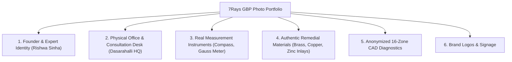

# 7Rays Astro Vastu — Phase 14: Google Business Profile Visual Media Strategy

**Document Purpose:** Establishes the real-world photography and visual asset guidelines for Google Business Profile, Apple Maps, and local directory listings to build authentic local trust and visual authority.  
**Lead Consultant:** Rishwa Sinha (Certified Vastu Consultant, 5+ years experience)  
**Date:** September 2026  
**Status:** Certified Visual Governance Standard

---

## 1. Visual Integrity & Anti-Deception Rules

> [!CRITICAL]
> **Strict Anti-Stock-Fraud Rule:**
>
> - Never upload generic stock photos of corporate boardrooms or mansions and claim they are "7Rays Projects".
> - Never publish photographs of client private bedrooms, floor plans showing family names, or high-security commercial layouts without explicit written consent.
> - Never post simulated "before & after energy glowing photos" that fabricate supernatural effects.
> - All imagery must reflect real people, genuine instruments, authentic materials, and the real physical headquarters.

---

## 2. Priority Photo Categories & Specifications

### Category 1: Founder & Expert Identity (E-E-A-T Anchor)

- **Subject:** Professional, warm, high-resolution portrait of Rishwa Sinha.
- **Setting:** Professional consulting study with architectural layouts, traditional astrolabe, or consulting desk in the background.
- **Attire:** Professional / formal Indian attire conveying approachable authority.
- **GBP Placement:** Profile Photo & "At Work" category.
- **Format:** Square (1:1), minimum 1200 x 1200 px, natural lighting.

### Category 2: Physical Headquarters & Exterior Context

- **Subject:** Exterior of building at 3J64+827, Balaji Layout, Bhuvaneswari Nagar, Dasarahalli, Bengaluru 560024.
- **Key Details:** Clear street context, building entrance, parking access, and any official 7Rays nameplate / brass signage.
- **Why It Matters:** Crucial for Google Maps physical verification and client direction confirmations.
- **GBP Placement:** "Exterior" & "Street View" verification.

### Category 3: Actual Diagnostic Instruments in Use

- **Subject:** High-quality macro and operational shots of the actual diagnostic instruments verified in the 7Rays methodology:
  1. _Calibrated Digital Compass:_ Showing angular degree measurement against architectural North.
  2. _Digital Gauss Meter:_ Demonstrating electromagnetic field scanning.
  3. _Traditional Dowsing Rods:_ Highlighting subterranean stress line detection.
- **Framing:** Hands-on consultation shots showing Rishwa Sinha holding the instruments over anonymized architectural CAD plans.

### Category 4: Authentic Remedial Materials & Inlays

- **Subject:** Physical metallic boundary inlay materials supplied by 7Rays:
  - Solid brass boundary rods / strips.
  - Pure copper earth grounding rods / wire.
  - Zinc elemental strips for bathroom / shaft insulation.
  - Lead dampening plates for heavy Southwest corners.
- **Why It Matters:** Proves real-world supply chain and reinforces the non-demolition remedial philosophy against competitors who sell cheap plastic trinkets or superstitious idols.

### Category 5: 16-Zone CAD Energy Blueprint Analysis

- **Subject:** Close-up photographs of anonymized CAD architectural floor plans showing:
  - 16-zone Shakti Chakra / Padavinyasa grid overlays.
  - 32 entrance pada degree allocations.
  - Anonymized zoning notes (client name and flat numbers blacked out).

### Category 6: Official Brand Identity Assets

- **Logo:** High-resolution transparent PNG and gold-gradient square logo (`7rays-logo.png`).
- **Cover Photo:** High-resolution 16:9 banner (minimum 1920 x 1080 px) featuring the luxury gold-and-navy aesthetic, brand name, and verified tagline (_"Scientific Astro-Vastu & Energy Harmonization in Bengaluru"_).

---

## 3. Metadata & Image Optimization Checklist

Before uploading photos to Google Business Profile:

1. **File Naming Standard:**
   - _Bad:_ `IMG_20260924_104523.jpg`
   - _Good:_ `7rays-astro-vastu-rishwa-sinha-consultant-bangalore.jpg`
   - _Good:_ `vastu-audit-digital-compass-peenya-dasarahalli.jpg`
   - _Good:_ `non-demolition-brass-inlay-remedies-bengaluru.jpg`
2. **EXIF Geotagging:** Ensure camera GPS tagging is enabled so photographs taken at Dasarahalli HQ retain valid coordinates (`13.0645° N, 77.5875° E`).
3. **No Heavy Filters:** Avoid heavy artistic HDR or artificial glow filters. Clean, well-illuminated natural photography communicates genuine trustworthiness.
