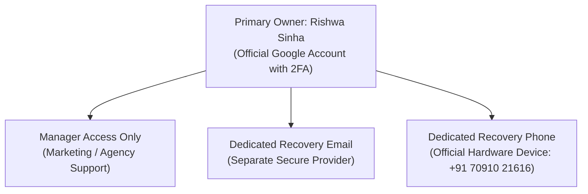

# 7Rays Astro Vastu — Phase 14: Google Business Profile Account Security & Safety Checklist

**Document Purpose:** Security protocol and governance checklist for protecting ownership, managing administrative permissions, preventing unauthorized edits, and securing the 7Rays Astro Vastu Google Business Profile against hijacking or suspension.  
**Lead Consultant:** Rishwa Sinha (Certified Vastu Consultant, 5+ years experience)  
**Date:** September 2026  
**Status:** Certified Operational Security Standard

---

## 1. Google Account Ownership & Access Control

> [!CRITICAL]
> **Primary Ownership Rule:**
>
> - The Google Business Profile must be owned exclusively by **Rishwa Sinha** using an official company Google account.
> - **Never** allow external marketing agencies, freelancers, or web development vendors to claim primary ownership.
> - If external vendors assist with profile optimization, grant them **Manager** access only—never Owner or Primary Owner.
> - Never share passwords or two-factor authentication (2FA) verification codes with anyone.

---

## 2. Security Configuration Checklist

- [ ] **Two-Factor Authentication (2FA) Enabled:**
  - Enforce Google 2-Step Verification using Google Authenticator, a hardware security key (YubiKey), or physical phone prompt.
  - Avoid SMS-only 2FA if vulnerable to SIM-swap attacks; prioritize app-based authenticator.
- [ ] **Dedicated Recovery Email & Hardware Phone:**
  - Configure a secondary secure recovery email address outside the primary domain.
  - Set the official business phone (`+91 70910 21616`) as the authorized recovery telephone.
- [ ] **Role-Based Permission Reviews:**
  - Audit Google Business Profile users every 90 days (`Business Profile Settings → Managers`).
  - Immediately revoke access for departed employees, past agencies, or inactive accounts.
- [ ] **Alerts & Notification Settings:**
  - Ensure all email notifications for _"Profile edits suggest by users or Google"_, _"Customer questions"_, and _"New reviews"_ are enabled.

---

## 3. Defense Against Profile Hijacking & Unauthorized Edits

Google allows public users to suggest edits (such as marking a business "Closed" or changing phone numbers). Unchecked edits can automatically go live if not reviewed within 14 days.

### Defense Protocols:

1. **Weekly Edit Monitoring:**
   - Log into Google Business Profile Manager weekly.
   - Look for orange or strikethrough text indicating "Google has updated your business info based on user feedback".
   - If an unauthorized change appears, click **Reject Changes** or restore the verified canonical NAP immediately.
2. **Preventing "Suggest an Edit" Exploits:**
   - Ensure the official website, schema markup, and external citations maintain 100% exact consistency with GBP. Google cross-references web citations before approving user edits.
3. **Handling Ownership Conflict Requests:**
   - If someone requests ownership of your profile via Google Business Profile, Google sends an alert email with a 3–7 day window to respond.
   - **Immediately click "REJECT REQUEST"**. Never ignore ownership transfer requests.

---

## 4. Suspension Defense & Business Verification Dossier

If Google ever triggers a re-verification or suspension (common during phone or category changes), keep the following official business evidence dossier compiled and ready for immediate appeal submission:

- **1. GST / MSME / Business Registration Certificate:** Showing business name `7Rays Astro Vastu` and Dasarahalli address.
- **2. Property Lease / Rental Agreement / Property Tax Receipt:** Proving physical tenure at 3J64+827, Balaji Layout, Dasarahalli, Bengaluru 560024.
- **3. Utility Bill (Electricity / Water / Internet):** Issued in the name of the business or founder at the verified address.
- **4. Physical Signage & Office Video Walkthrough:**
  - Unedited 1-minute video showing:
    - Street view, building exterior, and landmark.
    - Permanent business signage showing `7Rays Astro Vastu`.
    - Unlocking the office door and entering the consulting room.
    - Demonstrating diagnostic instruments (calibrated compass, Gauss meter) and branded stationery.
- **5. Official Telecom Bill:** Documenting account holder name for phone line `+91 70910 21616`.
