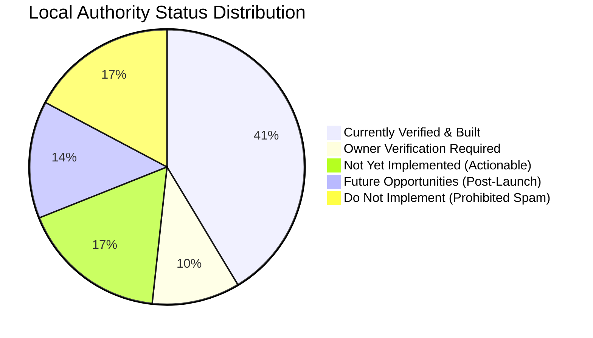

# 7Rays Astro Vastu — Phase 14: Local Authority Gap Analysis & Governance Audit

**Document Purpose:** Comprehensive gap analysis categorizing all local SEO, Google Business Profile, citation, and local authority assets into 5 distinct operational statuses.  
**Lead Consultant:** Rishwa Sinha (Certified Vastu Consultant, 5+ years experience)  
**Date:** September 2026  
**Status:** Certified Gap Analysis

---

## 1. Five-Tier Operational Governance Matrix

---

## 2. Comprehensive Inventory by Operational Status

### Tier 1: CURRENTLY VERIFIED & IMPLEMENTED (Technical Foundation)

1. **Physical Headquarters Entity:** `3J64+827, Balaji Layout, H A Farm Post, Bhuvaneswari Nagar, Dasarahalli, Bengaluru, Karnataka 560024, India` verified and hardcoded in `businessConfig.address`.
2. **Official Google Maps Link:** `https://maps.app.goo.gl/wcoHwGSBggq6n3Fe9` anchored across all schemas and navigation components.
3. **Verified Official Phone:** `+91 70910 21616` (National: `070910 21616`, WhatsApp: `917091021616`) integrated into `business.ts`, `env.ts`, `Footer.tsx`, `Header.tsx`, `ContactPage.tsx`, and schemas.
4. **Founder Entity Attribution:** Rishwa Sinha, Certified Vastu Consultant (5+ years experience) consistently identified across all pages.
5. **LocalBusiness Schema Markup:** Verified JSON-LD schema with `#localbusiness` URI, geographic coordinates (`13.0645, 77.5875`), and direct provider links.
6. **Bangalore Local SEO Pages:** 6 fully articulated local routes (`/locations/bangalore`, plus residential, commercial, industrial, audit, and astrology sub-pages).
7. **Service Territory Differentiation:** Clear structural distinction between physical HQ (Dasarahalli) and service territories (HSR, Indiranagar, Koramangala, Whitefield).
8. **Anti-Demolition Methodology:** Documented supply of genuine metallic boundary inlays (brass, copper, zinc, lead).
9. **Instrument Calibration References:** Verified usage of calibrated digital compasses, digital Gauss meters, and dowsing rods.
10. **Ethical Non-Guarantee Astrological Standard:** Complete rejection of guaranteed predictions or wealth promises.
11. **Responsive Map Embed & Contact Form:** Working consultation modals and contact forms on `/contact`.
12. **Sitemap & Robots Directives:** 58 canonical URLs with full crawler permissions for major map search engines.

---

### Tier 2: OWNER VERIFICATION REQUIRED (Needs Owner Business Decision)

1. **Operating / Consultation Hours:** Currently set to `null` to avoid guessing. Owner must verify exact consultation appointment hours (e.g., _Mon–Sat 09:30 AM – 06:30 PM_).
2. **Dedicated Business Email:** Currently set to `null`. Owner must provide official custom domain email (e.g., `contact@7raysastrovastu.com` or `rishwa@7raysastrovastu.com`).
3. **Official Social Media Profiles:** Social links currently set to `null` to prevent broken links. Owner must confirm handles for official Facebook, Instagram, LinkedIn, or YouTube channels.

---

### Tier 3: NOT YET IMPLEMENTED (Actionable Roadmap Post-Domain)

1. **Google Business Profile Claim & Verification:** Owner must log into GBP Manager and complete verification for the Dasarahalli pin.
2. **Direct Google Review Shortlink Generation:** Once GBP is verified, generate the `g.page/r/.../review` link and plug it into client follow-up templates.
3. **Tier 1 Citation Submission:** Claim and configure Apple Maps (Business Connect), Bing Places, and MapmyIndia.
4. **GBP Photo Upload:** Upload the 6 priority photo categories defined in `PHASE_14_GBP_MEDIA_STRATEGY.md` (portraits, HQ exterior, instruments, metal inlays).
5. **GBP Services & Products Configuration:** Populate the exact service names and descriptions matching `PHASE_14_NAP_STANDARD.md`.

---

### Tier 4: FUTURE OPPORTUNITY (Phased 60–90 Day Execution)

1. **Tier 2/3 Indian Directories:** Manual submission to Justdial, Sulekha, IndiaMART, and Bangalore chamber directories.
2. **Houzz India & Real Estate Expert Listings:** Establish expert profiles on Houzz India and 99acres home services.
3. **Guest Editorial Commentary:** Pitch Bangalore property and high-rise Vastu articles to architecture and city portals.
4. **Client Review Growth:** Accumulate 10–25 authentic reviews through the post-consultation workflow.

---

### Tier 5: DO NOT IMPLEMENT (Strictly Prohibited Black-Hat Tactics)

1. **DO NOT Create Fake Branch Locations:** Never register virtual office addresses in Indiranagar, Koramangala, or Whitefield.
2. **DO NOT Stuff Keywords into Business Name:** Never change Google Business Profile name to _"7Rays Astro Vastu - Best Vastu Consultant in Bangalore"_.
3. **DO NOT Buy Fake Reviews:** Never purchase bulk review packages or use friends/employees for fake ratings.
4. **DO NOT Buy Low-Quality Directory Packages:** Never use automated Fiverr directory submission bots.
5. **DO NOT Create Doorway City Pages:** Never generate thin, automated pages for neighboring towns (e.g., _"Vastu Consultant in Tumkur"_, _"Vastu Consultant in Mandya"_) without real local demand.
