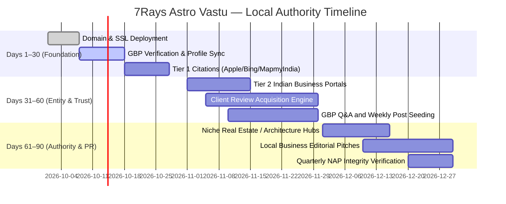

# 7Rays Astro Vastu — Phase 14: 30 / 60 / 90 Day Local Authority Roadmap

**Document Purpose:** Phased execution roadmap for the business owner and marketing team to build sustainable, white-hat local search authority in Greater Bengaluru following domain connection.  
**Lead Consultant:** Rishwa Sinha (Certified Vastu Consultant, 5+ years experience)  
**Date:** September 2026  
**Status:** Certified Execution Roadmap

---

## 1. Roadmap Overview & Strategic Horizon

---

## 2. Days 1–30: Technical Foundation & Core Verification

### Objective: Establish rock-solid geographic presence and verified business identity across primary map ecosystems.

- [ ] **Action 1.1: Deploy Final Production Domain & SSL:**
  - Connect production domain, enable strict HTTPS, and configure `VITE_SITE_URL` to update sitemap and robots.txt.
- [ ] **Action 1.2: Complete Google Business Profile Verification:**
  - Claim the existing pin at `https://maps.app.goo.gl/wcoHwGSBggq6n3Fe9`.
  - Verify phone number `+91 70910 21616` and Dasarahalli address.
  - Set Primary Category: `Vastu Consultant`. Secondary Category: `Astrologer`.
  - Enter the verified 750-character business description from `PHASE_14_NAP_STANDARD.md`.
- [ ] **Action 1.3: Upload Foundation Media:**
  - Upload founder portrait of Rishwa Sinha, Dasarahalli building exterior, and photos of calibrated instruments (compass, Gauss meter, metallic inlays).
- [ ] **Action 1.4: Establish Tier 1 Map Citations:**
  - Create verified listings on **Apple Maps (Apple Business Connect)**, **Bing Places for Business**, and **MapmyIndia (Mappls)** using exact canonical NAP.
- [ ] **Action 1.5: Confirm GSC & GBP Domain Linking:**
  - Ensure the website link in GBP points directly to the canonical HTTPS home page.

---

## 3. Days 31–60: Local Entity Grounding & Authentic Trust

### Objective: Expand local directory footprint and initiate the post-consultation client review workflow.

- [ ] **Action 2.1: Activate Post-Consultation Review Workflow:**
  - Generate the official Google review shortlink (`g.page/r/.../review`).
  - Deploy the WhatsApp and Email review request templates (from `PHASE_14_REVIEW_STRATEGY.md`) for all completed property audits and astrological readings.
- [ ] **Action 2.2: Establish Tier 2 Indian Directory Footprint:**
  - Manually claim free business profiles on **Justdial Bangalore**, **IndiaMART**, and **Sulekha Bangalore**.
  - Reject aggressive sales calls for paid sponsor ads; maintain clean, verified free listings with exact NAP.
- [ ] **Action 2.3: Seed Authentic GBP Q&A:**
  - Populate common client questions in Google Business Profile's Q&A section with clear direct answers (e.g., _"Do you consult for apartments without breaking walls?"_, _"What tools do you use during an on-site audit?"_).
- [ ] **Action 2.4: Publish Weekly GBP Updates:**
  - Share weekly informative updates on GBP linking to Bangalore educational guides (e.g., tips for master bedroom alignment, geopathic stress awareness).

---

## 4. Days 61–90: Local Authority Expansion & Editorial Commentary

### Objective: Gain recognition in specialized architectural and local business networks.

- [ ] **Action 3.1: Profile Building on Architecture & Design Platforms:**
  - Create professional profiles on **Houzz India** and real estate consultant platforms.
  - Showcase non-demolition metallic inlay approaches and CAD diagnostic capabilities.
- [ ] **Action 3.2: Editorial Guest Commentary & Local PR:**
  - Pitch expert commentary to Bangalore property publications on high-rise flat Vastu considerations.
  - Emphasize practical layout solutions for modern tech workers in Whitefield, HSR Layout, and Electronic City.
- [ ] **Action 3.3: Systematic NAP Audit & Cleanup:**
  - Perform a Google search for `"+91 70910 21616"` and `"7Rays Astro Vastu"` to identify any accidental duplicate or outdated listings.
  - Request immediate correction of any misspelled address elements.
- [ ] **Action 3.4: Review Response Protocol Governance:**
  - Ensure 100% of incoming customer reviews have received a warm, professional, privacy-conscious response within 48 hours.
