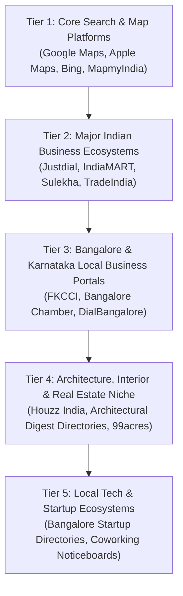

# 7Rays Astro Vastu — Phase 14: Local Citation Strategy & Ecosystem Blueprint

**Document Purpose:** Defines the white-hat, multi-tiered citation building strategy for 7Rays Astro Vastu across search engines, map aggregators, Indian business platforms, and Bangalore directories.  
**Lead Consultant:** Rishwa Sinha (Certified Vastu Consultant, 5+ years experience)  
**Verified Address:** 3J64+827, Balaji Layout, H A Farm Post, Bhuvaneswari Nagar, Dasarahalli, Bengaluru, Karnataka 560024, India  
**Verified Phone:** `+91 70910 21616`  
**Date:** September 2026  
**Status:** Pre-Deployment Citation Blueprint (Zero Listings Fabricated)

---

## 1. Citation Quality Governance & Anti-Spam Rules

> [!WARNING]
> **Strict Policy Against Low-Quality Directory Blasts:**
>
> - Never purchase bulk $5 "300 citation packages" from Fiverr or automated submission bots.
> - Never submit to link-farm directories (e.g., automated FreeBusinessListing directories with zero human traffic).
> - Every citation listing must feature an **exact 100% NAP match** to the canonical standard.
> - Every profile must be manually claimed, verified, and managed using the official business email.

---

## 2. Multi-Tiered Citation Matrix

### Tier 1: Core Search & Mapping Ecosystems (Highest Priority)

| Platform                                | Primary Domain              | Local Relevance                                   | Exact Entity Match Required | NAP Requirement                  | Verification Status                                        | Owner Action Required                                         |      Priority      |
| --------------------------------------- | --------------------------- | ------------------------------------------------- | --------------------------- | -------------------------------- | ---------------------------------------------------------- | ------------------------------------------------------------- | :----------------: |
| **Google Business Profile**             | `google.com/business`       | Essential (Global & Local #1)                     | `7Rays Astro Vastu`         | Full Address + `+91 70910 21616` | **CLAIMED & ACTIVE** (`maps.app.goo.gl/wcoHwGSBggq6n3Fe9`) | Complete profile optimization & photo upload.                 | **P0 (Immediate)** |
| **Apple Maps (Apple Business Connect)** | `businessconnect.apple.com` | High (iOS Safari & Siri navigation in Bangalore)  | `7Rays Astro Vastu`         | Full Address + `+91 70910 21616` | Not Yet Claimed                                            | Log in with Apple ID, claim location, verify via phone call.  |   **P1 (High)**    |
| **Bing Places for Business**            | `bingplaces.com`            | High (Copilot & Bing Search ecosystem)            | `7Rays Astro Vastu`         | Full Address + `+91 70910 21616` | Not Yet Claimed                                            | Sync directly from verified Google Business Profile.          |   **P1 (High)**    |
| **MapmyIndia (Mappls)**                 | `mappls.com`                | High (Dominant native Indian navigation platform) | `7Rays Astro Vastu`         | Full Address + `+91 70910 21616` | Not Yet Claimed                                            | Submit place listing with Dasarahalli Plus Code (`3J64+827`). |   **P1 (High)**    |

---

### Tier 2: Major Indian Commercial & Business Platforms

| Platform               | Primary Domain           | Business Category              | Target Service Representation                | NAP Requirement                 | Verification Status | Owner Action Required                                                     |    Priority     |
| ---------------------- | ------------------------ | ------------------------------ | -------------------------------------------- | ------------------------------- | ------------------- | ------------------------------------------------------------------------- | :-------------: |
| **Justdial Bangalore** | `justdial.com/Bangalore` | Vastu Consultants, Astrologers | Residential Vastu, Office Vastu, Vastu Audit | Exact Match + `+91 70910 21616` | Not Yet Claimed     | Create free verified business listing. Avoid aggressive paid ad packages. | **P2 (Medium)** |
| **IndiaMART**          | `indiamart.com`          | Vastu Consultancy Services     | Commercial & Industrial Vastu Audits         | Exact Match + `+91 70910 21616` | Not Yet Claimed     | Register verified consulting firm profile for B2B manufacturing plants.   | **P2 (Medium)** |
| **Sulekha Bangalore**  | `sulekha.com/bangalore`  | Vastu Consultants              | Apartment & Home Vastu Without Demolition    | Exact Match + `+91 70910 21616` | Not Yet Claimed     | Free listing registration; list Dasarahalli address.                      | **P2 (Medium)** |
| **TradeIndia**         | `tradeindia.com`         | Vastu Services                 | Corporate & Industrial Spatial Planning      | Exact Match + `+91 70910 21616` | Not Yet Claimed     | Standard supplier profile for commercial clients.                         | **P3 (Lower)**  |

---

### Tier 3: Bengaluru & Karnataka Local Business Directories

| Platform                         | Primary Domain                         | Focus Area                                   | NAP Requirement                             | Verification Status | Owner Action Required                                              |    Priority     |
| -------------------------------- | -------------------------------------- | -------------------------------------------- | ------------------------------------------- | ------------------- | ------------------------------------------------------------------ | :-------------: |
| **Bangalore Business Directory** | `bangalore.com` / `bangaloreonline.in` | Local city guide                             | Exact Address (Dasarahalli, 560024) + Phone | Not Yet Claimed     | Submit city-level business entry under Professional Services.      | **P2 (Medium)** |
| **FKCCI Directory**              | `fkcci.org`                            | Federation of Karnataka Chambers of Commerce | Verified Registered Address                 | Future Evaluation   | Evaluate associate membership when corporate B2B expansion occurs. | **P4 (Future)** |
| **Yalwa Bangalore**              | `yalwa.in/bangalore`                   | Local neighborhood classifieds               | Exact Match                                 | Not Yet Claimed     | Free neighborhood listing under Bengaluru North.                   | **P3 (Lower)**  |

---

### Tier 4: Architecture, Interior Design & Real Estate Platforms

| Platform                                 | Primary Domain                    | Niche Relevance                               | Content & Services Offered                                        | NAP Requirement            | Verification Status |      Priority       |
| ---------------------------------------- | --------------------------------- | --------------------------------------------- | ----------------------------------------------------------------- | -------------------------- | ------------------- | :-----------------: |
| **Houzz India**                          | `houzz.in`                        | High (Interior designers & home renovators)   | Vastu layout consultancy for home renovations without demolition. | Full Profile + Website URL | Not Yet Claimed     | **P2 (High Niche)** |
| **Magicbricks / 99acres Experts**        | `magicbricks.com` / `99acres.com` | High (Homebuyers seeking pre-purchase audits) | Pre-purchase floor plan Vastu audit for Bangalore apartments.     | Full Address + Phone       | Not Yet Claimed     | **P2 (High Niche)** |
| **Architectural Digest India Directory** | `architecturaldigest.in`          | High (Luxury design ecosystem)                | High-end penthouse and villa energetic alignment commentary.      | Editorial Profile          | Future Opportunity  |  **P3 (Niche PR)**  |

---

## 3. Step-by-Step Claiming & Maintenance Protocol

1. **Email Standard:** Use a single dedicated company Google/administrative email account for all directory registrations.
2. **Password & OTP Management:** The owner must directly handle SMS OTPs sent to `+91 70910 21616`.
3. **Crawl Tracking:** Once submitted, log each approved listing URL in `PHASE_14_LOCAL_AUTHORITY_ROADMAP.md`.
4. **Duplicate Prevention:** Before creating any new account, search the platform for _"7Rays Astro Vastu"_ and _"Rishwa Sinha"_ to ensure no outdated or automated duplicate listing exists.
