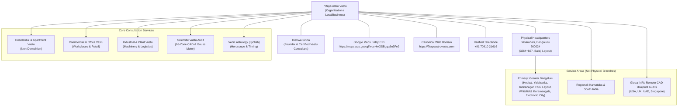

# 7Rays Astro Vastu — Phase 14: Local Entity & Knowledge Graph Architecture

**Document Purpose:** Defines the local entity relationships, geographic boundaries, physical headquarters grounding, and service-area hierarchy for 7Rays Astro Vastu in Bengaluru and beyond.  
**Auditor / Architect:** Antigravity AI Engine  
**Lead Consultant:** Rishwa Sinha (Certified Vastu Consultant, 5+ years experience)  
**Verified Physical Headquarters:** 3J64+827, Balaji Layout, H A Farm Post, Bhuvaneswari Nagar, Dasarahalli, Bengaluru, Karnataka 560024, India  
**Official Google Maps Entity:** `https://maps.app.goo.gl/wcoHwGSBggq6n3Fe9`  
**Verified Phone:** `+91 70910 21616` (Display: `+91 70910 21616`, Dialable: `tel:+917091021616`)  
**Date:** September 2026  
**Status:** Local Entity Source of Truth

---

## 1. Master Local Entity Topology

---

## 2. Core Entity Definitions & Relationship Matrix

| Entity Node             | Schema Type                     | Unique Identifier (`@id`)                    | Official Property Values                                                                                                                                                            | Semantic Relationship                                                                     |
| ----------------------- | ------------------------------- | -------------------------------------------- | ----------------------------------------------------------------------------------------------------------------------------------------------------------------------------------- | ----------------------------------------------------------------------------------------- |
| **7Rays Astro Vastu**   | `LocalBusiness`, `Organization` | `https://7raysastrovastu.com/#localbusiness` | `name: "7Rays Astro Vastu"` `telephone: "+91 70910 21616"` `url: "https://7raysastrovastu.com"`                                                                             | Primary business entity providing Vastu & Astrology consultations.                        |
| **Rishwa Sinha**        | `Person`                        | `https://7raysastrovastu.com/#rishwa-sinha`  | `jobTitle: "Certified Vastu Consultant"` `hasCredential: "Certified Vastu Consultant"` `experience: "5+ years"`                                                             | Founder, lead auditor, and authoritative creator of all consultation methodologies.       |
| **Dasarahalli HQ**      | `PostalAddress`                 | Embedded in `#localbusiness`                 | `streetAddress: "3J64+827, Balaji Layout, H A Farm Post, Bhuvaneswari Nagar, Dasarahalli"` `addressLocality: "Bengaluru"` `postalCode: "560024"` `addressCountry: "IN"` | **Sole verified physical location.** No other physical offices or branch locations exist. |
| **Official Google Map** | `Map`                           | `hasMap`                                     | `https://maps.app.goo.gl/wcoHwGSBggq6n3Fe9`                                                                                                                                         | Official Google Maps listing anchor for geographic verification (`13.0645, 77.5875`).     |

---

## 3. Strict Physical vs. Service-Area Boundaries

> [!CRITICAL]
> **Anti-Doorway Policy:** The Dasarahalli address is the **sole verified physical headquarters**. The localities of Indiranagar, HSR Layout, Koramangala, and Whitefield represent **service delivery territories** where on-site energy audits and consultations are conducted for homeowners and businesses. They must **never** be claimed as separate physical branches or virtual offices.

### Service Territory Hierarchy:

1. **Physical Office (Headquarters):**
   - _Location:_ Dasarahalli / Bhuvaneswari Nagar / Hebbal corridor (Bengaluru North).
   - _Functions:_ Client intake, architectural blueprint analysis, instrument calibration, administrative operations.
2. **On-Site Field Audit Coverage (Greater Bengaluru):**
   - _East Corridor:_ Whitefield, Marathahalli, KR Puram, Indiranagar.
   - _South Corridor:_ HSR Layout, Koramangala, BTM Layout, Jayanagar, JP Nagar, Electronic City.
   - _North & West Corridors:_ Hebbal, Yelahanka, Sahakar Nagar, Malleshwaram, Rajajinagar, Peenya Industrial Area.
3. **Remote Virtual Consultancy (Pan-India & Overseas):**
   - High-precision CAD blueprint audits, Google Earth coordinate analysis, and video walkthrough consultations for NRI flat buyers and commercial facilities globally.
