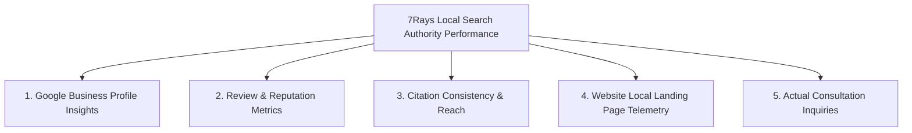

# 7Rays Astro Vastu — Phase 14: Local Authority & GBP KPI Tracking Framework

**Document Purpose:** Defines the telemetry metrics, measurement cadences, benchmark thresholds, and performance indicators for tracking local SEO progress across Google Business Profile, local citations, and website inquiries.  
**Lead Consultant:** Rishwa Sinha (Certified Vastu Consultant, 5+ years experience)  
**Date:** September 2026  
**Status:** Pre-Deployment Measurement Framework (Zero Simulated Performance Data)

---

## 1. Local Search Measurement Architecture

> [!NOTE]
> In accordance with Phase 14 governance, all metrics dependent on Google Search Console or live GBP access are marked as **PENDING PHASE 13 / PENDING LIVE GBP ACTIVATION**. No performance numbers are simulated.

---

## 2. Core KPI Scorecard & Measurement Cadence

| Metric Category           | Specific Indicator                    | Target Milestone / Benchmark                             | Measurement Cadence | Current Baseline Status         |
| ------------------------- | ------------------------------------- | -------------------------------------------------------- | ------------------- | ------------------------------- |
| **GBP Health**            | Profile Completeness Score            | **100%** (All fields, hours, photos, services populated) | Monthly Check       | Pending Owner GBP Verification  |
| **GBP Search Visibility** | Direct Searches vs Discovery Searches | Discovery Searches > 65% of Total                        | Monthly             | Pending Live GBP Activation     |
| **Customer Actions**      | Phone Calls Initiated                 | Tracked via GBP Insights (`+91 70910 21616`)             | Weekly / Monthly    | Pending Live GBP Activation     |
| **Customer Actions**      | Website Clicks from GBP               | Direct clicks to canonical landing pages                 | Weekly / Monthly    | Pending Live GBP Activation     |
| **Customer Actions**      | Driving Direction Requests            | Navigation to Dasarahalli HQ                             | Monthly             | Pending Live GBP Activation     |
| **Customer Actions**      | Direct Messages / Inquiries           | In-app messaging response rate < 2 hrs                   | Continuous          | Pending Live GBP Activation     |
| **Reputation & Trust**    | Authentic Review Count                | Steady growth matching completed client audits           | Monthly             | 0 Verified Reviews (Pre-launch) |
| **Reputation & Trust**    | Average Rating Score                  | Benchmark >= 4.7 / 5.0                                   | Monthly             | Pre-launch Baseline             |
| **Reputation & Trust**    | Review Response Rate                  | **100% of reviews responded to within 48h**              | Continuous          | Pre-launch Baseline             |
| **Citation Health**       | Canonical NAP Consistency Rate        | **100% exact match** across all live citations           | Quarterly Audit     | Standard defined in Phase 14    |
| **Citation Health**       | Live Approved Tier 1/2 Citations      | Minimum 8 verified ecosystem listings                    | Quarterly Audit     | Pre-submission Phase            |
| **Local Organic Traffic** | Local Landing Page Sessions           | Traffic to `/locations/bangalore/...`                    | Monthly             | PENDING PHASE 13 (GSC)          |
| **Local Organic Queries** | Geo-modified search impressions       | Bengaluru, HSR, Whitefield, etc.                         | Monthly             | PENDING PHASE 13 (GSC)          |
| **Business Conversion**   | WhatsApp Consultations Started        | Triggered via `whatsapp_click` event                     | Weekly              | Pre-launch Baseline             |
| **Business Conversion**   | Appointment Form Submissions          | Triggered via `form_submission` event                    | Weekly              | Pre-launch Baseline             |

---

## 3. Reporting Protocol & Quarterly Review

Once the profile is verified and active:

1. **Monthly Local Dashboard Review:**
   - Log into Google Business Profile Manager → Performance.
   - Record total interactions (calls, clicks, direction requests).
   - Log new verified reviews and confirm all received responses.
2. **Quarterly Citation Audit:**
   - Run a manual search check on Tier 1 and Tier 2 directories.
   - Verify phone number formatting (`+91 70910 21616`) and address consistency.
3. **Correlation with Phase 13:**
   - Once GSC data is active, correlate local landing page impressions with GBP discovery searches to identify emerging high-intent neighborhood corridors.
