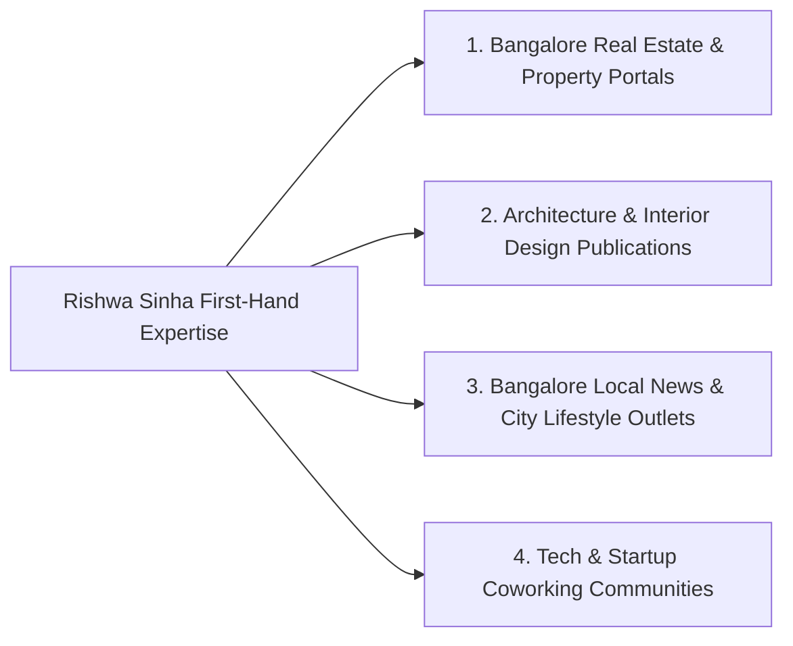

# 7Rays Astro Vastu — Phase 14: Local Link & Digital PR Opportunity Map

**Document Purpose:** Identifies legitimate editorial, architectural, real estate, and local Bengaluru platforms for future earned media mentions, expert commentary, and un-manipulated backlinks.  
**Lead Consultant:** Rishwa Sinha (Certified Vastu Consultant, 5+ years experience)  
**Date:** September 2026  
**Status:** Pre-Outreach Opportunity Catalog (Zero Purchased or Spammed Links)

---

## 1. Ethical PR & Link Earning Policy

> [!WARNING]
> **Strict Anti-Spam Policy:**
>
> - Never buy links from PBNs (Private Blog Networks), link brokers, or "sponsored post" marketplaces.
> - Never execute automated cold email spam blasts to Bangalore bloggers or journalists.
> - Value must be created first: links must be **earned** through expert commentary on high-rise urban living, non-demolition flat remediation, and architectural harmony.

---

## 2. Targeted Opportunity Clusters

### Cluster A: Bangalore Real Estate & Property Ecosystems

- **Target Outlets:** Housing.com Blog, Magicbricks Bangalore Real Estate Pulse, 99acres Insights, RoofandFloor Bangalore Guides.
- **Editorial Pitch Angles:**
  - _"How Bangalore Flat Buyers Can Assess Vastu on 2BHK/3BHK Floor Plans Before Signing the Sale Agreement."_
  - _"Non-Demolition Remedies for High-Rise Apartments Facing Southwest in Whitefield & Electronic City."_
  - _"Balancing Builder Architectural Constraints with Traditional Directional Principles."_
- **Target Landing Page:** `/vastu/apartment-vastu` or `/vastu-services/vastu-audit`.

### Cluster B: Architecture, Interior Design & Home Renovation

- **Target Outlets:** GoodHomes India, Architectural Digest India Online, Better Interiors, Houzz India Magazine, Bangalore Home Design Portals.
- **Editorial Pitch Angles:**
  - _"Integrating Classical Metallic Inlays (Brass & Copper) Discreetly into Modern Scandinavian & Minimalist Interiors."_
  - _"How Interior Designers and Vastu Consultants Can Collaborate Without Breaking Structural Walls."_
  - _"Ergonomic Home Office Orientation for Bangalore IT Hybrid Workers."_
- **Target Landing Page:** `/insights/vastu-remedies-without-demolition-modern-apartments` or `/about`.

### Cluster C: Bangalore Business & Tech Startup Ecosystems

- **Target Outlets:** YourStory, Bangalore Mirror Lifestyle, The Hindu Bangalore Metro Section, Deccan Herald City Features.
- **Editorial Pitch Angles:**
  - _"Office Vastu in Bangalore Startup Hubs: How Founders in HSR Layout and Koramangala Balance Open-Plan Collaboration with Executive Stability."_
  - _"Managing High Electrical & Server Room Heat Loads in Commercial Facilities Using Directional Zoning."_
- **Target Landing Page:** `/vastu/office-vastu` or `/locations/bangalore/commercial-vastu`.

### Cluster D: Expert Commentary & Podcast Appearances

- **Target Outlets:** Real Estate Podcasts, Wellness & Architecture YouTube Channels, Bangalore City Radio Talk Shows.
- **Contribution Format:** Guest interview with Rishwa Sinha discussing the reality of modern Vastu, debunking superstitious fear-mongering myths, and explaining the role of calibrated instruments (compass, Gauss meter).

---

## 3. Outreach Protocol & Integrity Verification

1. **Owner-Led Relationship Building:** All media outreach must be reviewed and approved by Rishwa Sinha.
2. **Attribution Integrity:** Every media mention must cite:
   - Consultant: _Rishwa Sinha, Certified Vastu Consultant_
   - Brand: _7Rays Astro Vastu_
   - Location: _Bengaluru, Karnataka_
   - Official URL: `https://7raysastrovastu.com`
3. **Tracking:** Log all earned editorial features in `PHASE_14_LOCAL_AUTHORITY_ROADMAP.md`.
