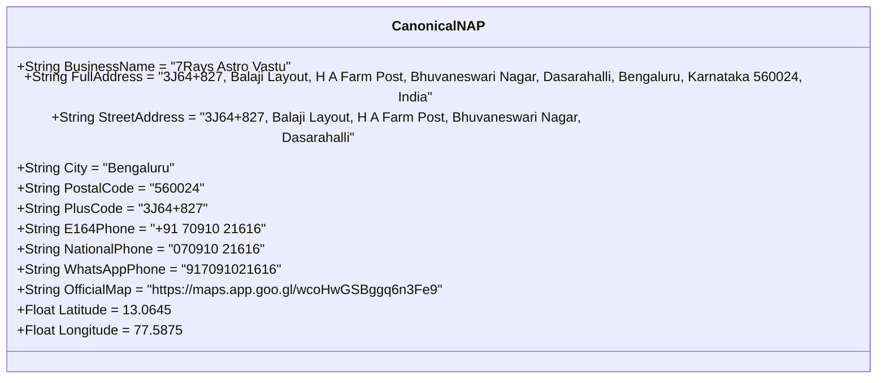

# 7Rays Astro Vastu — Phase 14: Canonical NAP & Brand Identity Standard

**Document Purpose:** The single authoritative master copy of 7Rays Astro Vastu's business identity. All citations, Google Business Profiles, directory listings, social profiles, and schema markup must copy verbatim from this standard.  
**Lead Consultant:** Rishwa Sinha (Certified Vastu Consultant, 5+ years experience)  
**Date:** September 2026  
**Status:** Certified Business Truth Standard

---

## 1. Canonical NAP Specifications

### Exact Copy-Paste Matrix:

| Attribute                       | Canonical Value                                                                                               | Strict Usage Guidelines                                                                                                             |
| ------------------------------- | ------------------------------------------------------------------------------------------------------------- | ----------------------------------------------------------------------------------------------------------------------------------- |
| **Business Name**               | `7Rays Astro Vastu`                                                                                           | **Never** add keyword suffixes (e.g. _DO NOT use "7Rays Astro Vastu - Best Vastu Consultant"_). Use the real legal brand name only. |
| **Legal Entity Name**           | `7Rays Astro Vastu`                                                                                           | Matches business registration and tax invoices.                                                                                     |
| **Founder / Lead Consultant**   | `Rishwa Sinha`                                                                                                | Spell accurately (Never _Singha_). Title: _Certified Vastu Consultant (5+ years experience)_.                                       |
| **Full Street Address**         | `3J64+827, Balaji Layout, H A Farm Post, Bhuvaneswari Nagar, Dasarahalli, Bengaluru, Karnataka 560024, India` | Must be entered exactly on all map aggregators.                                                                                     |
| **Street Line 1**               | `3J64+827, Balaji Layout, H A Farm Post`                                                                      | For forms requiring split lines.                                                                                                    |
| **Street Line 2 / Sublocality** | `Bhuvaneswari Nagar, Dasarahalli`                                                                             | Sublocality / neighborhood.                                                                                                         |
| **City / Locality**             | `Bengaluru` (or `Bangalore` if dropdown restricts)                                                            | Primary municipal city.                                                                                                             |
| **State**                       | `Karnataka`                                                                                                   | Official Indian state.                                                                                                              |
| **Postal Code (PIN)**           | `560024`                                                                                                      | Exact postal index number for Dasarahalli/Hebbal.                                                                                   |
| **Country**                     | `India` (`IN`)                                                                                                | Country code.                                                                                                                       |
| **Google Plus Code**            | `3J64+827`                                                                                                    | Precise global location identifier.                                                                                                 |
| **Geographic Coordinates**      | `13.0645, 77.5875`                                                                                            | Lat/Long coordinates for mapping pins.                                                                                              |
| **Primary Telephone (E.164)**   | `+91 70910 21616`                                                                                             | Standard international format for schema and links.                                                                                 |
| **National Dialing Format**     | `070910 21616`                                                                                                | Standard Indian national dialing format.                                                                                            |
| **WhatsApp Business Line**      | `917091021616`                                                                                                | Format for `https://wa.me/917091021616`.                                                                                            |
| **Official Website URL**        | `https://7raysastrovastu.com`                                                                                 | Or configured production domain (HTTPS, no trailing slash).                                                                         |
| **Official Google Maps Link**   | `https://maps.app.goo.gl/wcoHwGSBggq6n3Fe9`                                                                   | Canonical map sharing link.                                                                                                         |

---

## 2. Standardized Business Descriptions

### Short Description (Under 250 Characters — For Directories & Social Profiles):

> 7Rays Astro Vastu provides certified, non-demolition Vastu Shastra audits and classical Vedic astrology consultations in Bengaluru. Led by Certified Vastu Consultant Rishwa Sinha, serving apartments, homes, and corporate offices. Call +91 70910 21616.

### Medium Description (Under 500 Characters — For Indian Business Portals):

> 7Rays Astro Vastu is a premier Vastu Shastra and Vedic Astrology consultancy headquartered in Dasarahalli, Bengaluru. Led by Certified Vastu Consultant Rishwa Sinha (5+ years experience), we specialize in practical non-demolition spatial harmonization for modern high-rise apartments, luxury villas, corporate offices, and industrial plants. Using calibrated digital compasses and 16-zone CAD energy mapping, we resolve spatial imbalances cleanly. Book consultations at +91 70910 21616.

### Full Standard Description (750 Characters — For Google Business Profile):

> 7Rays Astro Vastu is an authoritative Vastu Shastra and Vedic Astrology consultancy based in Dasarahalli, Bengaluru, Karnataka (560024). Founded by Rishwa Sinha, a Certified Vastu Consultant with 5+ years of practical field experience, 7Rays provides scientific, non-demolition spatial harmonization for residential flats, independent villas, commercial tech offices, and industrial manufacturing plants.
>
> Our methodology integrates calibrated digital compass calculations, 16-zone CAD energy overlays, and environmental stress scanning. We specialize in resolving directional imbalances without structural demolition, using authentic metallic boundary inlays (brass, copper, zinc, lead). We also provide classical Vedic astrology chart timing. Call +91 70910 21616.

---

## 3. Approved Categories & Services Taxonomy

### Google Business Profile Categories:

- **Primary Category:** `Vastu Consultant` (or `Astrologer` / `Consultant` if localized category tree restricts)
- **Secondary Categories:**
  - `Astrologer` (Verified service: classical Vedic astrology readings)
  - `Consultant` (General professional service designation)
  - `Interior Designer` / `Architectural Designer` — _DO NOT USE_ (7Rays is a spatial energy consultancy, not an architectural drafting firm)

### Standard Service Tags:

- Residential Vastu Consultation
- Apartment Vastu Without Demolition
- Commercial Office Vastu
- Industrial & Factory Vastu
- 16-Zone CAD Vastu Energy Audit
- Geopathic Stress Scanning
- Vedic Astrology & Kundli Reading
- Pre-Purchase Floor Plan Evaluation
