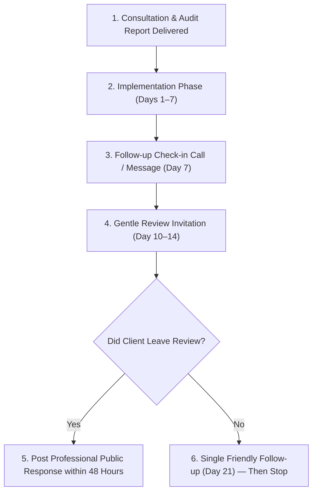

# 7Rays Astro Vastu — Phase 14: Ethical Local Review Acquisition Strategy

**Document Purpose:** Defines the operational process, communication scripts, and ethical boundaries for collecting authentic customer reviews on Google Business Profile following completed consultations.  
**Lead Consultant:** Rishwa Sinha (Certified Vastu Consultant, 5+ years experience)  
**Date:** September 2026  
**Status:** Certified Operational Policy

---

## 1. Ethical Governance & Google Policy Compliance

> [!CRITICAL]
> **Strict Anti-Manipulation Code:**
>
> - **Zero Review Gating:** Never pre-screen customers with a survey to filter unhappy clients away from Google. Every customer receives the exact same review link.
> - **Zero Review Purchasing or Incentives:** Never offer discounts, free birth chart readings, cash, gifts, or entry into lotteries in exchange for reviews.
> - **Zero Employee / Family Reviews:** Only real clients who booked and completed an actual consultation with Rishwa Sinha may leave reviews.
> - **Zero Coercion:** Never dictate wording, request specific star ratings, or pressure clients.



---

## 2. Review Request Cadence & Timing

- **Day 0:** Property audit completed or astrological reading delivered.
- **Day 3–5:** Final written CAD report / remedy recommendations delivered to client.
- **Day 7:** Client support check-in: _"Did you have any questions while reviewing your 16-zone layout plan?"_
- **Day 10–14 (Optimal Review Window):** Client has had time to absorb the recommendations and review the report. Send the primary review request.
- **Day 21:** If no response, send a single gentle reminder. If still no response, **close the loop**—never spam or harass clients.

---

## 3. Communication Templates

### A. WhatsApp Review Request (Direct from Official Line: +91 70910 21616)

```text
Namaste [Client Name],

It was a pleasure assisting you with the Vastu consultation for your [apartment / home / office in Locality].

Our goal is always to provide thorough, practical, and non-invasive spatial guidance. If you found our consultation and report helpful, would you mind taking 60 seconds to share your honest feedback on Google?

Your review helps other property owners in Bengaluru find genuine, evidence-based Vastu advice.

You can share your experience directly here:
👉 [Google Business Profile Shortlink: https://g.page/r/YOUR_CID_HERE/review]

Thank you for your trust in 7Rays Astro Vastu!

Warm regards,
Rishwa Sinha
Certified Vastu Consultant | 7Rays Astro Vastu
```

---

### B. Email Review Request Template (Post-Delivery Email)

```text
Subject: Your Vastu Consultation Experience with 7Rays Astro Vastu — [Property Name / Flat #]

Dear [Client Name],

We hope you are settling in well with the recommendations outlined in your customized 16-zone Vastu report.

As an independent consulting practice led by Rishwa Sinha, we take pride in delivering honest, methodical, and non-demolition solutions tailored to modern living in Bengaluru.

If you had a positive experience with our consultation process, we would deeply appreciate it if you could share a brief review on our Google Business Profile.

Please click the link below to leave your feedback:
[Leave a Google Review for 7Rays Astro Vastu]

Whether you have a sentence or a detailed paragraph to share, your candid thoughts are invaluable to our team and help other families and businesses make informed spatial decisions.

Thank you once again for choosing 7Rays Astro Vastu.

Sincerely,

Rishwa Sinha
Certified Vastu Consultant
7Rays Astro Vastu
Dasarahalli, Bengaluru, Karnataka 560024
Direct Phone: +91 70910 21616
Website: https://7raysastrovastu.com
```

---

## 4. Generating the Official Google Review Shortlink

To ensure clients land directly on the 5-star review modal without getting lost:

1. Log into Google Business Profile Manager (`business.google.com`).
2. On the dashboard home page, click **"Ask for reviews"**.
3. Copy the clean short URL (format: `https://g.page/r/.../review`).
4. Save this URL in `business.ts` under a new property `googleReviewUrl` once the profile is claimed.

---

## 5. Review Monitoring & Velocity Guidelines

- **Organic Velocity:** Aim for a natural, steady velocity of 2–4 verified reviews per month matching actual consultation volume.
- **Sudden Influx Warning:** An unnatural spike of 20 reviews in 48 hours triggers Google's anti-spam algorithm and can cause temporary profile suspension. Keep requests aligned with actual completed work.
