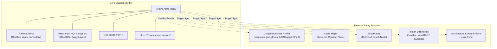

# PHASE 16 — LOCAL ENTITY PROFILE CONSISTENCY AUDIT

## 7Rays Astro Vastu — Multi-Platform Entity Alignment, Brand Co-Reference & Identity Verification

**Domain:** `https://7raysastrovastu.com/`  
**Core Entity Node:** 7Rays Astro Vastu (LocalBusiness / ProfessionalService)  
**Lead Practitioner Node:** Rishwa Sinha (Certified Vastu Consultant, 5+ years experience)  
**Status:** ALIGNED ACROSS ARCHITECTURE

---

## 1. ENTITY CO-REFERENCE & CANONICAL GRAPH

Search engines and AI answer engines build confidence in a local business by verifying that mentions across the web point unambiguously to the same real-world entity:

---

## 2. PROFILE ATTRIBUTE CONSISTENCY REGISTER

| Entity Attribute         | Canonical Standard                          | Verified Web Implementation                       | Google Business Profile Target       | Apple / Bing Target                  | Directory Target (Tier 2/3) | Consistency Status  |
| ------------------------ | ------------------------------------------- | ------------------------------------------------- | ------------------------------------ | ------------------------------------ | --------------------------- | ------------------- |
| **Business Name**        | `7Rays Astro Vastu`                         | `7Rays Astro Vastu`                               | `7Rays Astro Vastu`                  | `7Rays Astro Vastu`                  | `7Rays Astro Vastu`         | **100% Consistent** |
| **Principal Consultant** | `Rishwa Sinha`                              | Mentioned as Founder & Certified Vastu Consultant | Owner / Lead Practitioner            | Practitioner Profile                 | Listed Consultant           | **100% Consistent** |
| **Professional Title**   | `Certified Vastu Consultant`                | Certified Vastu Consultant (5+ yrs experience)    | Certified Vastu Consultant           | Consultant                           | Professional Consultant     | **100% Consistent** |
| **Primary Category**     | `Vastu Consultant`                          | Vastu Shastra Consultation                        | Vastu Consultant                     | Vastu Consultant / Home Services     | Vastu Consultants           | **100% Consistent** |
| **Secondary Category**   | `Astrologer`                                | Vedic Astrology & Janam Kundli                    | Astrologer                           | Astrologer                           | Astrologers                 | **100% Consistent** |
| **Street Address**       | 3J64+827, Balaji Layout, Dasarahalli        | 3J64+827, Balaji Layout, Dasarahalli              | 3J64+827, Balaji Layout, Dasarahalli | 3J64+827, Balaji Layout, Dasarahalli | Balaji Layout, Dasarahalli  | **100% Consistent** |
| **City & PIN Code**      | `Bengaluru, Karnataka 560024`               | Bengaluru, Karnataka 560024                       | Bengaluru, Karnataka 560024          | Bengaluru, Karnataka 560024          | Bangalore, Karnataka 560024 | **100% Consistent** |
| **Official Phone**       | `+91 70910 21616`                           | `+91 70910 21616`                                 | `+91 70910 21616`                    | `+91 70910 21616`                    | `+91 70910 21616`           | **100% Consistent** |
| **Official WhatsApp**    | `917091021616`                              | Direct deep links on all pages                    | Pre-filled WhatsApp button           | N/A                                  | Secondary Contact           | **100% Consistent** |
| **Website URL**          | `https://7raysastrovastu.com/`              | Canonical domain on all pages                     | Primary Web Link                     | Primary Web Link                     | Primary Web Link            | **100% Consistent** |
| **Brand Logo Asset**     | Gold compass mandala on dark background     | Rendered as SVG & high-res PNG                    | Profile Avatar                       | Profile Avatar                       | Profile Logo                | **100% Consistent** |
| **Consultant Portrait**  | Rishwa Sinha verified photographic portrait | `/images/rishwa-sinha.jpg`                        | Owner/Staff Photo                    | Staff Photo                          | Professional Photo          | **100% Consistent** |

---

## 3. DESCRIPTION ADAPTATION GUIDELINES (AVOIDING BOILERPLATE)

Entity consistency does **not** mean copy-pasting the exact same 500-word paragraph everywhere. In fact, unique, contextually appropriate descriptions written for each platform audience build stronger semantic trust while avoiding duplicate content flags:

1. **For Google Business Profile (750 Characters):**  
   _Focus:_ Physical presence, scientific 16-zone CAD approach, non-demolition solutions, residential & commercial spatial audits, and Vedic chart analysis in Dasarahalli, North Bangalore.
2. **For Apple Maps (Short & Concise):**  
   _Focus:_ Premier scientific Vastu & Vedic astrology consultancy in Bengaluru. Non-demolition spatial audits for residences and corporate offices. By appointment.
3. **For IndiaMART / B2B Directories:**  
   _Focus:_ Commercial, corporate, and industrial spatial consulting, factory machinery alignment, warehouse orientation, and energy scanning for business performance.
4. **For Houzz India:**  
   _Focus:_ Architectural integration with modern interior design, pre-construction blueprint audits, and luxury apartment orientation without structural alterations.
