# PHASE 16 — LOCAL AUTHORITY 90-DAY EXECUTION ROADMAP

## 7Rays Astro Vastu — Phased Operational Timeline for Real-World Local Entity Growth

**Domain:** `https://7raysastrovastu.com/`  
**Brand Identity:** 7Rays Astro Vastu  
**Lead Authority:** Rishwa Sinha (Certified Vastu Consultant, 5+ years experience)  
**Status:** 90-DAY OPERATIONAL ROADMAP

---

## 1. STRATEGIC OVERVIEW

Local entity authority cannot be artificially compressed into a single afternoon without triggering algorithmic spam filters. This 90-day roadmap outlines a natural, steady progression for establishing 7Rays Astro Vastu as Bangalore's premier scientific Vastu authority.

```mermaid
gantt
    title 7Rays Astro Vastu — 90-Day Local Entity Progression
    dateFormat  X
    axisFormat Day %d
    section Days 0–30
    GBP Verification & Dashboard Access       :active, 0, 10
    Tier 1 Profiles (Apple, Bing, Mappls)     :0, 20
    Review Outreach Workflow Deployment       :10, 30
    section Days 30–60
    Tier 2 Indian Business Profiles           :30, 45
    First Natural Client Reviews Logged       :30, 60
    Initial B2B Architect Outreach            :45, 60
    section Days 60–90
    Niche Portals (Houzz India)               :60, 75
    Local Bangalore Press / Media Pitching    :60, 90
    Local Authority Performance Audit         :80, 90
```

---

## 2. PHASED 90-DAY EXECUTION SCHEDULE

### 2.1 Days 0–30: Core Mapping Anchors & Verification Sprint

_Primary Goal:_ Secure ownership of all Tier 1 navigation platforms and establish review outreach habits.

- [ ] **Day 1–7: Google Business Profile Ownership Confirmation**
  - Owner logs into `business.google.com` to confirm verification of [`https://maps.app.goo.gl/wcoHwGSBggq6n3Fe9`](https://maps.app.goo.gl/wcoHwGSBggq6n3Fe9).
  - Verify exact business hours, contact numbers (`+91 70910 21616`), and website link.
  - Upload 10+ authentic high-resolution images (Dasarahalli workspace, instruments, exterior entrance).
- [ ] **Day 8–15: Apple Business Connect Registration**
  - Claim listing on Apple Maps via `businessconnect.apple.com`.
  - Pin exact coordinates for Balaji Layout, Dasarahalli.
  - Complete phone PIN verification.
- [ ] **Day 16–22: Bing Places for Business Synchronization**
  - Log into `bingplaces.com` and use the direct Google Business Profile synchronization tool.
  - Confirm NAP consistency across Microsoft Bing and Copilot search ecosystems.
- [ ] **Day 23–30: Review Request Process Activation**
  - Implement Stage 2 WhatsApp review requests for all completed client consultations.
  - Initialize the internal [`PHASE_16_REVIEW_TRACKER_TEMPLATE.md`](file:///Users/shekharyadav/Desktop/Projects%20/7rays%20Astro%20Vastu/PHASE_16_REVIEW_TRACKER_TEMPLATE.md).

---

### 2.2 Days 30–60: Indian Commercial Directories & Client Review Flow

_Primary Goal:_ Build national business credibility across Indian platforms and respond to initial reviews.

- [ ] **Day 31–40: Indian Commercial Platform Claiming (Tier 2)**
  - Claim free business profile on **Justdial Bangalore** (decline paid sales calls).
  - Register consulting profile on **IndiaMART** for B2B industrial & corporate audits.
  - Claim free profile on **Sulekha Bangalore** under Vastu Consultants.
- [ ] **Day 41–50: Initial Review Monitoring & Responses**
  - Monitor Google Business Profile for incoming client reviews.
  - Post customized, gracious responses within 24–48 hours using the [`PHASE_16_REVIEW_RESPONSE_SYSTEM.md`](file:///Users/shekharyadav/Desktop/Projects%20/7rays%20Astro%20Vastu/PHASE_16_REVIEW_RESPONSE_SYSTEM.md) templates.
  - Log entries in review tracker.
- [ ] **Day 51–60: Architectural Synergy Outreach (Initial Phase)**
  - Identify 5 boutique residential interior design studios in North/East Bangalore.
  - Initiate informal introductory meetings regarding pre-construction non-demolition CAD audits.

---

### 2.3 Days 60–90: Niche Portals, Local Editorial Mentions & Entity Maturity

_Primary Goal:_ Establish high-end niche authority and pursue genuine Bangalore press coverage.

- [ ] **Day 61–70: Architecture & Home Decor Profiles (Tier 4)**
  - Claim and complete **Houzz India** professional profile under Vastu & Interior Planning.
  - Showcase project layouts emphasizing non-demolition solutions.
  - Link back to canonical domain `https://7raysastrovastu.com/`.
- [ ] **Day 71–80: Local Editorial Pitching**
  - Pitch real estate and lifestyle editors at Bangalore publications (_The Hindu Property Plus_, _Bangalore Mirror_) using the angles formulated in [`PHASE_16_LOCAL_MENTION_PIPELINE.md`](file:///Users/shekharyadav/Desktop/Projects%20/7rays%20Astro%20Vastu/PHASE_16_LOCAL_MENTION_PIPELINE.md).
  - Offer Consultant Rishwa Sinha for expert commentary on apartment orientation challenges.
- [ ] **Day 81–90: Comprehensive Local Authority Audit**
  - Review all active citations for 100% NAP consistency.
  - Calculate review response rate (Target: 100%).
  - Ensure zero duplicate listings have emerged across any platform.
