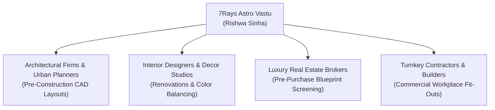

# PHASE 16 — LOCAL PROFESSIONAL PARTNERSHIP FRAMEWORK

## 7Rays Astro Vastu — B2B Collaboration, Architectural Synergy & Co-Consultation Network

**Domain:** `https://7raysastrovastu.com/`  
**Lead Consultant:** Rishwa Sinha (Certified Vastu Consultant, 5+ years experience)  
**Status:** ETHICAL B2B PARTNERSHIP ARCHITECTURE

---

## 1. PURPOSE & ANTI-SPAM PARTNERSHIP RULES

The local partnership strategy builds legitimate, offline and online collaborative relationships with Bangalore professionals whose clients require spatial energy alignment.

### Ethical Collaboration Rules:

- **Genuine Client Value First:** Partnerships exist to serve clients better (e.g. an architect consulting 7Rays during CAD blueprint drafting to prevent Vastu flaws before construction).
- **No Reciprocal Link Schemes:** Never enter private "I'll link to you if you link to me" reciprocal linking rings that violate Google Webmaster Guidelines. Links and mentions must be natural citations of professional expertise.
- **Strict Non-Interference with Design Integrity:** 7Rays never demands aesthetic demolition or disrupts an architect’s structural vision; remedies are integrated seamlessly into interior materials, colors, and lighting.

---

## 2. PARTNERSHIP ECOSYSTEM BY VERTICAL

### 2.1 Architectural Studios & Urban Planners

- **Collaboration Model:** Pre-construction blueprint review. The architect shares CAD floor plans with 7Rays to map the 16 directional zones before foundation pouring or plumbing line finalization.
- **Target Partners in Bengaluru:**
  - Independent residential architectural practices in North and East Bangalore (Hebbal, Yelahanka, Indiranagar, Whitefield).
  - Sustainable and biophilic architectural studios seeking alignment with natural solar geometry.
- **Value Proposition:** Prevents post-construction homeowner anxiety and costly architectural alterations.

### 2.2 Luxury Interior Design Firms

- **Collaboration Model:** Seamless non-demolition remedial integration. When an interior design firm is outfitting an apartment or penthouse, 7Rays advises on:
  - Master bed placement and head orientation.
  - Kitchen cooktop and water sink zoning.
  - Elemental balance through wood, metal, copper, and natural stone finishes.
- **Target Partners:** High-end boutique design studios catering to villas in gated communities and luxury high-rises.
- **Value Proposition:** Interior designers deliver spaces that satisfy clients' cultural and energetic values without compromising contemporary luxury aesthetics.

### 2.3 Premium Real Estate Advisors & Property Consultants

- **Collaboration Model:** Pre-purchase spatial feasibility audit. Buyers considering multi-crore investments in Bangalore properties often hesitate due to directional concerns.
- **Target Partners:** High-end real estate consultants managing transactions in Sadashivanagar, Lavelle Road, Indiranagar, and Whitefield.
- **Value Proposition:** Accelerated transaction closure by providing objective, non-demolition clarity to hesitant buyers.

---

## 3. PROFESSIONAL ENGAGEMENT PROTOCOL

When establishing a formal referral or consulting partnership:

1. **Initial Synergy Meeting:** Review mutual design philosophies and non-demolition principles.
2. **Confidentiality Commitment:** Both parties sign mutual non-disclosure agreements regarding client property locations and project budgets.
3. **Structured Service Scope:** Clear division between architectural/design authority (managed by the partner) and energetic/Vastu guidance (managed by 7Rays).
4. **Co-Branded Educational Value:** Opportunities to co-host private client webinars or publish educational guides on _"Designing Harmonious Luxury Homes in Bangalore"_.
