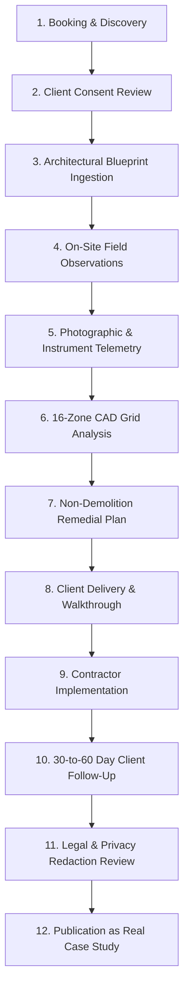

# PHASE 17 — CLIENT PROJECT CAPTURE WORKFLOW

## 7Rays Astro Vastu — Internal Field Documentation & Case Study Ingestion System

**Domain:** `https://7raysastrovastu.com/`  
**Lead Authority:** Rishwa Sinha (Certified Vastu Consultant, 5+ years experience)  
**Status:** INTERNAL OPERATIONAL PROTOCOL

---

## 1. PURPOSE & PRINCIPLE

To build a steady stream of authentic, verifiable case studies without violating client confidentiality, 7Rays Astro Vastu utilizes a 12-step project capture protocol.

> **Golden Rule:** Documentation begins at the moment of client onboarding, but public publication occurs **only** after formal post-consultation consent and privacy review.

---

## 2. THE 12-STAGE INGESTION WORKFLOW

### Stage Details:

1. **Booking & Discovery:** Record property typology (apartment, villa, office, factory), square footage, and client consultation objectives in internal records.
2. **Initial Consent Discussion:** Explain to the client that 7Rays documents projects for professional case records, with the option to remain completely anonymous.
3. **Architectural Blueprint Ingestion:** Secure existing builder floor plans or CAD drawings. Verify scale and North arrow markings.
4. **On-Site Field Observations:** Conduct physical walkthrough. Measure true magnetic orientation with a calibrated digital compass (record degree deviation from builder plans).
5. **Photographic & Instrument Telemetry:** Capture high-resolution field photos of layout transitions, main entrance, and testing instruments (compass readings, Gauss meter display).
6. **16-Zone CAD Grid Analysis:** Draft the Shakti Chakra directional overlay, identifying zoning cuts, extensions, and elemental distribution.
7. **Non-Demolition Remedial Plan:** Formulate non-invasive solutions (metallic boundary strips, room function reallocations, color/lighting adjustments).
8. **Client Delivery & Walkthrough:** Present written report and explain non-demolition logic to homeowner or facility head.
9. **Contractor Implementation:** Client or interior contractor applies physical adjustments (zero civil destruction).
10. **Follow-Up (30–60 Days):** Formal check-in to record client-reported spatial changes, comfort, and satisfaction.
11. **Legal & Privacy Redaction Review:** Redact client surname, exact flat number, builder building name (unless permitted), and sensitive personal information.
12. **Publication as Real Case Study:** Case study formatted using [`PHASE_17_REAL_CASE_STUDY_TEMPLATE.md`](file:///Users/shekharyadav/Desktop/Projects%20/7rays%20Astro%20Vastu/PHASE_17_REAL_CASE_STUDY_TEMPLATE.md) and published upon passing the Case Study Publishing Gate.
