# 7Rays Astro Vastu — Master SEO Site Architecture

**Version:** 2.0 (Enterprise SEO Blueprint)  
**Authoritative Business Truth:**

- **Brand Entity:** 7Rays Astro Vastu
- **Lead Consultant Entity:** Rishwa Sinha (Certified Vastu Consultant, 5+ years experience)
- **Headquarters Location:** 3J64+827, Balaji Layout, H A Farm Post, Bhuvaneswari Nagar, Dasarahalli, Bengaluru, Karnataka 560024, India
- **Official Google Maps Reference:** [https://maps.app.goo.gl/wcoHwGSBggq6n3Fe9](https://maps.app.goo.gl/wcoHwGSBggq6n3Fe9)

---

## 1. Executive Architectural Blueprint

The website architecture is structured as a **topical authority knowledge engine and conversion platform**, engineered to provide significantly greater depth, cleaner semantic relationships, and more robust E-E-A-T signals than competing consultancies.

### Core Entity Graph Relationship

```mermaid
graph TD
    Brand["7Rays Astro Vastu (Organization / Brand)"] --> Consultant["Rishwa Sinha (Person / Certified Vastu Consultant)"]
    Brand --> HQ["Bengaluru Headquarters (LocalBusiness - 560024)"]

    Brand --> VastuPillar["Vastu Shastra Ecosystem (/vastu)"]
    Brand --> AstroPillar["Vedic Astrology Ecosystem (/astrology)"]
    Brand --> LocalPillar["Bangalore Authority Hub (/locations/bangalore)"]

    VastuPillar --> ResVastu["Residential Vastu (/vastu/residential)"]
    VastuPillar --> CommVastu["Commercial Vastu (/vastu/commercial)"]
    VastuPillar --> IndVastu["Industrial Vastu (/vastu/industrial)"]
    VastuPillar --> CorpVastu["Corporate Vastu (/vastu/corporate)"]
    VastuPillar --> AuditVastu["Vastu Audit & Scanning (/vastu/audit)"]
    VastuPillar --> RemediesVastu["Non-Demolition Remedies (/vastu/remedies)"]
    VastuPillar --> NewConstVastu["New Construction Vastu (/vastu/new-construction)"]
    VastuPillar --> PlotVastu["Plot & Land Selection (/vastu/plot-selection)"]

    AstroPillar --> Kundli["Birth Chart & Kundli (/astrology/birth-chart)"]
    AstroPillar --> CareerAstro["Career Astrology (/astrology/career)"]
    AstroPillar --> BizAstro["Business Astrology (/astrology/business)"]
    AstroPillar --> MarriageAstro["Marriage & Matchmaking (/astrology/marriage)"]
    AstroPillar --> WealthAstro["Wealth & Timing (/astrology/wealth)"]
    AstroPillar --> LifePathAstro["Life Path Guidance (/astrology/life-path)"]
```



---

## 2. Core URL Hierarchy & Information Architecture

### Tier 1: Core Brand & Authority Pages

| URL Path              | Template / Page Type   | Search Intent                | Target Entity & Primary Keyword                     |
| --------------------- | ---------------------- | ---------------------------- | --------------------------------------------------- |
| `/`                   | Homepage               | Navigational / Commercial    | 7Rays Astro Vastu, Luxury Vastu Shastra Bangalore   |
| `/about`              | Brand Authority        | Informational / Brand        | About 7Rays Astro Vastu, Philosophy, Seven Energies |
| `/about/rishwa-sinha` | E-E-A-T Person Profile | Informational / Navigational | Rishwa Sinha Certified Vastu Consultant Bangalore   |
| `/process`            | Methodology / How-To   | Informational / Commercial   | Scientific Vastu Consultation Process               |
| `/the-7-rays`         | Proprietary Concept    | Informational                | Seven Rays Cosmic Harmonic Principles               |
| `/contact`            | Conversion Desk        | Transactional                | Book Vastu Consultation Bangalore                   |
| `/consultation`       | Dedicated Booking Flow | Transactional                | Schedule Vastu & Astrology Appointment              |

---

## 3. Residential Vastu Topical Authority Cluster

**Parent URL:** `/vastu/residential`  
**Search Intent:** High-intent commercial investigation and residential homeowner problem-solving.  
**Core Promise:** Scientific, non-demolition energy alignment for flats, apartments, independent villas, and penthouses.

```
/vastu/residential (Pillar Service Page)
  │
  ├── High-Intent Architectural Sub-Services (Standalone Service Pages)
  │     ├── /vastu/apartment-vastu (Apartment & High-Rise Flats Vastu)
  │     ├── /vastu/new-construction (New House Planning & Architectural Blueprints)
  │     └── /vastu/plot-selection (Residential Plot & Land Vastu Evaluation)
  │
  └── Room-by-Room & Directional Educational Hub (/insights/residential-vastu/...)
        ├── Room Topics (In-Depth Editorial Guides)
        │     ├── .../master-bedroom-vastu (Sleep Quality & Relationship Harmony)
        │     ├── .../kitchen-vastu-fire-element (Agni Zone & Digestive Health)
        │     ├── .../main-entrance-vastu-padas (32 Entrance Padas & Inflow Energies)
        │     ├── .../living-room-vastu (Social Energy & Family Harmony)
        │     ├── .../pooja-room-vastu (Ishan North-East Spiritual Clarity)
        │     ├── .../bathroom-toilet-vastu-remedies (Neutralizing Drainage Energy)
        │     ├── .../home-office-study-room-vastu (Focus, WFH & Career Expansion)
        │     ├── .../staircase-vastu-guidelines (Weight Distribution & Southwest Balancing)
        │     └── .../balcony-terrace-vastu (North & East Natural Inflow Optimization)
        │
        └── Directional Orientation Guides
              ├── .../north-facing-house-vastu (Kuber Wealth Inflow)
              ├── .../east-facing-house-vastu (Solar Vitality & Social Prominence)
              ├── .../south-facing-house-vastu-myth-vs-reality (3rd/4th Pada Prosperity)
              └── .../west-facing-house-vastu (Gainful Investments & Professional Mastery)
```

---

## 4. Commercial & Corporate Vastu Topical Authority Cluster

**Parent URL:** `/vastu/commercial`  
**Search Intent:** B2B commercial evaluation, commercial real estate selection, enterprise productivity enhancement.  
**Core Promise:** Spatial optimization for liquidity, leadership focus, employee retention, and sales acceleration without business downtime or demolition.

```
/vastu/commercial (Pillar Service Page)
  │
  ├── Specialized Enterprise Service Verticals
  │     ├── /vastu/corporate (Corporate Headquarters, Tech Parks & Co-working Spaces)
  │     ├── /vastu/industrial (Manufacturing Facilities, Warehouses & Production Units)
  │     └── /vastu/audit (16-Zone Digital CAD Diagnostic & Geopathic Scanning)
  │
  └── Commercial Business Property Guides (/insights/commercial-vastu/...)
        ├── .../office-layout-executive-cabin-vastu (Nairutya Southwest Leadership Placement)
        ├── .../retail-store-and-showroom-vastu (Customer Footfall & Cash Counter Alignment)
        ├── .../restaurant-and-hospitality-vastu (Kitchen Agni Placement & Dining Comfort)
        ├── .../co-working-space-vastu-principles (Dynamic Shared Workstation Energy)
        └── .../factory-machinery-and-raw-material-vastu (Weight Balancing & Heavy Plant Layout)
```

---

## 5. Vedic Astrology Topical Authority Cluster

**Parent URL:** `/astrology`  
**Search Intent:** Personalized life guidance, planetary cycle timing, business decision advisory, compatibility analysis.  
**Ethical Content Standard:** Clear framing of Vedic Astrology as a traditional interpretive advisory discipline; zero medical cures, zero guaranteed lottery/wealth outcomes.

```
/astrology (Pillar Service Page)
  │
  ├── Specialized Astrology Consultation Offerings
  │     ├── /astrology/birth-chart (Janam Kundli Synthesis & Lagna Analysis)
  │     ├── /astrology/career (Professional Transitions, Promotions & Timing)
  │     ├── /astrology/business (Partnership Compatibility & Venture Launch Timing)
  │     ├── /astrology/marriage (Kundli Milan, Navamsha & Relational Harmony)
  │     ├── /astrology/wealth (Dhana Yogas, Financial Planning & Asset Timing)
  │     └── /astrology/life-path (Planetary Dasha Cycles & Purpose Alignment)
  │
  └── Educational Astrology Insights (/insights/astrology/...)
        ├── .../understanding-dasha-cycles-and-transitions (Mahadasha & Antardasha Guidance)
        ├── .../planetary-influences-on-residential-spaces (Astro-Vastu Elemental Connections)
        └── .../remedies-through-gemstones-and-behavioral-habits (Traditional Remedial Protocols)
```

---

## 6. Bangalore Local SEO Architecture (Zero Doorway Pages)

**Primary Local Authority Hub:** `/locations/bangalore`  
**Geographic Foundation:**

- **Verified Business Location:** `3J64+827, Balaji Layout, H A Farm Post, Bhuvaneswari Nagar, Dasarahalli, Bengaluru 560024, India`
- **Service Territory:** Greater Bengaluru metropolitan area, catering to residential and commercial clients across North, South, East, West, and Central Bangalore via on-site visits and digital sessions.

### Local Service Relationships (Standalone High-Intent URLs):

To capture specific local commercial intent without thin doorway abuse, 7Rays deploys 5 dedicated, high-value local service pages:

1. `/locations/bangalore/residential-vastu`:
   - _Focus:_ Bangalore high-rise apartments, gated villa communities (Sarjapur, Whitefield, Yelahanka), balcony orientations, BBMP/BDA layout compliance.
2. `/locations/bangalore/commercial-vastu`:
   - _Focus:_ Tech hubs, startup incubators (HSR, Koramangala, Indiranagar), corporate leased office spaces, retail strips.
3. `/locations/bangalore/industrial-vastu`:
   - _Focus:_ Peenya Industrial Area, Bommasandra, Hoskote, Dabaspet manufacturing setups.
4. `/locations/bangalore/vastu-audit`:
   - _Focus:_ On-site digital compass & geopathic scanning across Bangalore properties.
5. `/locations/bangalore/astrology`:
   - _Focus:_ In-person and hybrid Vedic Astrology consultations for Bangalore tech leaders, entrepreneurs, and families.

### Neighborhood Content Representation (Contextual Integration, NOT Doorways):

Instead of generating 30 thin, auto-generated regional doorway pages, local neighborhood insights (Hebbal, Yelahanka, Dasarahalli, Indiranagar, HSR Layout, Koramangala, Whitefield, Electronic City, Jayanagar, Malleshwaram) are:

- Built as verified case study references (`/case-studies/corporate-office-bangalore`, `/case-studies/fintech-startup-growth-hsr-layout`, `/case-studies/whitefield-apartment-health-harmony`).
- Represented with distinct architectural nuances directly within the master Bangalore Hub and targeted local guides.

---

## 7. Navigation & Semantic Link Pathways

### 1. Primary Header Navigation:

- **Logo / Home** (`/`)
- **Vastu Services** (Dropdown: Residential Vastu, Commercial Vastu, Industrial Vastu, Corporate Vastu, Vastu Audit, All Services)
- **Vedic Astrology** (Dropdown: Birth Chart, Career Astrology, Business Astrology, Marriage Astrology, Astrology Hub)
- **Bangalore Hub** (`/locations/bangalore`)
- **About** (Dropdown: Our Story, Rishwa Sinha Profile, The 7 Rays, Process)
- **Insights** (`/insights`)
- **Primary CTA Button:** `Book a Consultation` (`/contact` or Modal)

### 2. Secondary Footer Architecture (5 Strategic Columns):

- **Column 1 — Enterprise Identity:** Brand statement, Verified Consultant credentials, Authoritative Postal Address (Dasarahalli, Bengaluru 560024), Non-demolition statement.
- **Column 2 — Vastu Services:** Residential Vastu, Commercial Vastu, Industrial Vastu, Corporate Vastu, Vastu Energy Audit, Vastu Remedies.
- **Column 3 — Vedic Astrology:** Birth Chart Analysis, Career Timing, Business Astrology, Marriage Compatibility, Wealth Advisory.
- **Column 4 — Bangalore Locations:** Bangalore Hub, Residential Vastu Bangalore, Commercial Vastu Bangalore, On-Site Inspection Zones.
- **Column 5 — Trust & Knowledge:** About Rishwa Sinha, Case Studies, Insights / Blog, FAQ, HTML Sitemap, Privacy Policy, Terms.

### 3. Contextual Breadcrumb Standard:

Every subpage renders an accessible, crawlable breadcrumb trail backed by `BreadcrumbList` JSON-LD schema:
`Home > Vastu > Residential Vastu > Apartment Vastu`  
`Home > Locations > Bangalore > Commercial Vastu Bangalore`  
`Home > Insights > Residential Vastu > Master Bedroom Vastu`

---

**Approved Architecture:** Enterprise SEO Blueprint for 7Rays Astro Vastu
