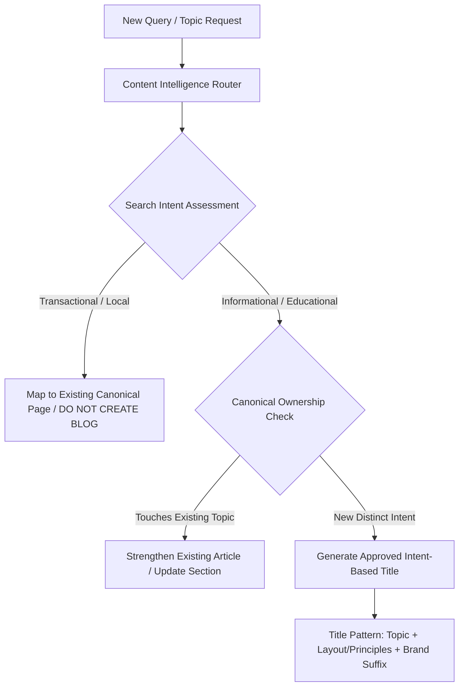

# 7Rays Astro Vastu — SEO Title Architecture & Meta Title Governance

**Entity:** 7Rays Astro Vastu (`https://7raysastrovastu.com`)  
**Operating System:** Master SEO Operating System 2026  
**Standard:** Intent-Based Title Architecture & Strict E-E-A-T Claim Governance  
**Scope:** All 58 Canonical Indexable URLs  
**Last Updated:** September 2026

---

## 1. Executive Summary & Core Objective

The primary objective of the 7Rays Astro Vastu SEO Title Architecture is to provide a sophisticated, intent-aligned, scalable title and meta description operating system.

The system enforces:
$$\text{PRIMARY SERVICE / TOPIC} + \text{LOCATION (WHEN RELEVANT)} + \text{BRAND SUFFIX}$$

### Fundamental Governance Guardrails:

1. **No Keyword Stuffing / Superlative Claims:** The system strictly rejects unsupported superlatives (`best`, `No. 1`, `top`, `leading`, `most trusted`, `#1`, `scientifically proven`, `guaranteed`).
2. **Search Query vs. Marketing Claim Distinction:** While users may search for _"best vastu consultant in bangalore"_, the website will never declare itself _"Best Vastu Consultant in Bangalore"_ as an unverified factual claim.
3. **Single Brand Suffix Standard:** Eliminates repetitive double-branding (e.g., `Page Title | 7Rays Astro Vastu | 7Rays`).
4. **100% Title Uniqueness:** Every canonical indexable URL has a distinct, search-aligned title targeting its specific query intent.
5. **Zero Doorway Pages & No Phantom Expansion:** Titles are only created for approved, canonical URLs. No titles are generated for unapproved future cities/states (e.g., Mumbai, Delhi) or unapproved locality hubs.

---

## 2. Intent-Based Title Formula Taxonomy

| Page Type                    | Structural Pattern                               | Brand Suffix           | Primary Intent                   | Example                                                                      |
| :--------------------------- | :----------------------------------------------- | :--------------------- | :------------------------------- | :--------------------------------------------------------------------------- |
| **Homepage**                 | `Vastu & Astrology Consultant in Bangalore`      | `\| 7Rays Astro Vastu` | Brand / Navigational             | `Vastu & Astrology Consultant in Bangalore \| 7Rays Astro Vastu`             |
| **Service Pillars**          | `[Primary Service] Consultant in Bangalore`      | `\| 7Rays`             | Commercial / Transactional       | `Residential Vastu Consultant in Bangalore \| 7Rays`                         |
| **Service Sub-Pillars**      | `[Specific Sub-Service] Consultant in Bangalore` | `\| 7Rays`             | Commercial / Transactional       | `Apartment Vastu Consultant in Bangalore \| 7Rays`                           |
| **Astrology Services**       | `[Astrology Domain] Consultation in Bangalore`   | `\| 7Rays`             | Commercial / Transactional       | `Career Astrology Consultation in Bangalore \| 7Rays`                        |
| **Bangalore Master Hub**     | `Vastu Consultation Services in Bangalore`       | `\| 7Rays`             | Local Commercial Hub             | `Vastu Consultation Services in Bangalore \| 7Rays`                          |
| **Local Service Pillars**    | `[Service] [Visits/Audits] in Bangalore`         | `\| 7Rays`             | Local Transactional Delivery     | `Residential Vastu Visits in Bangalore \| 7Rays`                             |
| **Bangalore Locality Pages** | `Vastu Consultant in [Area], Bangalore`          | `\| 7Rays`             | Hyper-Local Transactional        | `Vastu Consultant in Whitefield, Bangalore \| 7Rays`                         |
| **Diagnostic Audits**        | `Vastu Audit & Consultation in Bangalore`        | `\| 7Rays`             | Commercial Diagnostic            | `Vastu Audit & Consultation in Bangalore \| 7Rays`                           |
| **Informational Guides**     | `[Specific Topic / Principle]: [Context]`        | `\| 7Rays Astro Vastu` | Informational (Problem/Solution) | `South Facing House Vastu: Myths, Pada Rules & Layout \| 7Rays Astro Vastu`  |
| **Blog Articles**            | `[Specific Topic / Search Intent]`               | `\| 7Rays Astro Vastu` | Informational (Educational)      | `Master Bedroom Direction & Bed Placement as per Vastu \| 7Rays Astro Vastu` |
| **Case Study Scenarios**     | `[Scenario Topic] Assessment Scenario`           | `\| 7Rays Astro Vastu` | E-E-A-T / Illustrative Proof     | `Enterprise Tech Office Vastu Assessment Scenario \| 7Rays Astro Vastu`      |
| **Static / Entity**          | `About [Founder Name] \| [Credential]`           | `\| 7Rays`             | Entity Authority                 | `About Rishwa Sinha \| Certified Vastu Consultant \| 7Rays`                  |
| **Static / Contact**         | `Contact Us \| [Service Context]`                | `\| 7Rays`             | Conversion                       | `Contact Us \| Vastu Consultation in Bangalore \| 7Rays`                     |
| **Static / Philosophy**      | `The 7 Rays Philosophy \| [Sub-topic]`           | `\| 7Rays`             | Philosophy                       | `The 7 Rays Philosophy \| Spatial Harmony Principles \| 7Rays`               |
| **Online Vastu (Future)**    | `Online Vastu Consultation`                      | `\| 7Rays Astro Vastu` | Global / Remote Consultation     | `Online Vastu Consultation \| 7Rays Astro Vastu`                             |
| **NRI Vastu (Future)**       | `Online Vastu Consultation for NRIs`             | `\| 7Rays Astro Vastu` | Remote Diaspora Consultation     | `Online Vastu Consultation for NRIs \| 7Rays Astro Vastu`                    |

---

## 3. Brand Suffix Governance

To prevent double-branding and excessive snippet truncation, brand suffixes are systematically assigned:

1. **Commercial & Local Transactional Pages (`| 7Rays`)**:
   - Applied to core service pillars, service aliases, local Bangalore pages, locality pages, and contact pages.
   - Saves character space for high-intent modifiers (`Consultant in Bangalore`, `Apartment Vastu`, `Indiranagar`).
2. **Entity, Brand & Informational Content (`| 7Rays Astro Vastu`)**:
   - Applied to the Homepage, Editorial Hub (`/insights`), all 15 blog articles, 6 illustrative case study scenarios, and the HTML sitemap.
   - Establishes complete entity recognition for topical and educational search queries.
3. **Automated Suffix Deduplication**:
   - Managed directly inside `src/components/seo/SEOHead.tsx`:
   ```typescript
   const fullTitle = React.useMemo(() => {
     if (!title) return env.defaultTitle
     if (/\|\s*7Rays/i.test(title)) {
       return title // Preserves single brand suffix exactly as specified
     }
     return `${title} | ${siteConfig.shortName}`
   }, [title])
   ```

---

## 4. Claim & Superlative Governance (E-E-A-T Safety)

In compliance with Google Search Essentials and truth-in-advertising guidelines, all titles and descriptions are governed by strict claim rules:

| Category                 | Prohibited Phrasing                                                         | Approved Defensible Alternative                                                 | Rationale                                                                                             |
| :----------------------- | :-------------------------------------------------------------------------- | :------------------------------------------------------------------------------ | :---------------------------------------------------------------------------------------------------- |
| **Superlatives**         | Best Vastu Consultant, No. 1 Vastu Expert, Top Astrologer, #1, India's Best | Certified Vastu Consultant, Professional Vastu Consultation                     | Superlatives cannot be independently substantiated and trigger spam algorithms.                       |
| **Scientific Overreach** | Scientifically Proven Astrology, 100% Scientific Vastu, Guaranteed Vastu    | Measured Energy Evaluation, Digital Compass Mapping, 16-Zone Grid Analysis      | Traditional metaphysical systems cannot be claimed as experimentally verified physical sciences.      |
| **Outcome Guarantees**   | Guaranteed Wealth, 100% Prosperity, Instant Cure, Miraculous Transformation | Spatial Harmonization, Non-Demolition Elemental Remedies, Directional Balancing | Consultations provide environmental balancing; outcomes depend on multiple external variables.        |
| **Branch Claims**        | Indiranagar Office, Whitefield Branch                                       | On-site property visits in Indiranagar / Whitefield; Single HQ in Dasarahalli   | Operating from a single verified HQ in Dasarahalli (560024). Service areas are not physical branches. |

---

## 5. Fallback Title Architecture

The site fallback title is established in `index.html`, `.env`, and `src/config/env.ts`:

```text
7Rays Astro Vastu | Vastu & Astrology Consultation in Bangalore
```

- **Removed Legacy Claim:** The phrase _"Scientific Astrology"_ has been permanently purged from all fallbacks.
- **Scope of Fallback:** Used exclusively when a component fails to pass a page-specific title or during edge rendering errors. It is never used as the default title for live indexable routes.

---

## 6. Content Intelligence Router Integration

Every future blog, guide, or resource request executed by the AI or editorial team must pass through the **Content Intelligence Router** before generating a title:



### Routing Rules for Blog Titles:

1. **Commercial Intent Queries**: If a user requests an article on `"vastu consultant in whitefield"`, the router maps it to the existing location canonical (`/locations/whitefield`) with title `Vastu Consultant in Whitefield, Bangalore | 7Rays`. It rejects blog creation.
2. **Informational Intent Queries**: If a user requests `"south facing house vastu"`, the router generates an informational title: `South Facing House Vastu: Myths, Pada Rules & Layout | 7Rays Astro Vastu`.
3. **No Superlatives in Blog Titles**: Never create titles like `"Best South Facing House Vastu Guide"`.

---

## 7. Title Length & SERP Optimization

Titles are engineered for maximum legibility in Google SERPs:

- **Optimal Character Count:** 50–65 characters (desktop & mobile snippet safety).
- **Core Entity Front-Loading:** The primary keyword and service concept appear within the first 35 characters.
- **Clean Dividers:** Single vertical bar pipe (`|`) with standard whitespace. No double pipes, dashes, or duplicate colons.
