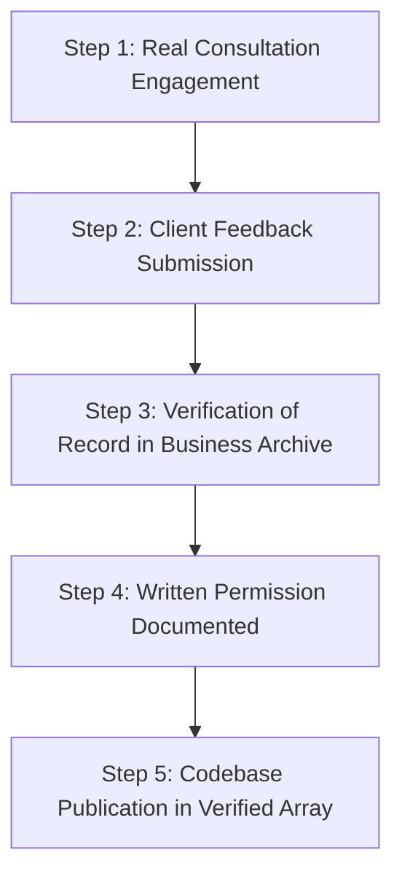

# 7Rays Astro Vastu — Testimonial Verification Policy

**Phase 10: E-E-A-T & Real-World Authority Engine**
**Document:** TESTIMONIAL_VERIFICATION_POLICY.md
**Status:** Active Editorial Policy
**Date:** September 2026

---

## 1. POLICY STATEMENT & CORE MANDATE

Trustworthiness (the central pillar of E-E-A-T) requires that all client praise, reviews, and testimonials published on 7Rays Astro Vastu originate from authentic, verifiable client engagements.

**Zero Fabrication Rule**:

> 7Rays Astro Vastu strictly prohibits the creation, generation, or publishing of fabricated testimonials, synthetic client names, placeholder reviews, simulated star ratings, or invented client initials. Missing testimonials must NEVER be replaced with faux cards or simulated social proof.

---

## 2. STANDARD VERIFICATION WORKFLOW FOR FUTURE TESTIMONIALS

Before any client quote is added to the website codebase:

### Step 1: Engagement Verification

- The reviewer must be a bona fide client who received an on-site Vastu audit, remote floor plan analysis, or Vedic astrology consultation from Rishwa Sinha.

### Step 2: Unsolicited or Requested Feedback

- Feedback may be received via email, verified messaging, or directly via the official Google Business Profile.

### Step 3: Consent & Identification Protocol

- Explicit written consent must be retained on file.
- The client confirms their preferred display format:
  1. Full Name (e.g., "Rajesh Kumar, Bengaluru")
  2. First Name + Last Initial (e.g., "Priya S., Dasarahalli")
  3. Professional Context / Role (e.g., "Homeowner", "Tech Founder")
  4. Location (City or Locality only; never personal home street address)

### Step 4: Verbatim Accuracy

- Quotes must represent the client's actual words.
- Minor grammatical corrections for readability are permitted only if they preserve the exact meaning.
- Exaggerated medical or commercial outcome claims (e.g., "cured my illness", "tripled my wealth overnight") must not be published.

---

## 3. INTERIM TRANSPARENCY STANDARD

When no verified, permission-documented on-site testimonials are ready for publication:

- The site displays a transparent, honest message:
  > _"Client testimonials will be published here as verified feedback becomes available."_
- A direct link is provided to the business's official Google Business Profile (`https://maps.app.goo.gl/wcoHwGSBggq6n3Fe9`), where users can view independent, third-party reviews.
- No dummy avatars, placeholder quotes, or artificial 5-star badges are permitted.

---

## 4. AUDIT OF REMOVED FABRICATED TESTIMONIALS

During Phase 10 implementation, the following unverified testimonials were audited and permanently removed from the codebase:

| Location                  | Removed Persona / Claim             | Rationale                                        |
| ------------------------- | ----------------------------------- | ------------------------------------------------ |
| `TestimonialsSection.tsx` | "Priya S. (Mumbai)"                 | Unverified source; outside core Bengaluru market |
| `TestimonialsSection.tsx` | "Rohit Mehta (Bangalore)"           | Unverified source                                |
| `TestimonialsSection.tsx` | "Ananya Rao (Goa)"                  | Unverified source; outside core Bengaluru market |
| `TestimonialsSection.tsx` | "Ar. Kunal Sharma (Delhi)"          | Unverified source; outside core Bengaluru market |
| `AstrologyPage.tsx`       | "Priya S. (Marketing Director)"     | Unverified source; duplicate persona             |
| `AstrologyPage.tsx`       | "Rahul M. (Tech Entrepreneur)"      | Unverified source                                |
| `AstrologyPage.tsx`       | "Ananya K. (Management Consultant)" | Unverified source                                |
| `caseStudies.ts`          | "R.K. (Co-founder & CEO)"           | Unverified quote; client permission not on file  |
| `caseStudies.ts`          | "P. & A. Sharma (Homeowners)"       | Unverified quote; client permission not on file  |

**Current Status**: Zero unverified testimonials exist in the 7Rays Astro Vastu production codebase.
